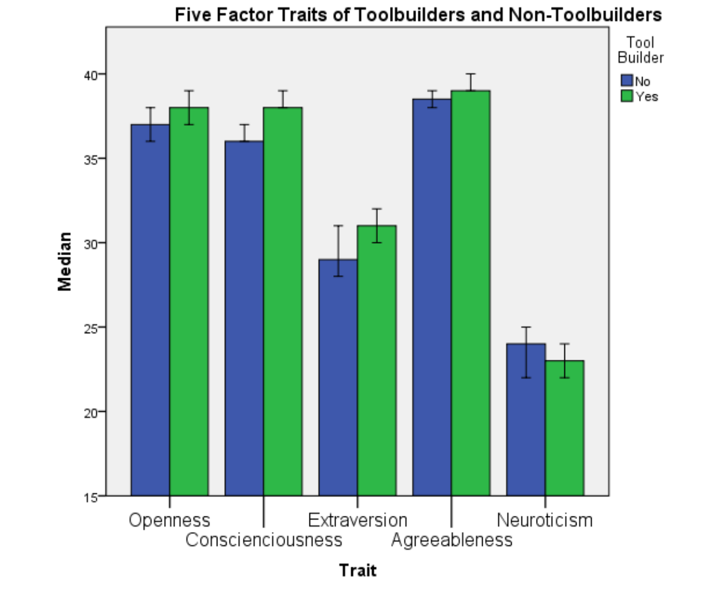
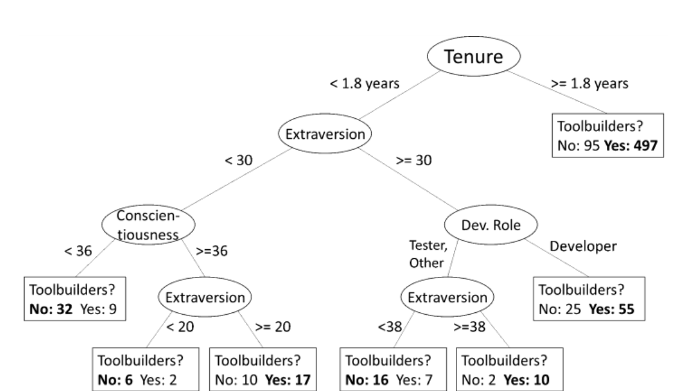

Fig. 3. Median personality factor score for toolbuilders and non-toolbuilders.  
Scores for a particular factor range from 0 to 50.

### B. Personality Traits

In total, 597 (74.9%) of the 797 respondents to our personality survey indicated that they had built homegrown tools. We ran an independent-samples Mann-Whitney test on each of the Big Five personality factors across toolbuilders and non-toolbuilders. The Mann-Whitney test detected that toolbuilders are significantly more open (p = 0.041, median difference = 1), conscientious (p < 0.001, median diff. = 2), and extraverted (p = 0.024, median diff. = 2) than non-toolbuilders. Toolbuilders are less neurotic than non-toolbuilders (p = 0.032, median diff = 1). While these differences in OCEAN scores are statistically significant, the small median difference indicates that the effect size is small.

In order to understand and determine key factors related to toolbuilding behavior, we created a pruned decision tree. Fig. 4 presents this tree. The round inner nodes are decision criteria and the edges indicate the criteria used to traverse the tree. Each leaf node corresponds to a group of participants. We label each leaf with the number of participants who do not build tools (“No”) and the number who build tools (“Yes”); the majority class is in bold. Decision trees use the most differentiating factor first as decision criteria, in this case the Tenure of an employee.

- Employees who have been at Microsoft for at least 1.8 years are more likely to be toolbuilders: 497 employees have built a tool while 95 have not. No other factor was differentiating for this group in the decision tree.
- For employees who have been at Microsoft for less than 1.8 years (left subtree), differentiating factors between toolbuilders and non-toolbuilders are their personality (the levels of extraversion, conscientiousness) and their role (developers vs. testers and others).

This might suggest that for new employees the personality and development role influences whether they build tools. However, once employees are with the company for a certain period and

Fig. 4. Decision tree classifying toolbuilding in our Personality Survey dataset.  
Numbers below a leaf node are the number of “no” and “yes” cases on the left and right respectively at that node, with the model’s prediction in bold.

adapt to corporate culture, personality traits and development role do not differentiate toolbuilder from non-toolbuilders anymore.

The tree is also in agreement with our other findings and intuitions on toolbuilding. We found that toolbuilders have significantly more tenure, and are significantly more extraverted and conscientious. Discussions with employees and anecdotes created an expectation that within Microsoft that testers write more tools than developers (testing requires significant automation), though there was no significant difference in either of our survey datasets (p = 0.775).

## IV. WHAT KINDS OF TOOLS DO TOOLBUILDERS BUILD?

One goal of our study was to characterize what types of homegrown tools are being built. Understanding these can give insight into the challenges that developers face and tooling gaps that may exist and may need to be addressed more broadly. The categories that we present come from our card sort of open survey responses gathered in Phase I and the interviews conducted in Phase II.

### A. Common types of tools

Here we present an overview of the descriptions of tools that developers built. Each category emerged during our card-sorting process as described in Section II.D. These categories represent qualitative distinctions between tools emerging from our discussions, not an attempt at an objective taxonomy of tools.

- **Information Retrieval** – Information retrieval tools access and report specific information to their users. Information retrieval tools locate, process, and display information on-demand for users.

- **Testing** – This category represents any tool related to testing software. This category includes tools such as test automation, test reporting, or tools that actually conduct the testing. We describe an example of such a testing tool called xAuto in more detail in Section B.

- **General Automation** – The general automation category represents any tool unrelated to testing, building, or deploying specifically that automated a previously manual process.

- **Debugging** – We categorized any tool related to tracking down a specific defect in software as a debugging tool. MemSpect (a tool we will describe in Section D) is an example of a debugging tool.