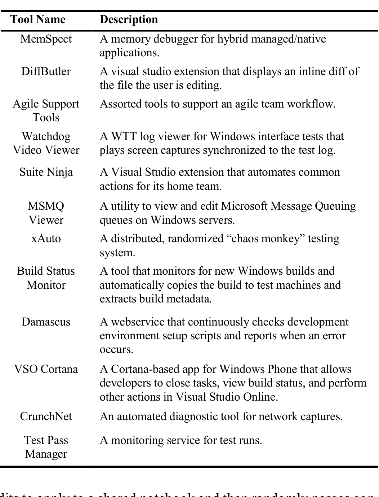

### User Interface
User interface tools provide ways to use existing functionality in a different, usually graphical, interface. Microsoft contains a diversity of services and processes that might lack a visualization or graphical interface, e.g., because it runs on the command line, prompting developers to build their own UI.

### Deployment Automation
Deployment automation tools relate to installing software, usually for the purposes of testing new builds. While this is a common task, complex build processes and runtime dependencies as well as diverse environments can make deployment difficult, necessitating automated tools.

### Monitoring
We categorized any tool that persistently watched for a set of events as a monitoring tool. Many monitoring tools were information retrieval tools that ran constantly, or tools that automatically performed an action given some trigger, such as a build being completed or source code being checked in.

### Extensions
Many commercial tools provide extension points or plugin facilities. This category comprises all the quotations we found that described extensions of existing products or tools, and which did not belong in a more specific category. One notable case is the IDE. Microsoft developers spend most of their time in the Visual Studio IDE, and some have used Visual Studio’s extension framework to add functionality. DiffButler, discussed later in this section, is an example of an IDE-based tool. One of our interview tools, SuiteNinja, is a Visual Studio plugin intended to be a general grab bag of common actions performed by a specific team.

### Build-Related Tools
Many developers referred to the build process that they deal with. The tools described range from simple build automation systems to more sophisticated actions that ran as part of a build. One developer mentioned a tool that added additional information to a build; another tool extracts information from a new build.

We received a small number of responses indicating other types of tools, which we categorized into: Personal Support Tools, which facilitate communication and information management with team members; Machine Learning Tools, which relate to building machine learning models; and software libraries. Notably, VSO Cortana is an example of a personal support tool.

In the following subsections, we present three vignettes that illustrate toolbuilding scenarios we encountered, to provide a more comprehensive picture of what factors drive tool creation, the challenges and goals in toolbuilding, how teams react to homegrown tools, and how they spread. While these vignettes are not intended to be representative in a statistical sense, they illustrate diverse points throughout the space of homegrown tools. All names are anonymized.

### B. OneAuto
When the OneNote team was first building collaboration features, they encountered a data corruption bug that only manifested within the first day after interacting with a shared notebook. Typically, internal beta usage data would isolate the problem, but it was difficult to find enough users of the beta software on this new feature in a still-nascent product. Adam, a test lead, wrote a random testing tool that he called OneAuto in an effort to find the bug. The bug was so critical that the entire team ran instances of OneAuto on their machines overnight. OneAuto randomly selects

TABLE I. TOOLS DISCUSSED IN INTERVIEWS

edits to apply to a shared notebook and then randomly passes control to another instance on another machine, which then does the same thing.

Before it had found the bug it was created to track down, OneAuto proved its value by discovering other bugs. Most importantly, the OneNote team was able to fix these bugs, because OneAuto was discovering problems with a high degree of accuracy. Even today, while directed automated scenario testing finds more bugs in total than OneAuto, the bugs OneAuto discovers have a 40% fix rate, which interviewees indicated is considered high for an automated tool. Further, because OneAuto worked through the existing extensibility system, and since testers were obligated to test the extension points for their features, OneAuto quickly grew to support all OneNote features. Impressed by the tool, Adam’s manager, Barbara, evangelized the tool heavily to other groups within Office.

Soon after the team fixed the collaboration bug, Adam left the group to head another team. OneAuto development responsibilities fell to Claire, a developer in test who was an intern when OneAuto was first developed. As more products added collaboration features and Barbara continued evangelizing the tool, OneAuto attracted mounting attention. At the same time, more of the products within Office began implementing collaborative co-authoring. When Word implemented this feature, they forked OneAuto to help with testing, having heard of it from Barbara. To avoid the inefficiency of a fork, Claire worked six months full-time on OneAuto, collaborating with David, another developer in