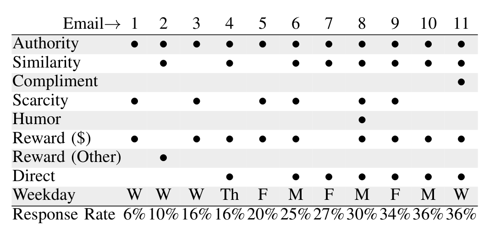

TABLE I  
PRESENCE OF PERSUASIVE FACTORS IN OUR DATASET. FEATURES WERE OMITTED IF THEY WERE NEVER PRESENT.

> Subject: MS Research Survey on Bug Fixes  
> Hi FIRSTNAME,  
>  
> I’m with the Empirical Software Engineering group at MSR, and we’re looking at ways to improve the bug fixing experience at Microsoft. We’re conducting a survey that will take about 15–20 minutes to complete. The questions are about how you choose bug fixes, how you communicate when doing so, and the activities that surround bug fixing. Your responses will be completely anonymous. If you’re willing to participate, please visit the survey: http://url There is also a drawing for one of two $50.00 Amazon gift cards at the bottom of the page.  
>  
> Thanks very much,  
> Emerson

TABLE II  
THE TEXT OF EMAIL 4 IN OUR DATASET.

We collected data from 11 previously conducted surveys. At a sample size of eleven, few traditional null-hypothesis significance tests are plausible. While we computed some statistics on our dataset, the low power afforded by these methods provide us little assurance that their results generalize, and in the interests of clarity, we decided to not report their results. As such, our analysis of the importance of various persuasive factors should be considered qualitative, as a guideline for future work, rather than a definitive quantitative analysis.

### A. Methodology

Ten of our surveys were conducted at Microsoft and one at another large company. We coded the data from each survey in terms of our factors as described in Section II. When coding, we assigned a binary score if the given email contained a cue associated with any persuasive factor described above, such as a gift, reward for completion, authority (determined by a title or statement of affiliation with a research group), similarity (determined by mutual group association with the participant), or scarcity (determined by the presence of a time limit). The first author performed the coding; in the future, we plan on using multiple coders and assessing inter-coder reliability.

For each survey, we collected data about the email that was sent to participants, including: the number of people the email was sent to, the number of people who completed the survey, a description of how people were selected, the date and time the survey was sent on, and a description of what participants were asked to do. We also collected data on how it was distributed (via blind carbon copy or direct personalized mail).

Table I summarizes the surveys and their features. A • indicates that an email contained a cue for a feature. Response rates are shown on the last line. A • in the “Direct” row indicates that the participant’s name was used directly; otherwise the email was sent as a blind carbon copy (BCC). Table II shows a recruiting email from our dataset.

### B. Results

Few of the survey invitation emails we analyzed contained evidence of many persuasive factors from psychology research. Out of all possible persuasive factors identified from research, emails from our dataset used approximately 3 on average. The minimum was two; the maximum was five. All emails were coded as containing a cue for authority via expertise (the presence of this cue is assumed in the remainder of this section). The other persuasive factors from research present in our data set were compliments to the participant (1), similarity (8), scarcity via time limits (6), and humor (1). Nine surveys offered a raffle entry as compensation for participation; one offered a non-monetary reward (an iPod Nano).

In our sample, the highest response rate was 36%. Two surveys attained this response rate. The first was sent on a Monday late afternoon, contained an offer of compensation (as a raffle entry), and a similarity cue, in the form of a reference to shared company affiliation. This is the same number of cues as the lowest response-rate survey (6%); however, this survey contained a scarcity cue, in the form of a time limit for participation, rather than a similarity cue. The second survey with a high response rate was sent on a Wednesday in the early afternoon, had a similarity cue, offered a reward, and unlike any other survey, contained a compliment to the participant (“We think you would have great insight into the process”).

The message with the highest number of persuasive factors (five) had a similarly high response rate for our sample at 30%. It contained a similarity cue, a scarcity cue, offered a reward, and unlike any other survey, contained humor (the subject line “‘Not my Bug!’, or Reassignments in Windows bug reports”). With one exception, requests that were marked as being distributed directly or via personalized messages had higher response rates than requests distributed via BCC emails. This makes intuitive sense, and has a plausible explanation in the persuasion research, and deserves future study.

## IV. DISCUSSION AND LIMITATIONS

The data included in this study suggests that some of the persuasive factors discussed in this paper may lead to increased survey response rates. For example, addressing the email directly to the recipient, as opposed to having the recipient’s address included in the BCC line of the email, seems to be associated with higher response rates. This may have been because participants’ email clients may have placed BCC emails in spam folders, or may have placed them at lower priority in a participant’s inbox, and so may have reduced