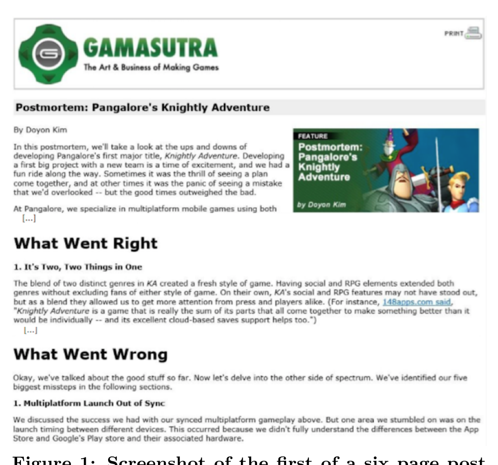

## 2. RELATED WORK

There are many books and articles which inspect the practices relating to the game development process [2, 5, 10, 11, 22, 3]. These studies primarily focus on how game development should be in the industry and are primarily based off the authors’ experience. However, our findings focus on how game development is in practice based off of the postmortem reviews written by game developers and posted on Gamasutra.com [1]. There have been several studies where developers were interviewed or surveyed to understand several specific characteristics of game development [4, 8, 20, 7, 14, 12]. These studies tend to focus more on software engineering processes and methodologies in game development. Additionally, these studies solicited information from game developers by either conducting interviews or surveying developers. In contrast, we retrieved our data more organically by analyzing self-reported postmortem reviews that had already been written by developers. Similar to what we do, there have been studies that examine what went wrong during game development using bug data [9], and 20 postmortem reviews [17]. However, in this study, we not only focus on what went wrong but also look at what went right in order to distill best practices and pitfalls.

The work most similar to ours is that of Ara Shirinian who conducted a study in which he analyzed 24 postmortem reviews written between 2008 and 2010 from Gamasutra.com in order to see if there were any interesting trends occurring in game development [19]. Also like this study, he analyzed the postmortems and grouped them into categories to determine what went right and what went wrong while developing games. In contrast, we analyzed a much larger set of postmortem reviews, spanning from 1998 until 2015. In addition to this, Shirinian categorized items from the postmortems into 7 categories of what went right and what went wrong, while we had a total of 22 categories in order to more precisely determine the trends in game development (which could be because of the increased set of postmortem reviews that we analyzed).

## 3. METHODOLOGY

To conduct this case study, we analyzed 215 postmortem reviews listed before Jan 2014 on Gamasutra.com, a game development news website. These reviews contain an introduction with some context, sections describing what went right and what went wrong during the development process, and finally some more contextual information in a table. An example of a postmortem is shown in Figure 1. We (Michael Washburn and Pavithra Sathiyanarayanan) analyzed each postmortem review, categorizing items discussed in the what went right and what went wrong sections into groups of common themes. We used the contextual information to determine which platform the game was designed for, how many people were in the development team, how much time it took to develop the game, among other things.

### Ignoring Off-Topic Reviews

While analyzing the postmortem reviews, we found that some reviews were off-topic. For example, some cases were just reviews of an individual’s experience at the Game Developers Conference. Sometimes the case only described a specific tool or technology used during development, rather than how development went. In other cases, authors focused on a particular aspect of their process, rather than their experience as a whole. Cases classified as off-topic were ignored in our study.

Figure 1: Screenshot of the first of a six page postmortem for Pangalore’s Knightly Adventure on Gamasutra.com

If a case was in fact a postmortem review for a game, and detailed what went right and what went wrong during development, then it was used in this study. Out of the original 215 postmortem reviews, 60 cases were ignored, leaving 155 postmortem reviews to be analyzed.

### Identifying Categories

Initially, we started with 12 categories of common aspects of development. These categories were based on the categories Ara Shirinian identified in his analysis of postmortem reviews [19].

In order to identify additional categories, we performed 3 iterations of analysis and identification. The first week, we each read and analyzed 3 postmortem reviews each, classifying the items discussed in each section into the 12 predetermined categories of common aspects that impact development. While analyzing these reviews, we identified additional categories of items that went right or wrong during development, and revisited the reviews we had already analyzed to update the categorization of items. For the next two weeks we repeated this process of analyzing postmortems and identifying categories, analyzing 10 postmortems each in week 2, and 15 postmortems each in week 3. After each iteration, we discussed the additional categories we identified, and determined if they were viable.

### Analysis

After our initial iterations for identifying additional categories, we had completed the analysis of 60 postmortem reviews. We then stopped identifying new categories, and began analyzing postmortems at a combined rate of about 40 postmortem reviews per week. After each week we reviewed what we had done to ensure we both had the same understanding of each category. This continued until we had analyzed all the postmortem reviews.

## 4. CONTEXTUAL INFORMATION

The characteristics of the games mentioned in the postmortem reviews we inspected were diverse in areas such as their supported platforms, the size of the development team, the amount of time it took to develop them, the type of publisher they had, and more. We will further describe the context of these games, based on data we gathered, which is available in our online appendix [6].