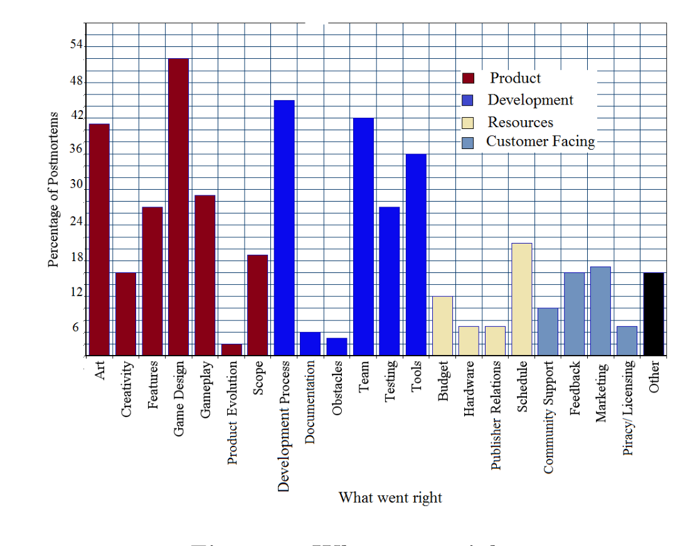

Figure 2: What went right

Example of what went right: Blair Fraser and Brad Wardell of developer Ironclad said that they chose to release Sins of a Solar Empire without any CD/DVD copy protection. They calculated that users would still buy the game to avoid the inconvenience of pirating it. Therefore, they were able to ignore the issue, and save a little time and money.

Example of what went wrong: Alex Austin of Chronic Logic stated that when they released Gish, many players started pirating their software after release. This took away from their profits and they expressed much frustration at watching so many users steal their game. They even said that in some cases there were “people even writing to us [Chronic Logic] for tech support when their stolen keycode [didn’t] work with the newest patch.”

### 5.5 Other

We categorized things into this category when they didn’t quite fit into the other categories. Examples include – teams believing in themselves, a team self funding their own project, luck, and risks paying off.

## 6. RESULTS

### 6.1 Best Practices

Figure 2 shows the percentage of postmortem reviews which list each category as something that went right during development. These percentages do not add up to 100% because each postmortem lists multiple categories that went right during development. The four categories that most frequently went right were game design, development process, team, and art.

(a) Game Design: As shown in Figure 2, Game Design was stated to have gone right in 50% of postmortems. In general, teams who marked game design as something that went right emphasized having a “hook” to capture player interest, and having a clear vision. Having a complete story, and developed characters were less prevalent themes.

Example of game hook: Dan Marshall stated that when making Gibbage, he emphasized variety in the different levels of Gibbage, which helped maintain the player’s attention. Marshall said “It’s this variety that keeps the gameplay fresh throughout each of its levels.”

> Example of clear vision: Paul Dennen of Nayantara Studios stated that “Focusing the design down one clearly plotted path from start to finish resulted in a game with strength of clarity and identity” during the creation of Start Chamber.  
> Takeaway: Game developers should create a well-defined concept before beginning development as opposed to an ad hoc method of game design. Developers should also focus the design around capturing the attention of the player.
> 
> (b) Development Process: Development process was marked as something that went right in 43% of the postmortem reviews, according to Figure 2. Among the teams that listed the development process as something that went right when making a game, there were 3 common practices teams did: First, they spent time planning and preparing for the game prior to development. Additionally, they often created prototypes which they would use as a proof of concept for the game in general, or a specific feature of the game. Many teams also used their prototypes as a basis of development. It was also common for these teams to use an iterative development process.
> 
> Example of planning: Brian Gilman of Full Sail described how before starting development on Romeo and Juliet, they were able to spend an extra month planning how they were going to complete the project. They said that “a single additional month in pre-production can make all of the difference in the world.”
> 
> Example of prototyping: Wu Dong Hao of Ubisoft stated that they made a prototype for their title Tom Clancy’s Splinter Cell which “helped determine resources and scheduling” for the whole project. They also said that the prototype helped them organize the production schedule and proved that they could overcome the technical issues of the problem. Additionally, they were able to use the prototype as a base for production.
> 
> Takeaway: For a better development process, game developers should invest time in the beginning of the project planning and designing. Game developers should also build prototypes during development, and if possible continue building off of these prototypes using an iterative process.
> 
> (c) Team: The team was listed as something that went right in 40% of the postmortem reviews that we analyzed, as depicted in Figure 2. Of the developers that listed the team as going right during development, many of them credited their experienced team members. Many developers also stated that their team members were very motivated.
> 
> Example of experienced team: According to Rade Stojsavljevic, the team who built Command and Conquer: Tiberian Sun was extremely experienced with real-time strategy games. Many of the members had worked on at least 4 real-time strategy games before, and according to Stojsavljevic “This level of experience was key in allowing the team to conquer all the obstacles thrown in their path.”
> 
> Example of motivated team: Deng Yi Wen of Ubisoft described how the team of Music Up – Summer Rainbow was highly motivated. He stated that “A willing crew is the most important factor shipping a title on time, and we had a team who [was] highly motivated by the chance to finally make a game for local players.”
> 
> Takeaway: Game developers should spend more time training their team members in the environment they will be developing in. However, game development companies should focus on recruiting not only talented individuals, but they have to be motivated as well.