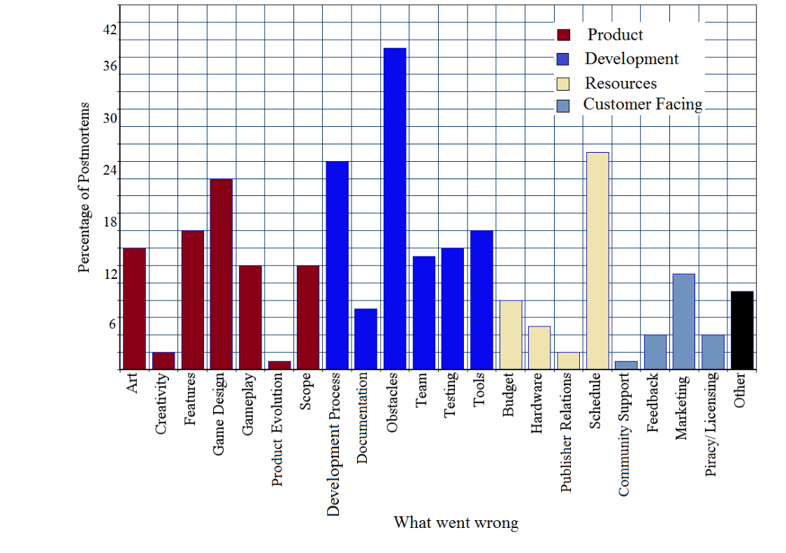

Figure 3: What went wrong

### (d) Art
In Figure 2 it is shown that art went right in 39% of the postmortem reviews. Those developers who marked art as something that went right in development typically had creative artists on their teams, or were able to contract creative artists.

Example of creative artists: Brad Wardell of Stardock Entertainment described their method of improving the quality of art in Galactic Civilizations 2: Dread Lords. According to Wardell, "Anyone who's followed Gamasutra for a long time and seen Stardock's games mentioned in the past knows one simple fact: Stardock's games look like crap." To improve the art in the new Galactic Civilizations, they began working with popular artists like Paul Boyer and Mike Bryant. Additionally, they increased the size of their in-staff art department. Wardell stated that "The result was that we were able to make a game that had competitive graphics for any AAA strategy title."

> Takeaway: In order to build a higher quality game, game studies should seek the help of professional artists in order to make visuals that will capture the attention of the player.

## 6.2 Pitfalls
The percentages of each categories that went wrong in the postmortem reviews can be seen in Figure 3. These percentages do not add up to 100% because each postmortem mentions multiple categories that went wrong during development. The 4 most occurring categories that went wrong for teams during development are obstacles, schedule, development process, and game design.

### (a) Obstacles
Teams reported facing various obstacles in 37% of the postmortem reviews, as shown in Figure 3. While there was a large variety in the types of obstacles faced by developers, a significant number of the teams and sometimes companies were newly formed, and faced obstacles related to lack of team dynamic and unfamiliarity among the team.

Example of newly formed team: Scott Alden of DreamForge Entertainment described the troubles in their newly formed team during the development of Sin. Alden said "Our newly formed tribe felt little sense of cohesion, as most members were basically strangers to each other." He went on to say that their team had trouble agreeing with each other, which led to problems making decisions during the project.

> Takeaway: Developers working in newly formed teams should participate in team building in order to minimize risks during development related to unfamiliar teams. Additionally, new companies and teams should subscribe to a method of risk management, because they are more likely to face obstacles than more seasoned teams.

### (b) Schedule
In 25% of the postmortem reviews, developers said that the schedule was something that went wrong, as shown in Figure 3. These games faced common problems in estimation and optimistic scheduling. Some teams also faced problems with design changes late in development.

Example of bad estimation: Linda Currie of Blue Fang Games described the scheduling problems surrounding their game Zoo Tycoon: Marine Mania. According to Currie, "we [Blue Fang Games] overlooked the fact that the young guests needed their own specific animations." Currie also described additional scheduling problems, saying that "We also underestimated some of the difficulty in transitioning to 3D movement through water."

Example of bad optimistic scheduling: Peter Molyneux of Lionhead Studios described the scheduling difficulties they encountered during the creation of Black & White. Molyneux admitted "I have a reputation for being, shall we say, optimistic about when the projects I'm working on will be completed." Molyneux also stated that there were many people who didn't believe him when he finally told them the game was finished, and that they "were only convinced when they saw a box with a CD in it."

> Takeaway: To avoid schedule slippage, game developers need to spend more time to plan out all the work that needs to be done so that no tasks are overlooked when giving estimates. By planning out tasks, you can also estimate each task individually, and give a more accurate prediction, instead of an optimistic one.

### (c) Development Process
The development process was listed as something that went wrong in 24% of postmortem reviews. Many teams listed this as something that went wrong when they did not spend a significant amount of time planning before beginning development. There was a large variety of things that went wrong in the development processes, however, another less common theme within these postmortems was mismanagement.

Example of lack of planning: Wayne Imlach of Muckyfoot Productions described a lack of up-front design work during the making of Startopia. The result was a lot of confusion among the team during development. Imlach said that they dove in to development as soon as possible but that "we [Muckyfoot Productions] failed to realize at the time that everybody was carrying a slightly different picture in his head of what the final game would be."

Example of poor project management: Leonard Paul of Moderngroove stated that Modern Groove – The Ministry of Sound Edition suffered from poor project management because they had no dedicated project manager. Most of those responsibilities were given to the lead programmer, which resulted in an overburdened team. Paul said "I believe hiring a good manager early in the project and having clearer deadlines would have definitely helped the project."

> Takeaway: In order to avoid conflicts during the development process, teams need to have proper management. Developers also need to invest time upfront planning before beginning development.

### (d) Game Design
According to Figure 3, game design