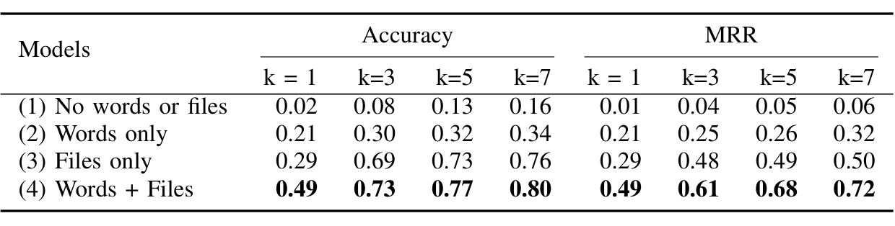

TABLE VIII: Link prediction accuracy and MRR for various configurations of parameters

specific features (e.g., how long ago user authored/modified files, whether two users belong to the same org or not, etc.). Incorporating such features may help the model learn even complex patterns from the data and further improve the recommendation accuracy. Furthermore, we believe that a detailed study of effect of model hyper-parameters (such as embedding dimension, number of GCN layers, different activation functions, etc.) on the recommendation accuracy will be a very useful result. We intend to explore these directions in our future work.

The techniques explained in this paper and the CORAL system are generic enough to be applied on any dataset that follows a GIT-based development model. Therefore, we see opportunities for implementing CORAL for source control systems like GitHub and GitLab.

## VIII. CONCLUSION

In this work, we seek to leverage additional recorded information in software repositories to improve reviewer recommendation and address the weaknesses of the approaches that rely only on the historical information of changes and reviews.

To that end we propose CORAL, a novel Graph-based machine learning model that leverages a socio-technical graph built from the rich set of entities (developers, repositories, files, pull requests, work items, etc.) and their relationships in modern source code management systems. We train a Graph Convolutional Neural network (GCN) on this graph to learn to recommend code reviewers for pull requests.

Our retrospective results show that in 73% of the pull requests, CORAL is able to replicate the human pull request authors’ behavior in top 3 recommendations and it performs better than the rule-based model in production on pull requests in large repositories by 94.7%. A large-scale user study with 500 developers showed 67.6% positive feedback, and relevance in suggesting the correct code reviewers for pull requests.

Our results open new possibilities for incorporating the rich set of information available in software repositories and the interactions that exist between various actors and entities to develop code reviewer recommendation models. We believe the techniques and the system have wider applicability ranging from individual organizations to large open source projects. Beyond code reviewer recommendation, future research could also target other recommendation scenarios in source code repositories that could aid software developers leveraging the socio-technical graphs.

## IX. DATA AVAILABILITY

We are unfortunately unable to make the data involved in this study publicly available as it contains personally identifiable information as well as confidential information. Access to the data for this study was made under condition of confidentiality from Microsoft and we cannot share it while remaining compliant with the General Data Protection Regulation (GDPR) [36].

## REFERENCES

[1] G. Gousios, M. Pinzger, and A. v. Deursen, “An exploratory study of the pull-based software development model,” in International Conference on Software Engineering, 2014, pp. 345–355.

[2] P. Rigby, B. Cleary, F. Painchaud, M.-A. Storey, and D. German, “Contemporary peer review in action: Lessons from open source development,” IEEE Software, vol. 29, pp. 56–61, 2012.

[3] P. C. Rigby and C. Bird, “Convergent contemporary software peer review practices,” in International Symposium on the Foundations of Software Engineering, 2013, pp. 202–212.

[4] A. Bacchelli and C. Bird, “Expectations, outcomes, and challenges of modern code review,” in International Conference on Software Engineering, 2013, pp. 712–721.

[5] P. C. Rigby and M.-A. Storey, “Understanding broadcast based peer review on open source software projects,” in International Conference on Software Engineering, 2011, pp. 541–550.

[6] A. Bosu, M. Greiler, and C. Bird, “Characteristics of useful code reviews: An empirical study at Microsoft,” in International Working Conference on Mining Software Repositories, 2015, pp. 146–156.

[7] J. Lipcak and B. Rossi, “A large-scale study on source code reviewer recommendation,” in Euromicro Conference on Software Engineering and Advanced Applications (SEAA), 2018, pp. 378–387.

[8] A. Ouni, R. G. Kula, and K. Inoue, “Search-based peer reviewers recommendation in modern code review,” in 2016 IEEE International Conference on Software Maintenance and Evolution (ICSME), 2016, pp. 367–377.

[9] J. Jiang, Y. Yang, J. He, X. Blanc, and L. Zhang, “Who should comment on this pull request? Analyzing attributes for more accurate commenter recommendation in pull-based development,” Information and Software Technology, vol. 84, pp. 48–62, 2017.

[10] Y. Yu, H. Wang, G. Yin, and C. X. Ling, “Reviewer recommender of pull-requests in GitHub,” in IEEE International Conference on Software Maintenance and Evolution, 2014, pp. 609–612.

[11] Y. Yu, H. Wang, G. Yin, and T. Wang, “Reviewer recommendation for pull-requests in GitHub: What can we learn from code review and bug assignment?” Information and Software Technology, vol. 74, pp. 204–218, 2016.

[12] J. B. Lee, A. Ihara, A. Monden, and K.-i. Matsumoto, “Patch reviewer recommendation in OSS projects,” in Asia-Pacific Software Engineering Conference (APSEC), vol. 2, 2013, pp. 1–6.

[13] E. Sülün, E. Tüzün, and U. Doğrusöz, “Reviewer recommendation using software artifact traceability graphs,” in International Conference on Predictive Models and Data Analytics in Software Engineering, 2019, pp. 66–75.

[14] P. Thongtanunam, C. Tantithamthavorn, R. G. Kula, N. Yoshida, H. Iida, and K.-i. Matsumoto, “Who should review my code? A file location-based code-reviewer recommendation approach for modern code review,” in International Conference on Software Analysis, Evolution, and Reengineering (SANER), 2015, pp. 141–150.