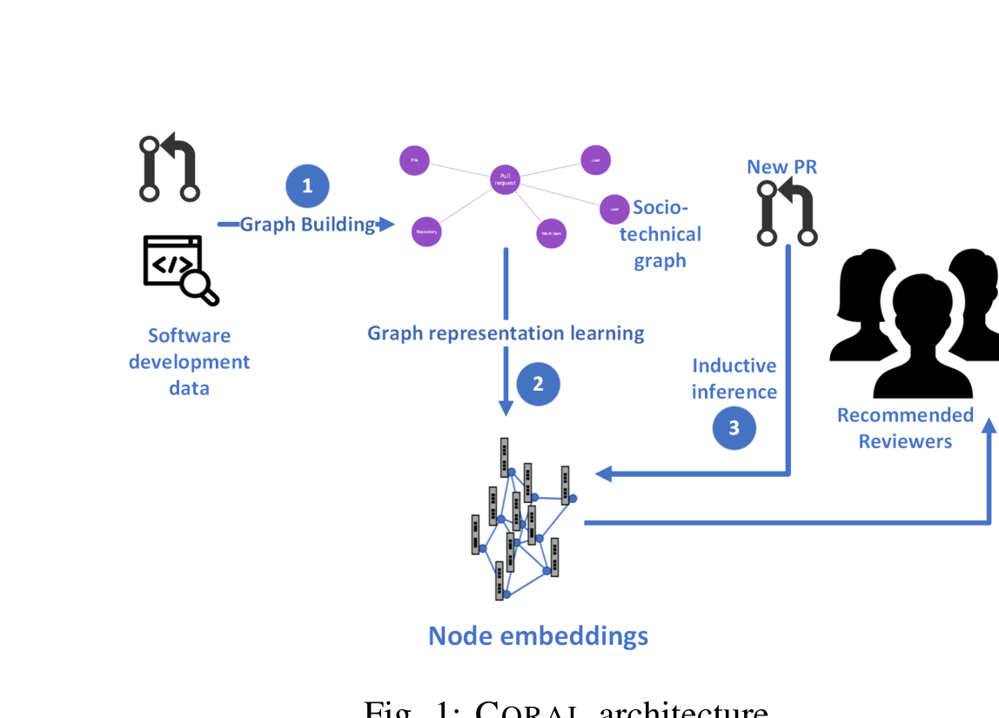
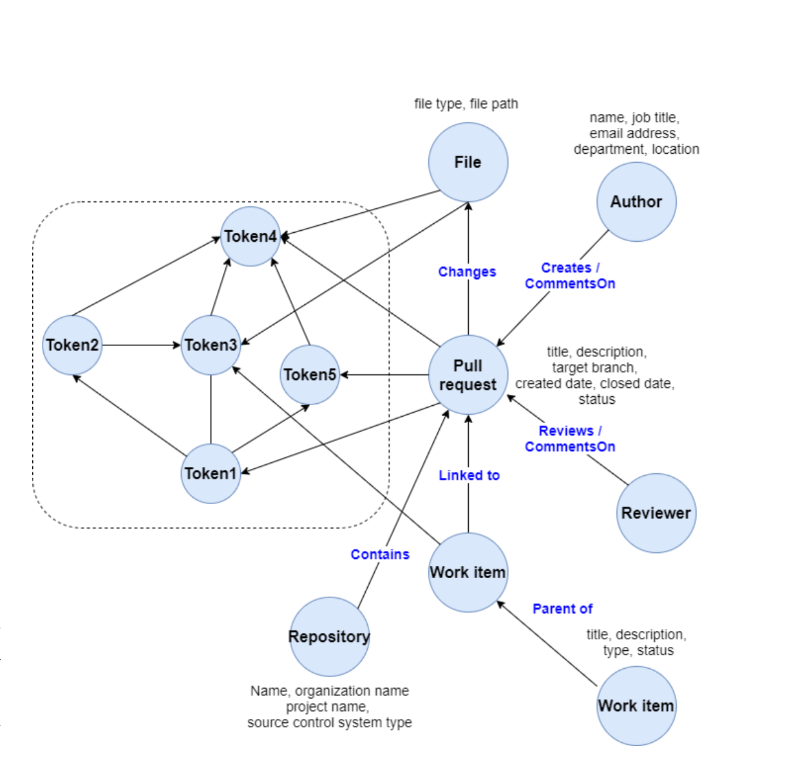

Fig. 1: CORAL architecture

Fig. 2: Socio-technical graph

Dougan et al. [23] investigated the problem of ground truth in reviewer recommendation systems. They point out that many tools are trained and evaluated on historical code reviews and rely on an (often unstated) assumption that the selected reviewers were the correct reviewers. They find that using history as the ground truth is inherently flawed.

## III. SOCIO-TECHNICAL GRAPH

CORAL system contains three main building blocks (as shown in Figure 1).

1) Building the socio-technical graph.  
2) Performing the graph representation learning to generate node embeddings.  
3) Performing inductive inference to predict reviewers for the new pull requests.

In this section, we describe the process of building the socio-technical graph from entities (developers, repositories, files, pull requests, work items) and their relationships in modern source code management systems shown as step 1 in Figure 1.

### A. Socio-technical Graph

The Socio-technical graph consists of nodes, which represent the people and the artifacts, and edges, which represent the relationships or interactions that exist between the nodes. Figure 2 shows the nodes and the edges along with their properties. The Socio-technical graph (STG) has two fundamental elements.

Nodes There are six types of nodes in the Socio-technical graph. They are pull request, work item, author, reviewer, file, and repository.

Edges There are five types of edges in the Socio-technical graph as listed below.

- creates created between an author node and a pull request node.  
- reviews created between a reviewer node and a pull request node.  
- contains created between a repository node and a pull request node if the repository contains the pull request.  
- changes created between a pull request node and a file node if the pull request is changing the file.  
- linkedTo created between a pull request node and a work item node if the pull request is linked to the work item.  
- commentsOn created between a pull request node and a reviewer node if the reviewer places code review comments.  
- parentOf created between a work item node and another work item node if there exist a parent-child relationship between them.

### B. Augmented Socio-technical graph

To include semantic information, we expand the Socio-technical graph to have text tokens represented as nodes. This has two benefits:

1) Map users to concepts (word tokens): this helps in building a knowledge base of users (authors, reviewers) to concepts. For example, if a user is authoring/reviewing pull requests which contain a token, a second order relationship will be established from that user to the token.  
2) Bring semantically similar token together: as we are establishing edges between words that appear together, we capture the semantic similarity between the words.

We perform the four steps explained below to construct the augmented Socio-technical graph (ASTG):

- Tokenize the text (title and description) of each pull request, work item, and the names of the source code files edited in those pull requests.  
- Filter the stop words by implementing a block list [24].