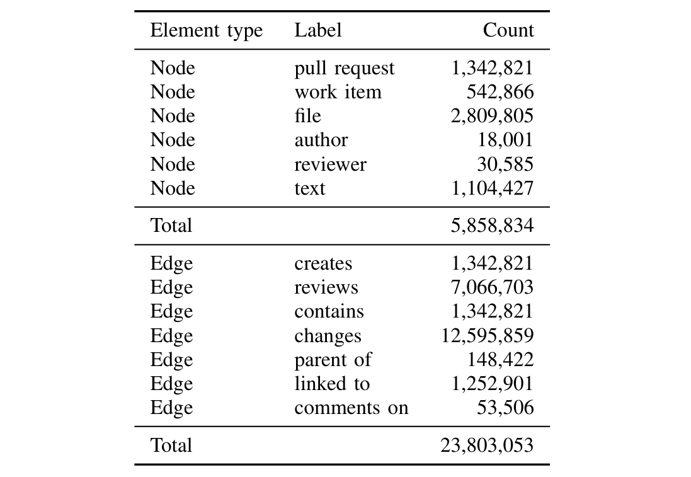

**TABLE I: Distribution of node and edge types in the Socio-technical graph**

- All the text nodes that appear in a pull request title or description and work item title or description are linked to the respective pull requests. All the text nodes that appear in a file name are linked to the file nodes.
- Text nodes are linked to each other based on their co-occurrence in the pull request corpus. Pointwise Mutual Information (PMI) [25] is a common measure of the strength of association between two terms.

PMI(x, y) = log ( p(x, y) / (p(x) p(y)) ) (1)

The formula is based on maximum likelihood estimates: when we know the number of observations for token x, o(x), the number of observations for token y, o(y), and the size of the corpus N, the probabilities for the tokens x and y, and for the co-occurrence of x and y are calculated by:

p(x) = o(x) / N  
p(y) = o(y) / N  
p(x, y) = o(x, y) / N (2)

The term p(x, y) is the probability of observing x and y together.

### C. Scale

The Socio-technical graph is built using the software development activity data from 332 repositories. We ingest data starting from 1st January, 2019, or from when the first pull request is created in a repository (whichever is older). The graph is refreshed three times a day. During the refresh we perform two operations:

- **Insert** Ingest new pull requests, work items, and code review information, across all the 332 repositories, by creating corresponding nodes, edges, properties.  
- **Update** Update the word tokens connected to nodes, if there are changes. We also update the edges between nodes to reflect the changes in the source data.

## IV. Reviewer Recommendation via Graph Neural Networks

Reviewing a pull request is a collaborative effort. Good reviewers are expected to write good code review comments that help improve the quality of the code and thus shape a good product. In order to achieve this, a good reviewer needs to be:
1. familiar with the feature that is implemented in the pull request,
2. experienced in working with the source code and the files that are modified by the pull request,
3. a good collaborator with others in the team, and
4. actively involved in creating and reviewing related pull requests in the repository.

Hence a machine learning algorithm that recommends reviewers for a pull request needs to model these complex interaction patterns to produce a good recommendation. Feature learning via embedding generation has shown good promise in the literature in capturing complex patterns from the data [26], [27], [28], [29]. In this work we propose to pose the reviewer recommendation problem as ranking reviewers using similarity scores between the users and the pull requests in the embedding space. In the rest of this section we give details on learning embeddings for pull requests and users along with other entities (such as files, word tokens, etc.), and scoring top reviewers for a new pull request using the learned embeddings.

The socio-technical graph shown in Figure 2 has essential ingredients to model the characteristics of a good reviewer:
1. the user - pull request - token path in the graph associates a user to a set of words that characterize the user’s familiarity with one or more topics,
2. user - pull request - file path associates a user to a set of files that the user authors or reviews,
3. user - pull request - user path characterizes the collaboration between people in a project, and
4. pull request - user - pull request path characterizes users working on related pull requests.

Essentially, by envisioning software development activity as an interaction graph of various entities, we are able to capture interesting and complex relations and patterns in the system. We aim to encode all these complex interactions into entity embeddings using Graph Neural Network (GNN) [18]. These embeddings are then used as features to predict most relevant reviewers to a pull request. In Figure 1 this is depicted as step 2 and 3.

### A. Graph Neural Network Architecture

Graph Convolutional Network (GCN) [30] (which is a form of GNN) has shown great success in the machine learning community for capturing complex relations and interaction patterns in a graph through node embedding learning. In GCN, for each node, we aggregate the feature information from all its neighbors and, of course, the feature itself. During this aggregation, neighbors are weighted as per the edge (relation) weight. A common approach that has been used effectively ...