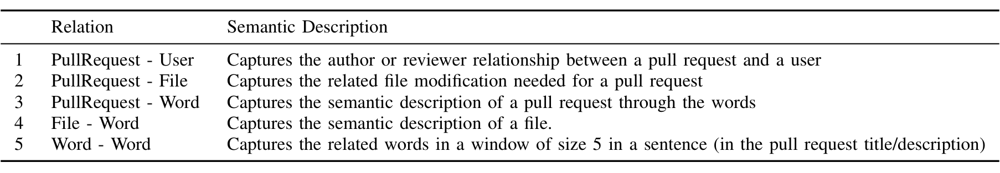
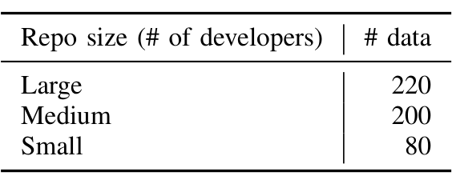

TABLE II: Relations (R) used for generating embeddings

TABLE III: Pull request distribution across dimensions

After obtaining the embedding of the new pull request as per Equation 6, we can get the top k reviewers for it by finding the top k closest users in the embedding space. That is,

reviewers_k(u') = argmax_{v1..vk} (z_{u'}^T z_{v_i})    (7)

where z_{v_i} is the embedding of the user v_i. Since our training objective enforces high z_u^T z_v score when the likelihood of an edge (u, v) is high, Equation 7 finds the users who are most likely to be associated with the pull request, as reviewers. Finding top k reviewers in this way using their embeddings allows us to naturally make use of complex relationships that are encoded in those embeddings to capture user’s relatedness to the pull request.

## V. EXPERIMENTS

To assess the value of CORAL empirically, we pose three research questions:

- RQ1 How well does CORAL model the review history?
- RQ2 Under what circumstances does CORAL perform better than a Rule-based Model (and vice versa)?
- RQ3 What are developers’ perceptions about CORAL?

The vast majority of code reviewer recommendation approaches are evaluated by comparing recommendations from the tool with historical code reviews and examining how often the recommended reviewers were the actual reviewers [23]. In line with this accepted practice, RQ1 asks how often the network is able to recommend the reviewers that the authors added. However, as Dougan et al. point out, there is an underlying (and often unstated) assumption that these are the correct reviewers* [23]. To address this flawed assumption and pursue a more complete ground truth, we reach out to the reviewers recommended by CORAL that were not recommended by a rule-based model. The results of this developer study help address RQ2 and RQ3.

For the purpose of conducting the experiments and comparative studies, we use a rule-based model built based on the heuristics proposed by Zanjani et al. [21] which demonstrated that considering the history of source code files edited in a pull request in terms of authorship and reviewership is an effective way to recommend peer reviewers for a code change. This model is currently deployed in production at Microsoft. This gives us an opportunity to conduct comparative studies.

*We would point out that if this assumption were correct, then there would be no need for a recommender in the first place!

by observing the recommendations made by the CORAL and the telemetry generated from the production deployment.

### A. Methodology

1) Retrospective Evaluation: To address RQ1, we construct a dataset of 254K code reviews, i.e. pull request–reviewer pairs, starting from 2019 to evaluate CORAL. To keep training and validation cases separate, these nodes and their edges are not present in the graph during model training. We use the following metrics, which are the most common measures for evaluating reviewer recommender approaches [14], [8], [13], [21], [20], [22]:

Accuracy
We measure the percentage of pull requests from test data for which CORAL is able to recommend at least one reviewer correctly and report the percentage for top 1, 3, 5, and 7 reviewers suggested by the model. Specifically, given a set of pull requests P, the top-k accuracy can be calculated using Equation 8. The isCorrect(p, Top-k) function returns value of 1 if at least one of top-k recommended reviewers actually review the pull request p; and returns value of 0 otherwise.

Top-k accuracy(P) = ( sum_{p∈P} isCorrect(p, Top-k) ) / |P|    (8)

Mean reciprocal rank (MRR)
This metric is used extensively in recommender systems to assess whether the correct recommendation is made at the top of a ranked list [32]. MRR is calculated using Equation 9, where rank(candidates(p)) returns value of the first rank of correct reviewer in the recommendation list candidates(p).

MRR = (1 / |P|) * sum_{p∈P} ( 1 / rank(candidates(p)) )    (9)

2) User Study: To address RQ2 and RQ3, we conduct a user study by reaching out to reviewers recommended by CORAL to see if they would be qualified to review the pull requests.

Sampling
We select 500 recent pull requests from the test data set of 254K pull requests and randomly pick one of