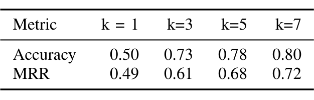
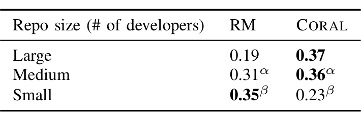

the top 2 recommendations by CORAL as the recommended reviewer to reach out. Note that pull requests selected had not been recommended by the rule-based model and each recommended reviewer appears at most once. The pull requests are collected from repositories having different number of developers using stratified random sampling following the distribution in Table III. The categories are defined as follows: number of developers: Large (> 100 developers), Medium (between 25 and 100 developers), Small (< 25 developers).

### Questionnaire
We perform the user study by posing a set of questions on what actions a reviewer might take when they were recommended for a specific pull request:

1) Is this pull request relevant to you (as of the PR creation date, state)?  
A - Not relevant  
B - Relevant, I’d like to be informed about the pull request.  
C - Relevant, I’d take some action and/or I’d comment on the pull request.

2) If possible, could you please explain the reason behind your choice?

We avoid intruding in the actual workflow, yet still maintain an adequate level of realism by working with actual pull requests, thus balancing realism and control in our study [33]. Note that, with 287 responses, this is one of the largest field studies conducted to understand the effects of an automated reviewer recommender system.

We divided the questionnaire among 4 people to conduct the user studies. The interviewers did not know these reviewers, nor had worked with them before. The teams working on the systems under study are organizationally far away from the interviewers. Therefore, they do not have any direct influence on the study participants. The interview format is semi-structured where users are free to bring up their own ideas and free to express their opinions about the recommendations.

We use the question (2) to collect user feedback and analyze it to generate insights about the perceptions of the developers about the automated reviewer recommendation systems (RQ3). Namely, the factors that influence people to not lean towards using an automated reviewer recommendation system.

### 3) Comparing with Rule-based Model
To compare CORAL with the rule-based model, we select another 500 recent pull requests from the set of pull requests on which the rule-based model (currently deployed in production) has made recommendations, by following the same distribution as the pull requests selected for evaluating CORAL (Table III). We then collect the recommendations made by the rule-based model, the subsequent actions performed by the recommended reviewers (changing the status of the pull request, or adding a code review comment, or both) for the selected pull requests from telemetry. The telemetry yields two benefits: 1. it helps us gather user feedback without doing another large-scale user study, as the telemetry captures the user actions already; 2. it avoids the probable study participants from taking one more

TABLE IV: Link prediction accuracy and MRR

TABLE V: Comparative user study precision across dimensions. RM is Rule-based Model. The differences between the two models with the same Greek letter suffix (and only those pairs) are not statistically significant.

survey (and save time and frustration), because they already indicated their preferences on the pull request when it was active and when they were added as reviewers.

An important point to keep in mind is, the rule-based model is adding recommended reviewers directly to the pull requests. This increases the probability of them taking an action even if they may not be an appropriate developer to conduct the review. The reason for this is that the reviewers are being selected and the assignment of them to the PR is public (everyone, including their managers, can see who is reviewing the pull request) [5]. If they do not respond, it might look like they are blocking the pull request progression.

In contrast, CORAL’s recommendations are validated through user studies, which are conducted in a private 1-1 setting where participants likely feel more comfortable indicating that they are not appropriate for the review. Reviewers can be open about their decisions in the user studies. Therefore, CORAL might be at a slight disadvantage.

B. Results

1) How well does CORAL model the review history?: To answer RQ1, we examine who the pull request author invited to review a change and then check to see if CORAL recommended the same reviewers. In this context, the “correct” recommendation is defined as the recommended reviewer being invited to the pull request. While the author’s actions may not actually reflect the ground truth of who is best able to review the change, most prior work in code reviewer recommendation evaluates recommenders in this way (see [23] for a thorough discussion of this) and so we follow suit here. Table IV shows the accuracy and MRR for CORAL across all 254K (pull request–reviewer) pairs. In 73% of the pull requests, CORAL is able to replicate the human authors’ behavior in picking the reviewers in the top 3 recommendations which validates that CORAL matches the history of reviewer selection quite well.

*Note that by design the rule-based model always includes the author-invited people to review, so we do not evaluate rule-based model in this approach.*