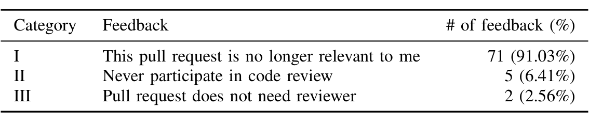

TABLE VII: Users’ Negative Feedback Categories.

Besides the negative feedback, we receive a lot of credits from users:

> "The recommendation makes a lot of sense since I primarily contributed to that repository for a few years. However, a recent re-org means I no longer work on that repository."

> "I am lead of this area and would like to review these kinds of PRs which are likely fixing some regressions."

They validate our claim that CORAL does consider the interactions between users and files, and the recommendations are understandable by humans. Since CORAL is trained and evaluated on historical pull requests starting from 2019, it is hard to reconstruct the situation where the pull requests were created and many users complain that it is difficult to recall the context of the pull requests, thus putting CORAL at a disadvantage. We expect it will have better performance in the actual production.

### 4) Ablation Study
To evaluate the contribution of each of the entities in CORAL, we perform an ablation study, with results shown in Table VIII. Specifically, we first remove the entities from the socio-technical graph and training data, and then retrain the graph convolutional neural network. We find that ablating each entity deteriorates performance across metrics. After removing word entities and file entities from the graph, i.e., the socio-technical graph only contains user and pull request entities, the model can hardly recommend correct reviewers. By comparing (1) and (2), (1) and (3), we demonstrate the importance of semantic information and file change history introduced by file entities in recommending reviewers and file entities give more value than words. Looking at (3) and (4), we observe a boost in performance when adding semantics information on top of the file change and review activities, which underlines our claim that incorporating information around interactions between code contributors as well as the semantics of code changes and their descriptions can help identify the best reviewers.

## VI. THREATS AND LIMITATIONS
As part of our study, we reached out to people who were not invited to a review but that CORAL recommended as potential reviewers. It is possible that their responses to our solicitations differed from what they may have actually done if they were unaware that their actions/responses were being observed (the so-called Hawthorne Effect [35]). Microsoft has tens of thousands of developers and we were careful not to include any repositories or participants that we have interacted with before or might have a conflict of interest with us. Nonetheless, there is a chance that respondents may be positive about the system because they wanted to make the interviewers happy.

The Socio-technical graph contains information about who was added as a reviewer on a PR, but it does not explain why that person was added or if they were added as the result of a reviewer recommendation tool. Thus, in our evaluation of how well CORAL is able to recommend reviewers that were historically added to reviews, it is unclear how much of history comes from the rule-based model recommender and how much from authors without the aid of a recommender.

When looking at repository history, the initial recommendation by the rule-based model is based on files involved in the initial review, while CORAL includes files and descriptions in the review’s final state. If the description or the set of files was modified, then CORAL may have a different set of information available to it than it would have had it been used at the time of PR creation.

In our evaluation of CORAL, we use a training set of PRs to train the model and keep a hold-out set for evaluation. These datasets are disjoint, but they are not temporally divided. In an ideal setting all training PRs would precede all evaluation PRs in time and we would evaluate our approach by looking at CORAL’s recommendation for the next unseen PR (ordered by time), then add that PR to the Socio-technical graph, and then retrain the model on the updated graph for the following PR and repeat until all PRs in the evaluation set were exhausted. This form of evaluation proved too costly and time consuming to conduct and so we used a random split of training and testing data sets.

We sampled the 500 PRs from the population using a random selection approach. We selected sample size in an effort to avoid bias and confounding factors in the sample, but we cannot guarantee that this data set is free from noise, bias, etc.

## VII. FUTURE WORK
In this work we showed that a simple GCN style model is able to capture complex interaction patterns between various entities in the code review ecosystem and can be used to predict relevant reviewers for pull requests effectively. While this method is very promising on large sized repositories, we believe that the method can be improved to make good recommendations on other repositories too by training repository type specific models. In this work we mainly focused on using interaction graph of various entities (pull requests, users, files, words, etc.) to learn complex features through embeddings. We neither captured any node specific features (e.g., user-specific features, file-specific features, etc.) nor any edge