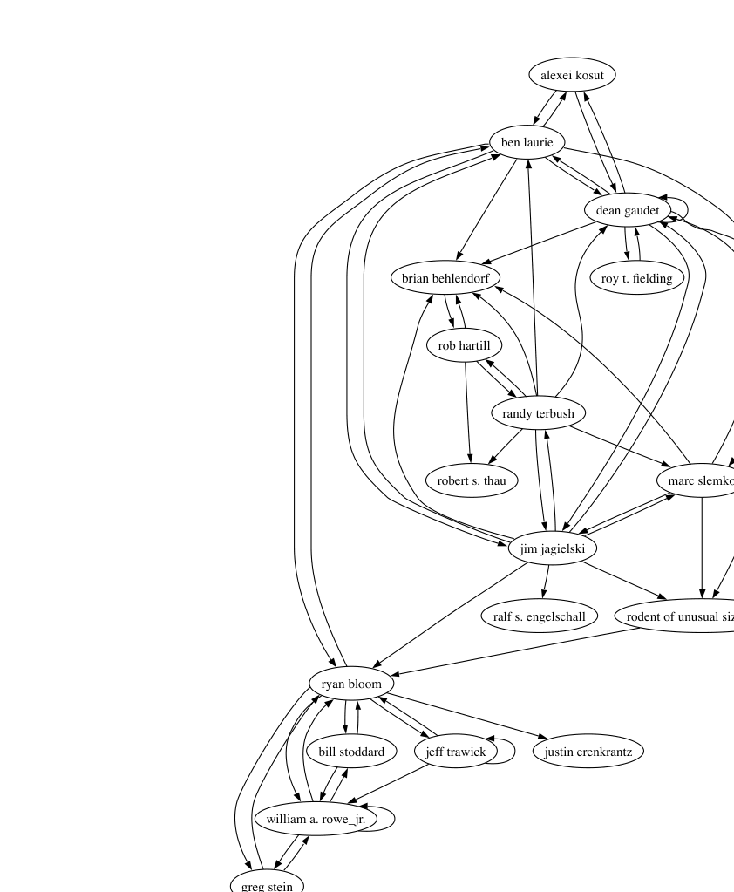
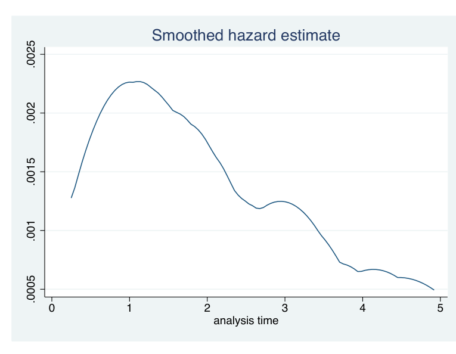

Figure 1: Pruned Social Network of Apache Emailers (Each link indicates at least 150 messages sent, or replied-to).

## B. How does a project newcomer become a core developer?

Each OSS project has a core team of developers who have the authority to commit changes to the repository; this team is the elite core of the project, selected through a meritocratic process from a larger number of people who participate on the mailing list. Understanding the factors that influence the “who, how and when” of this process is critical for the sustainability of OSS projects and for outside stakeholders who want to gain entry and succeed. Prior research indicates that certain types of behaviors, such as the duration and intensity of participation on the developer mailing list, and the submission of patches, play a role in immigration [13], [14], [15]. However, this work has largely been qualitative and/or descriptive. We used quantitative hazard rate modeling, which supports the statistical testing of hypotheses concerning the influence of these factors on the rate of immigration [12]. We developed a theory of open source project joining, and used data from Postgres, Python, and the Apache web server to statistically evaluate this theory using a piecewise-constant proportional hazard rate model. Quantitative modeling reveals variations across the projects in the effects of a participant’s a) duration in an OSS community; b) their volume of patch submission; and c) their social status. These variations can be attributed to differences across the projects in institutional norms for joining, technical complexity of the projects and governance mechanisms.

In both Apache and Postgres, the statistical models supported the hypothesis that the rate of promotion to core developer first increases, and then decreases with tenure time (see Figure 2). In all three cases, the data, when plotted, shows this trend; however, in Python the results are not statistically significant. The difference may be due to the centralized community structure and more ad hoc immigration policies in this monarchist project or could be attributable to the calendar duration of the projects: Python is 4 years younger than both

Figure 2: Fitted hazard rate for immigration events (promotions to core developer) in Postgres by project membership time in years. Note an initial peak around 1 year followed by a drop-off.

Apache and Postgres; perhaps the community’s reaction to newcomers is still evolving.

In Python and Postgres, prior history of patch submission has a significant positive effect. The effect is positive and within the same order of magnitude, but not statistically significant in Apache. We thus conclude that demonstrated skill level via patch submission plays an important role in Python and Postgres, but results are inconclusive in Apache. The effect in Python is especially strong. This is consistent with stated institutional norms of the Python project, which emphasize display of skills through patch submissions and other technical contributions as a way of gaining status.

The social network measure, indegree, which is a measure of the breadth of response to an individual, and thus status within the community, also had a significant effect on immigration, although the effect is moderate. This is especially interesting given the varied governance structures and levels of formality with regard to the immigration process in the projects. The effect of social network status is especially strong in Postgres, reflecting Josh Berkus’s description [3] of Postgres as a community project, where decisions are made communally. Still, the significance in all projects indicates a phenomenon that may generalize well to a significant portion of other OSS projects.

## C. Are OSS communities haphazard and “bazaar” like or are they more organized?

Commercial software project managers design project organizational structure carefully, mindful of available skills, division of labour, geographical boundaries, etc. We contrasted these organizational “cathedrals” with the “bazaar-like” nature of Open Source Software (OSS) Projects, which have no pre-designed organizational structure (referencing Raymond’s famous essay [7]). Any structure that exists is dynamic, self-organizing, latent, and usually not explicitly stated. Still, in large, complex, successful OSS projects, we do expect that subcommunities will form spontaneously within the developer teams. Studying these subcommunities, and their behavior, can shed light on how successful OSS projects self-organize. This phenomenon could well hold important lessons for how commercial software teams might be organized. Building on known well-established techniques for detecting community