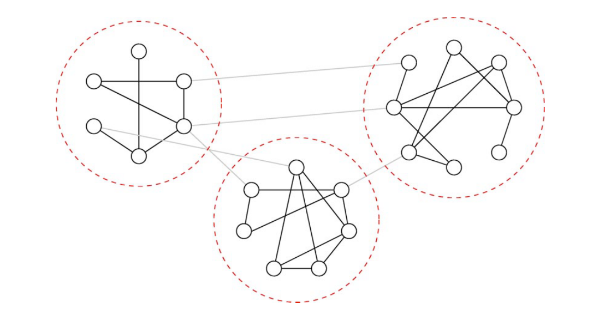
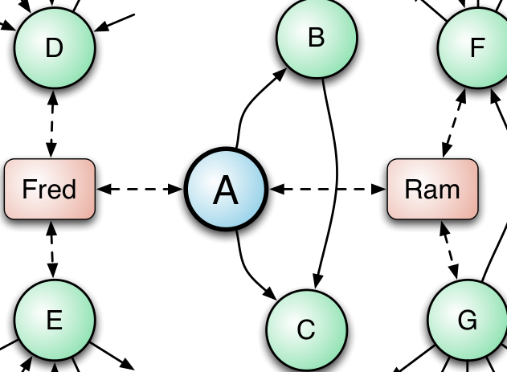

Figure 3: An example of community structure within an email social network.

Considered in this paper. In this case there are three communities. In our study of structure in complex networks [16], we extracted and studied latent subcommunities from the email social network of several projects: Apache HTTPD, Python, PostgreSQL, Perl, and Apache ANT [17]. We then validated them with software development activity history.

We found clear subcommunities (teams) in all of the projects studied. These became even more clearly delineated when constraining the communication that we used in our analysis to messages directly mentioning product topics, viz., emails that specifically name actual code artifacts. These communications require more technical expertise and are separate from messages that discuss more broadly accessible topics such as release schedules and project-wide policies (we term these “process” messages).

In four of the five projects, developers worked together on the same file with people in their own subcommunity much more often than people in others on average. This indicates that the communication behavior is tied to their collaborative development activities.

We also examined the development and communication activities of people in the groups identified to see if they were in fact working together on common tasks. Due to the sheer number of groups identified over the life of all five projects, a comprehensive manual inspection was not possible. However, we randomly sampled and found that the groups’ activities reflected focused efforts towards specific goals. We refer the reader to our original study for details on these case studies [12].

3-1 ©2004 The American Physical Society

## IV. RELATIONSHIP WITH QUALITY

### A. Can social and technical relationships help identify failure prone components?

Studies have shown that social factors in development organizations have a dramatic effect on software quality [18], [19], [20]. Separately, program dependency information has also been used successfully to predict which software components are more fault prone. Interestingly, the influence of these two phenomena have only been studied in isolation.

Intuition and practical experience suggests, however, that task assignment (i.e. who worked on which components and how much) and dependency structure (which components have dependencies on others) together interact to influence the quality of the resulting software. We argue that these forms of information should be used together. The intuition behind our approach is that software components may be related through important but different types of relationships. By aggregating these relationships our ability to predict failures will increase. We do this in two ways.

Figure 4: An example sociotechnical network. Circles are components and solid lines, dependency relationships. Rectangles are developers and dashed lines represent contributions made.

We studied the influence of combined socio-technical software networks on the fault-proneness of individual software components within a system [21]. An example of a sociotechnical network is shown in Figure 4. The network properties of a software component in this combined network were able to predict if an entity is failure prone with greater accuracy than prior methods which use dependency or contribution information in isolation. We evaluated our approach in different settings by logistic regression defect prediction models on Windows Vista and across six releases of the ECLIPSE development environment including using models built from one release to predict failure prone components in the next release. We compared this to previous work. Results of our empirical study showed a strong correlation between the centrality of software components and the number of post-release failures. In every case, our method performed as well or better and was able to more accurately identify those software components that have more post-release failures.

### B. What is the affect of distributed development on software quality?

Existing literature on distributed development in software engineering, and other fields discuss various challenges, including cultural barriers, expertise transfer difficulties, and communication and coordination overhead [22], [23], [24], [25], [26]. Conventional wisdom, in fact, holds that distributed software development is riskier and more challenging than collocated development. While there are studies that have examined the delay associated with distributed development and the direct causes for them [27], there has been much less attention (see e.g., [28]) to the effect of distributed development on software quality in terms of post-release failures. We evaluate this belief, empirically studying the overall development of Windows Vista [29] as well as FIREFOX and ECLIPSE [30] comparing the post-release failures of components that were developed in a distributed fashion with those that were developed by collocated teams.