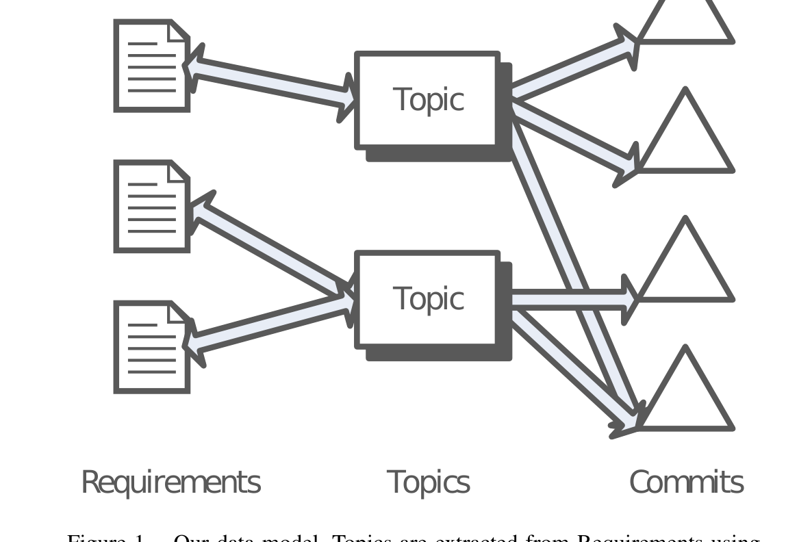

language processing (NLP) to produce UML models [20]. NLP is also used in topic analysis.

## B. Topics in Software Engineering

Topics in software engineering literature are known by many names: concerns, concepts, aspects, features, and sometimes even requirements. In this paper, by topic we mean a word distribution extracted from requirements documentation by an algorithm such as Latent Dirichlet Allocation (LDA) [5] that often matches a topic of discussion between authors. LDA helps us find topics by looking for independent word distributions within numerous documents. These documents are represented as word distributions (i.e., counts of words) to LDA. Given a number, n, LDA then attempts to discover a set of n topics, n word distributions that can describe the set of input documents. Each document is then described as a linear combination of the n topics that are extracted. Thus the end result of topic analysis is a set of n topics (word distributions) and a matrix that provides the relationship between documents and topics. This means that 1 document can be related to 0 or 1 to n topics. Since each LDA topic is a word distribution over many words, we must present to end-users (developers and managers) an alternative representation. These topics can be represented to end-users as a ranked list of words, from highest magnitude to lowest magnitude. Many researchers use top-10 lists of words; in this study we used 20 words. An example topic might be:

code, improve, change, functionality, behaviour, readability, maintainability, structure, restructure, modify, reduce, quality, process, complexity, software, refactoring, performance

How would you label this topic? Notice how this topic takes time to interpret. We investigate the difficulty practitioners have when labelling the topic as well as the relevance of the topic to practitioners. There is much software engineering research relevant to topics. Many techniques are used, ranging from LDA [11] to Latent Semantic Indexing (LSI) [21]. Researchers such as Poshyvanyk et al. [18] and Marcus et al. [21] often focus on the document relationships rather than the topic words. In terms of topics and traceability, Baldi et al. [7] labelled topics and then tried to relate topics to aspects in software. Asuncion et al. [6] used LDA on documentation and source code in order to provide traceability links. Thomas et al. [10] statistically validated email to source code traceability using LDA. Both groups did not validate their results with practitioners.

These studies rely on assumptions about the applicability to practitioners. We investigate these assumptions by surveying practitioners in order to validate the value of topics extracted from requirements. Furthermore, instead of tracing individual requirements documents or sections of said documents directly, we extract topics from sets of requirements and then track those topics within the version

Figure 1. Our data model. Topics are extracted from Requirements using LDA. Topics are related to requirements in a many-to-many relationship. Commits are related to topics via inference.

Developers and managers. The core motivation of this work is to validate if topic analysis (with LDA) of requirements documents produces topics relevant to practitioners, if the extracted topics make sense to software developers, and if the development behaviour associated with a topic matches the perception shared by the practitioners. This work could be used in traceability tools, project dashboards for managers, effort models, and knowledge management systems.

## II. BACKGROUND AND PREVIOUS WORK

Our work fits into traceability, requirements engineering, and topic analysis [3], [4], [10], [12].

### A. Traceability and Requirements Engineering

Traceability in software engineering is a well-studied topic and authors such as Ramesh et al. [13] have provided excellent surveys of the literature and the techniques. Gannod et al. [2] have discussed mining specifications by their language in order to aid traceability for reverse engineering. Kozlenkov and Zisman et al. [1] have also studied requirements traceability with respect to design documents and models. Ernst et al. [14] attempted to trace nonfunctional requirements (NFRs) within version control using a simple technique incorporating NFR word dictionaries. Murphy et al. [15] defined explicit mappings between concepts and changes to files but did not use topics, whereas Sneed [16] investigated mining requirements in order to produce test cases. Reiss et al. [17] produced a tool, CLIME, that allowed one to define constraints and track the co-evolution of artifacts in order to enforce adherence. Poshyvanyk et al. [8], [18], [19] has explored the use of IR techniques for software traceability in source code to other kinds of documents. Others within the RE community have leveraged natural