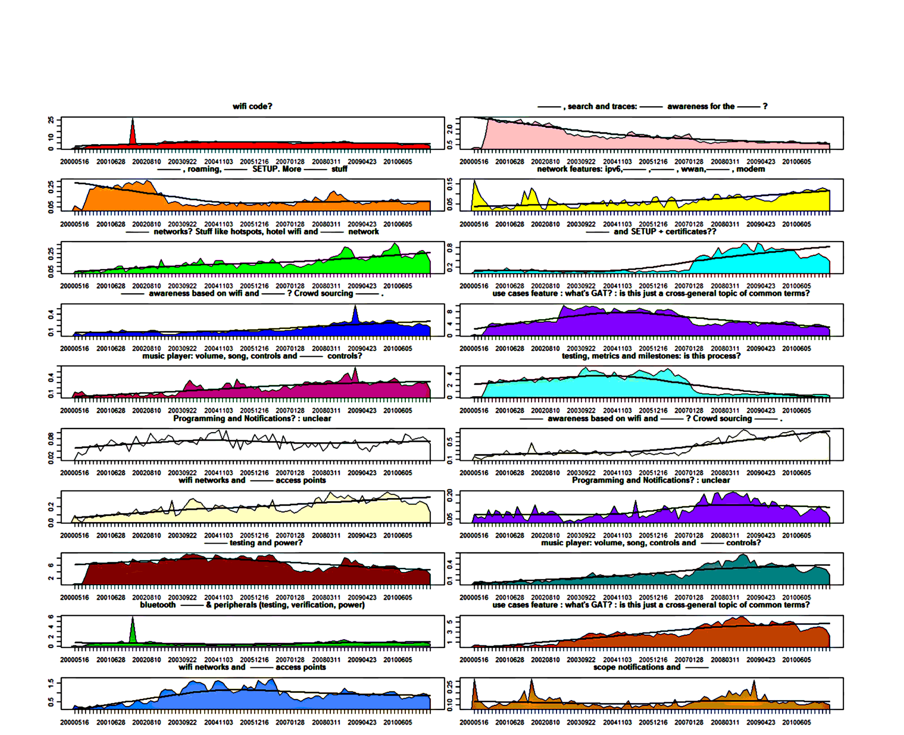

Figure 2. Topics and relevant revisions over time. X axis is time, Y axis is the average relevance per time window (greater is larger).

Documents: We removed stop words, stemmed the terms and used the intersection of the vocabulary (as we were inferring, not learning) shared by the requirements documents and topics.

Thus we filtered each commit's words by the words in our topics and then inferred (via LDA inference) the relationship between the requirements topics and the changes over time. Inference is similar to how LDA trains and learns topics except it does not learn from this inference — it relates documents to pre-existing topics. We inferred the topics related to each change, leaving us with a document-topic matrix of changes associated with topics. Figure 1 depicts this relationship between the version control system, LDA topics and the requirements documents. Topics are extracted from and related to requirements documents and then the relationship between topics and commits is inferred. The LDA inference technique was used to query bug reports previously by Lukins et al. [22]. We did not train on the commits because our goal was to use topics that were requirements relevant. Also, inference allows for fewer topic updates as requirements updates are less frequent than commits.

LDA inference produced a document-topic matrix that represents the association of a document (a commit message in our context) to each of the 20 topics we had already extracted from requirements. This allows us to plot time-series of commits that are relevant to topics. In the next section we discuss how this matrix allows us to plot the relationship over time between requirements topics and commits.

### E. Topic Plots of Requirements Relevant Effort

In order to communicate the effort that was associated with a requirements topic and the related requirements documents, we had to present summaries of this effort to