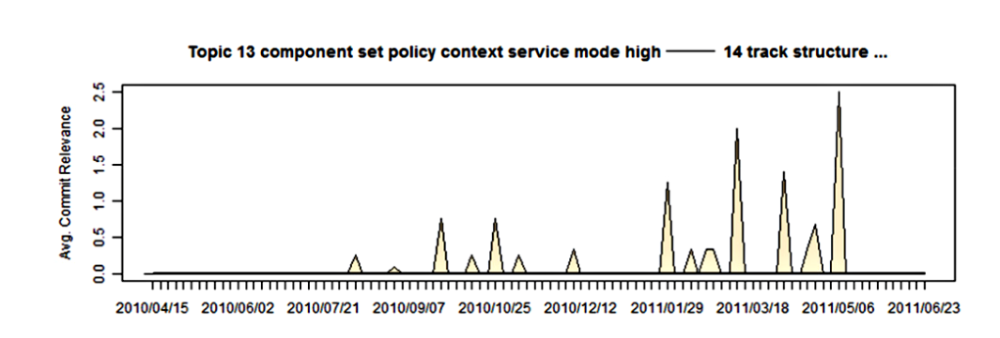

Figure 3. Personal topic from 1 developer. Topics and relevant revisions over time. X axis is time, Y axis is the average relevance per time window (greater is larger).

The users. We used a time-line overview, a topic-plot (see Figure 2), which showed the relevant commits over time. We also utilized our previous topic labels to label these plots as shown in Figures 2 and 3. These topic-plots can be generated at various levels of granularity: entire projects, entire teams, or individual developers. Using one single global analysis we can slice and dice the commits by attributes such as time, topic, author, or team in order to produce more localized topic relevance plots. In particular we found that developers were more likely to remember their own effort; thus we produced topic-plots based solely on their own commits; we called these plots personal topic plots. Figure 3 is an example of one of these plots. These topic-plots are appropriate representations as they provide stakeholders with an overview of topic-relevant effort and would be a welcome addition to a project dashboard.

Note that a single commit can be associated with multiple topics. Figure 2 shows a topic-plot of 20 topics that show the focus on these topics by average commit relevance over time. We put the commits into bins of equal lengths of time and then plot their average relevance (a larger value is more relevant) to that topic. Note that — indicates a redaction; within this study we redacted some tokens and words that would disclose proprietary information. Within this figure we can see distinct behaviours such as certain topics increasing or decreasing in importance.

The figures produced are interesting but we had to evaluate if they represented the developer’s perception of their relevant behaviour.

## F. Qualitative Evaluation

Our goal was to determine utility of the global revision topic plots and the personal topic plots (e.g. Figure 3). Thus we interviewed relevant stakeholders and developed a survey. Our interviews and surveys were designed using methodologies primarily from Ko et al. [23] and those described by the empirical software engineering research of Shull et al. [24] and Wohlin et al. [25], regarding interviews, surveys and limited study sizes.

### 1) PM and Developer Interviews

Our goal is to determine if these labelled topics are relevant to developers and program managers (PMs), all of whom are development engineers. Relevance to a developer is subjective, but we define it as “the developer worked on a task that had at least a portion of it described by the topic”. We scheduled and interviewed 1 PM and 1 developer for the period of 1 hour each. During the interviews with PMs and developers we asked if the topic-plots of the 20 requirements topics were relevant to developers and PMs. We also asked, “Are they surprised by the results?” and, “Can they identify any of the behaviours in the graphs?” We then summarized the comments and observations from these interviews and used them to design the survey, discussed in the next section.

### 2) Developer Survey

To gain reliable evidence about the utility of requirements topic and topic-plots, we produced a survey to be administered to developers that asked developers to label topics and to indicate if a personalized plot of their behaviour matched their perception of their own effort that was related to that topic and its keywords. We analyze these results in Section V-B.

The survey asked developers to label three randomly chosen topics, evaluate the three personal topic-plots of these topics, and to comment about the utility of the approach. Each of the topic labelling questions presented an unlabelled topic with its top 20 words and asked the respondents to label the topic. Another question asked if this topic was relevant to the product they worked on. They were then asked to look at a personal topic-plot and see if the plot matched their perception of the effort they put in. Finally they were asked if these plots or techniques would be useful to them. The surveys were built by selecting the developers' commits and randomly selecting topics that the developer had submitted code to. Three topics were randomly chosen for labelling and these topics were ordered randomly in an attempt to limit ordering effects.

Initially, we randomly selected 35 team members who had committed changes within the last year and had over 100 revisions. We sent these developers an email survey. After only 4 developers responded we switched to manually administering surveys. We repeated the previous methodology for choosing participants and chose 15 candidates, 8 of whom agreed to be administered the survey. Administering the surveys in person would reduce training issues and allow us to observe more. The administered surveys included an example topic question, used for training, where we verbally explained how the topics were extracted and how the commit messages were analyzed during the in-person administration of the survey. We then walked them through this example, reading the topic words out loud and thinking out loud. We provided a concrete example and abstract explanation to increase survey success or completion.

Surveys were administered by the first two authors; the first author spoke aloud each question to the respondents in order for their answers to conform to the survey. An example of a labelling that perceptually matched was when a respondent gave the label “Design/architecture words” to the following topic: