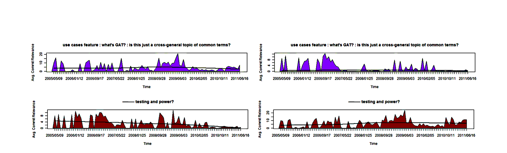
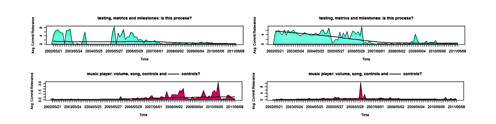

(a) Topic plots of 2 developers

(b) Topic plots of 2 teams

Figure 4. Topic plots of 2 topics for 2 different developers and teams.

## 2) An Interview with a Developer who Writes Requirements and Design Documents:

The program manager expressed interest in the research and suggested it would be useful in a project dashboard. He additionally suggested that he would like to be able to “drill down” and see related documents.

The developer we interviewed had written design documents based on the requirements document. At first he seemed apprehensive about labelling topics, potentially due to the unstructured nature of the task. We had him successfully label the 3 topics that the program manager had labelled. The developer labels correlated (contained similar words and concepts verified by the paper authors) with the program manager as well as our non-expert labels. Some topics were relevant to concepts and features he had worked on. The developer quickly recognized them and explained to us what the topic and those features were actually about.

The developer also mentioned that some topics were more cohesive and less general than others. Since the developer had made commits to the project's source code, we were able to present him with a personal view of his commits across the topics. The developer expressed that this personal view was far more relevant to him than a global view. The developer also agreed that for 2 of the 3 topic-plots we presented, the plots were accurate and clearly displayed the effort he put into them at different times. When asked about the usefulness of this approach, the developer indicated that it was not useful for himself but might be for managers.

Our preliminary conclusions were that developers could label topics with prompting, but were far more comfortable dealing with topics relevant to their own code. The developers preferred topic-plots relevant to themselves over plots about entire projects and could pick out and confirm their own behaviour.

### B. Survey Response

We administered surveys over email and in person. In-person surveys were favored due to low response from the email survey. One email respondent expressed difficulty interpreting the topic-plots but did associate the behaviour with their own experience:

> Again, all my projects only lasted about 2-3 months — the closest thing that made sense in the topics listed is the USB and video work I did, which was done in June–Aug, possibly coinciding with the last spike.

Our observation from some of the surveys was that some raw, unprocessed LDA topics were far too complicated to be interpreted without the training provided by our example topic that we labelled in front of the respondent. For example one respondent described a topic as:

> These seem pretty random. The words from the topic that actually come close to identifying