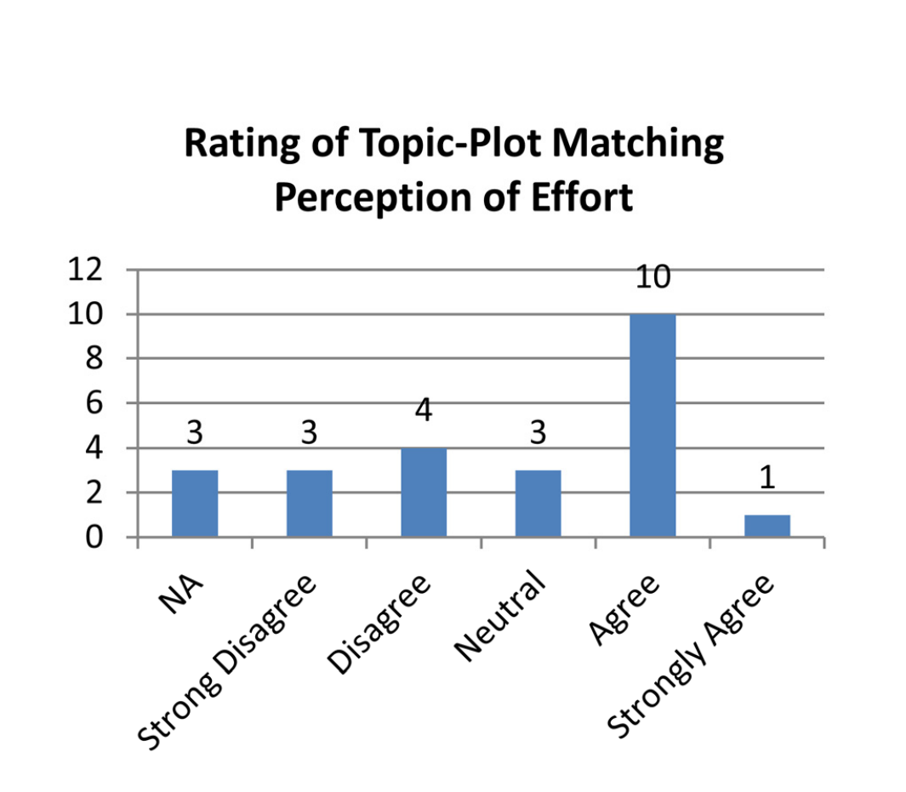

Figure 5. Distribution of topic-plot perceptual ratings performed on two separate modules.

something in my work area are “device update” and “connection”.

As the surveys used personalized plots, such as the plots in Figures 3 and 4a, we gained insight on the perception of the respondent if their plot matched their perceived effort. The respondent of this plot said that some of the plot matched his architectural work and that he had concluded that labelling is a difficult activity. The respondent also said that the peaks were in sync with the changes that he had made. In the two other topic plots he could not recognize any behaviour. Thus, given a summary of his development effort he could correlate his perception of what occurred with the topic plot provided: this topic plot matched his perception.

Some respondents found that part of the plots presented to them matched their behaviour while other parts of the same plots did not. “I would have expected more activity,” said one participant about a topic that was related to client–server interactions.

The majority of topics were labelled by respondents, and the mode score was 4 for agreement (rather than 5 for strongly agree) that the topic-plot matched the developers' perception. Figure 5 displays the scores for the administered survey: 3 not applicable, 3 strong disagree, 4 disagree, 3 neutral, 10 agree and 1 strongly agree. This gives us an average of 3.09 (neutral to agree) from 21 topic ratings. Disagree versus agree, ignoring neutral, had a ratio of 7:11.

> “This plot matches my perception of the effort that went into that topic and/or its features,” 46% of topic-plot ratings were in agreement with this statement (see Figure 5).

### C. Did Respondents Agree on Topic Labels?

One topic that we had labelled “wifi networks and software access points” had agreement across 2 of the respondents asked. One said: “Configuration of [software access point]”, the other said “but really [it is] [software access point]. [In particular], the [user interface] related to configuring network broadcast, connectivity and sharing.”

Two of the respondents had agreed it was a user scenario “End user usage pattern” and “Functionality related network mode — allowing users to select and their preferred network —”. We cannot be sure that either interpretation is more accurate. This illustrates that there can be disagreement in terms of the meaning of a topic.

## VI. DISCUSSION

### A. Topic Labelling

We have demonstrated that stakeholders can indeed label topics. Furthermore we have demonstrated that many of these topics are relevant to the task at hand.

1) Developers: Developers seemed to express difficulty labelling topics, but to be clear, many developers did not write the requirements or the design documents that the topics were derived from. We argue that some of the difficulty of labelling topics derives from the experience one has with the topic’s underlying documents.

2) Managers: Managers seemed to have a higher level view of the project, as they had the awareness that there were other teams and other modules being worked on in parallel. This awareness of the requirements documents and other features suggested that topic labelling is easier if practitioners are familiar with the concepts. These plots are relevant to managers investigating who have to interpret development trends.

One manager actually gave the labelled topics a scope ranking: low, medium, or high. This scope related to how many teams would be involved; a cross-cutting concern might have a high or broad scope, while a single-team feature would have a low scope. This implies that global awareness is more important to a manager than a developer.

3) Non-Experts: We consider ourselves to be experts in software, but not experts about the actual product we studied. Thus we relied on the experts to help us label the topics. At the same time we also labelled the topics. We examined all the topic labels and checked to see if there was agreement between our labellings and theirs. Of 46 separate labellings, our labels agreed with the respondents only 23 times. Only 50% of expertly labelled topic labels were similar or agreed with the non-expert topic labels. This indicates that while non-experts can label these topics, there is inherent value in getting domain experts to label the topics.