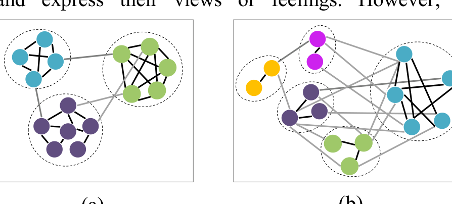

## Understanding a Developer Social Network and its Evolution *

Qiaona Hong, Sunghun Kim, S.C. Cheung  
Department of Computer Science and Engineering  
The Hong Kong University of Science and Technology  
{qiaona, hunkim, scc}@cse.ust.hk

Christian Bird  
Microsoft Research  
cbird@microsoft.com

{qiaona, hunkim, scc}@cse.ust.hk

Abstract—With the growing number of large scale software projects, software development and maintenance demands the participation of larger groups. Having a thorough understanding of the group of developers is critical for improving development and maintenance quality and reducing cost. In contrast to most commercial software endeavors, developers in open source software (OSS) projects enjoy more freedom to organize and contribute to a project in their own working style. Their interactions through various means in the project generate a latent developer social network (DSN). We have observed that developers and their relationships in these DSNs change continually under the influence of differences in the set of active developers and their changing activities. Revealing and understanding the structure and evolution of these social networks as well as their similarities and differences from other more general social networks (GSNs) is of value to our software engineering community, as it allows us to begin building an understanding of how well the findings from other fields based on GSNs apply to DSN. In this paper, we compare DSNs with popular GSNs such as Facebook, Twitter, Cyworld (a large social network in South Korea), and the Amazon recommendation network. We found, for instance, that while most social networks exhibit power law degree distributions, our DSNs do not. In addition, we also examine how DSNs evolve over time, highlighting how events within a project (such as a release of new software or the departure of prominent developers) impact the makeup of the DSNs, and observe the evolution of topological properties such as modularity and the paths of communities within these networks.

Keywords—developer social network; community detection

### I. INTRODUCTION

Due to the great increase in the scale of software projects recently, software development and maintenance are highly social activities which have attracted study from many researchers [10, 19, 15]. As developers work together on software projects, they form implicit collaborative social networks [19]. Some researchers have begun to apply ideas from general social networks (GSNs) such as Facebook and Twitter to these developer social networks (DSNs). For example, Begel et al. [19] proposed a social networking web service, Codebook, containing pages with information about developers and artifacts in a style similar to Facebook. GSNs such as Facebook, Twitter, and Cyworld have enjoyed much success as they have leveraged and enhanced social relationships. As researchers study developer collaboration networks, a natural question to ask is, "How similar are developer social networks to general social networks?"

As both DSNs and GSNs undergo more study, it is useful to know how similar DSNs are to GSNs. Unlike general social networks (GSNs), a developer social network (DSN) is an underlying network which only reveals itself after being extracted from an open source project. Developer social networks generally have stricter control over topics than GSNs. In GSNs such as Twitter and Facebook, participants are encouraged to post on any topic and express their views or feelings. However, developers in DSNs are restricted to contribute on project-related topics. Meaningless or unrelated opinions can be grounds for being banned from the project. Therefore, we expect that DSNs will differ from GSNs in certain aspects. In contrast, developers are similar to participants in GSNs in some respects. Neither is forced to participate.

Much research exists on GSNs including Facebook [7], Twitter [6], and Cyworld [5], and there is pre-existing work examining DSNs in OSS projects [10, 15, 16]. However, since there has been no formal comparison of these two types of networks, it is unclear which properties are general and what is specific to these individual types of social networks. This paper presents a detailed comparison between DSNs and GSNs from multiple aspects including community structure.

Community structure in social networks which has attracted considerable attention is an important aspect to consider when making the comparison between DSNs and GSNs. In 2002, Girvan and Newman [20] introduced the notion of community structure within networks as the division of a graph into subgraphs (called communities) in which the connections within the subgraphs are much denser than the connections between them. They also defined a metric, termed modularity [9], for evaluating how well a graph can be partitioned into these communities. A graph with high modularity has very well defined and tight

(a) (b) Figure 1. An example of community structure in networks.