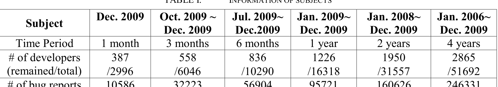
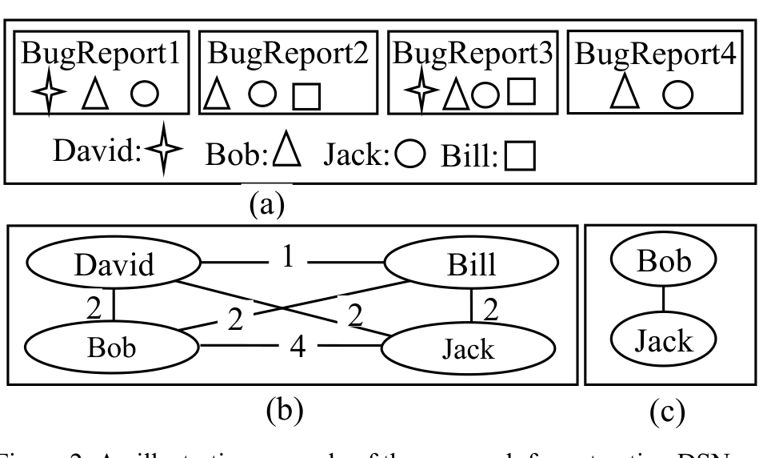

TABLE I. INFORMATION OF SUBJECTS
Oct. 2009 ~ Jul. 2009 ~ Jan. 2009

# of comments 37056 131569 26

tightly knit communities with few connections between them, while a low modularity graph has poor structure. The networks in Fig. 1 have the same amount of nodes and edges. However they have very different structures. The network in Fig. 1(a) displays strong community structure and has a high modularity 0.51 while the network in Fig. 1(b) has weak community structure. There is not much difference between the densities of interconnections and intra-connections in this network. It has a low modularity of 0.176. Identifying the optimal partition of nodes into communities is an NP-complete problem, but in recent years much progress has been made in developing algorithms that work well in practice. Beyond this comparison we also provide a detailed study of DSNs themselves in terms of community evolution, providing a reference for researchers and developers. This study addresses several questions. We list them here.

- Do DSNs display similar characteristics to GSNs? Which characteristics are distinct?
- How does a DSN evolve over time?
- Does a DSN have significant community structure, evidenced by tightly knit communities within a project?
- What is the evolution of these communities in a DSN? Are there obvious patterns or trends evident in this evolution? Does the observed evolution correspond to key events in the project lifetime?

To address the above questions, we begin with extracting DSNs. We take developers involved in the Mozilla Bug Tracking system1 as subjects of analysis since Mozilla is among the most popular and mature open source projects. In the DSNs, the nodes represent developers and the edges correspond to developers’ connections via shared bugs.

The structure of this paper is as follows. Section 2 describes our approach for extracting and identifying the communities in DSNs. In Section 3, we study the topological characteristics of the developer social network. Section 4 presents the topological characteristic evolution of the DSN, and Section 5 investigates community evolution. Section 6 discusses some threats to validity, and Section 7 surveys related work. Finally, we conclude all lessons learned in Section 8.

## II. DEVELOPER SOCIAL NETWORK COMMUNITIES

This section describes the methodology of extracting DSNs from Mozilla bug reports and their comments from 2000 to 2009. From the DSNs, we identify communities, which are the basic units of our study in community

http://bugzilla.mozilla.org
http://wiki.mozilla.org/Summit2010/Meetings

(b) (c)

Figure 2. An illustrative example of the approach for extracting DSNs from a bug tracking system.

We employ a well-known and widely used community identification algorithm, Louvain [11]. Finally, we evaluate our methodology by comparing identified communities with off-line birds-of-a-feather (BOF) meetings at the 2010 Mozilla Summit2.

### A. Extracting Developer Social Network

Bird et al. examined the social interactions on developer mailing lists of Apache [16]. Xu et al. examined co-membership in SourceForge projects [22]. Each of these networks is based on a particular form of relationship. However, we choose to examine DSNs in the context of bug tracking systems for two reasons. First, the majority of bugs are short lived, indicating a strong temporal relationship. Previous work has examined collaboration on source files, but using project membership or file contributions may indicate false relationships because both are long lived and the interactions may be distant temporally. Second, bugs are generally focused on one technical topic and fixed in a localized portion of the codebase. Bird et al. found that mailing list discussions can include general topics such as process discussions that large majorities of the community participate in. As our interest is modeling how developers work together, these discussions may represent noise in the data. Individual bugs do not elicit comments from a large proportion of the developer base as some mailing list discussions do, and require more effort than simply replying to a message.

Specifically, we extract the DSN by mining Mozilla bug reports and their comments. Since Mozilla developers are free to comment on any bug, the bug comments reflect developers’ interest. Our underlying assumption is that developers who share the same interest are related to each other. We express their relationships in an undirected graph.

As an illustrative example, suppose we have three bug reports and four developers who commented on each bug report as shown in Fig. 2(a). Each symbol in a bug report indicates a comment in that bug report from the corresponding developer. Based on their comment