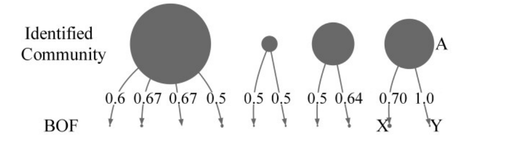

Figure 3. Mapping between identified communities and BOF meetings. Radius is proportional to number of developers.

relationships, we extract a developer network as shown in Fig. 2(b) indicating that developers who made comments on the same bugs are connected. We create weighted edges between developers by assigning a weight to each edge equal to the number of bug reports that the two developers have both commented on.

In the majority of open source projects (including Mozilla), bug reports are open to the public to encourage all users to report bugs and comment on the bugs. As a result, our developer network includes a large number of users who contributed to bug reports only a few times. While these contributions are of value to the community, we are most interested in examining the interactions of the core participants in the community - developers with direct code access and participants with a consistent history of activity working on bugs. To remove the “casual” users, we eliminate edges with a weight of only one or two. After this elimination process of edges, all nodes that no longer have any connected edges are removed from the graph. For example, after removing edges whose weight is equal or less than three and the resultant unconnected nodes in Fig. 2(b), we are left with the unweighted graph shown in Fig. 2(c).

We extracted 26 DSNs from 496,692 bug reports and 3,893,025 comments made by 106,123 developers in total. Six DSNs are extracted from different lengths of time, and the other twenty are extracted from a series of subsequent six month periods for examining DSN evolution. We provide detailed subject information analyzed regarding the different lengths of use in this paper in Table I.

### B. Identifying Communities

After extracting DSNs from bug reports, we identify communities. Understanding community structure is critical to understand the network [10] as it allows us to identify sets of developers who share the same interests and work on similar issues. To identify communities, we use the Louvain [11] algorithm which is widely used in the social network analysis literature [1]. Kwak et al. found that Louvain outperforms other community detection algorithms on most subjects [1]. The Louvain method is probabilistic and produces slightly different values of modularity for the same graph as the input ordering of nodes change [1]. To mitigate this issue, we generated 50 sets of the same data with randomly perturbed input orderings of nodes for every network and present all the results.

### C. Evaluation of Identified Communities

Once we have identified the communities in the DSNs, we need to verify that they reflect real divisions of developers into their communities. We validated the results in two ways.

First, we selected the developers with the highest node degree in the DSNs and examined the project to determine if these were leaders within the project. For example, we found that Gervase Markham, one of the highest degree nodes in our network, started to contribute to the Mozilla project in 1999 and is a leading developer in the Bugzilla project. Another example is Mike Beltzner, who is a famous Mozilla hacker. Gavin Sharp, another high degree node, is currently one of the most active developers in the Mozilla project. We verified 100 nodes in the network and found that all represented key Mozilla developers (they all made a large number of commits to the system and/or had a long history with the project, most spanning multiple years), validating that our DSNs do reflect reality.

Next, we evaluated the similarity between the identified communities in our DSNs and real offline developer meetings. We used the birds-of-a-feather (BOF) meetings in the Mozilla Summit 2010. BOF meetings represent communities in reality since developers that take part in those meetings are those that have an interest in them. Since these meetings were held only last year (2010), we identified developer communities in a DSN created from recent bug reports (Jul. 2009 to Dec. 2009).

The divisions on the top of Fig. 3 represent identified communities, and the divisions of the developers on the bottom represent BOF meetings. We measured how many developers overlap between real BOF meetings and identified communities. For example, community A in Fig. 3 consists of 70% of BOF X (the Thunderbird Fun/Product/Participation meeting), and 100% of BOF Y (the Thunderbird engineering/dev-process working session meeting). All of the developers from these two BOF meetings were placed in the same community by the Louvain algorithm. Since in Mozilla Summit 2010, they held many small BOF meetings, our identified communities include more than one BOF meeting. However the vast majority of BOF meetings belong to one community. This indicates that while BOF meetings may indicate a finer division of developers than our communities, our method rarely divides known groups of developers. We conclude that our identified communities reflect real groups of developers with similar interests and concerns. Furthermore, we consulted a Mozilla developer, Channy Yun, about our identified communities, and he confirmed that they reflect real Mozilla developer structures.

## III. DEVELOPER SOCIAL NETWORK VS GENERAL SOCIAL NETWORK

This section compares DSNs to various GSNs in various domains including Facebook, Cyworld, and Twitter by measuring commonly used social network metrics such as Power Law, Degree of Separation, Modularity, and Community Size. Basic information of all used GSNs are shown in Table II.

In addition, we compare DSNs extracted from different lengths of time, which include the most recent 1 month, 3 months, 6 months, 1 year, 2 years, 4 years (all ending in Dec. 2009). For brevity, we name DSNs extracted from different periods as length-DSN (e.g. 1-month DSN, 3-month DSN, … , 4-year DSN).

### A. Power Law

Various networks (e.g., WWW [18], social [6]) display a power-law node degree distribution, having only a few nodes with very high degree and a large number of nodes with low degree. When plotted on a log-log plot, a power law generally follows a straight line. This property of networks is indicative of the existence of a small number of “hubs” in the network that act as influential nodes and