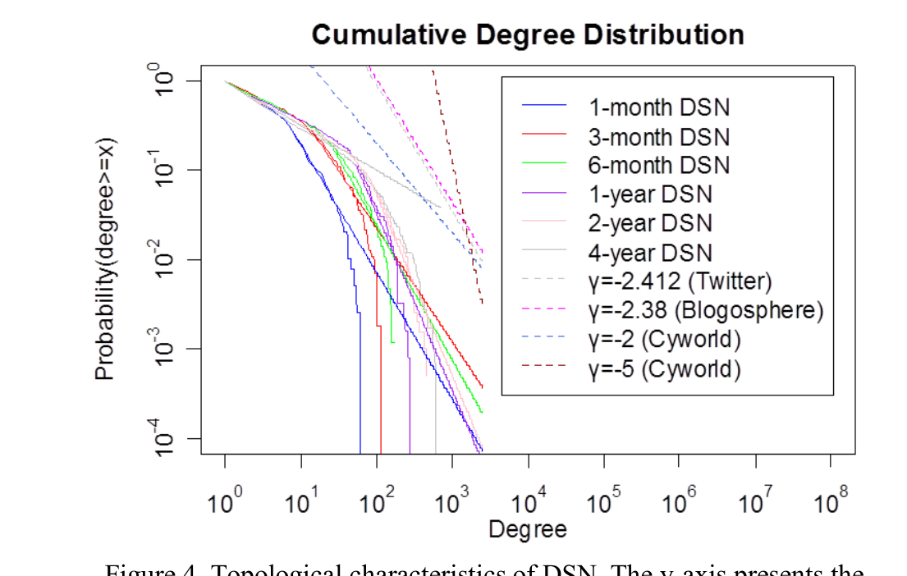
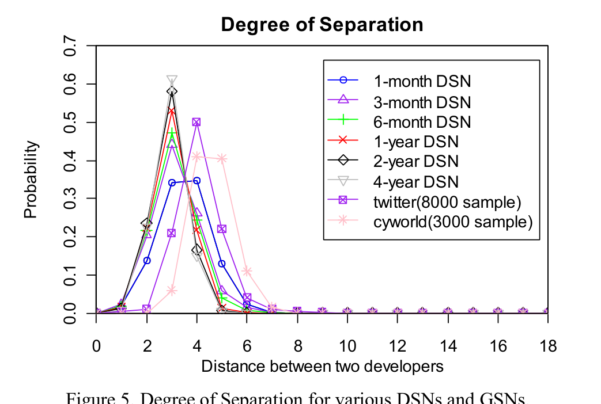

TABLE III. INFORMATION OF GSNs

| WWE | Twitter | Cyworld[5] | Cyworld[1] | Facebook | Amazon | FL | GL | Hugged |
| --- | ------- | ---------- | ---------- | -------- | ------ | -- | -- | ------ |
| # of nodes | 143736 | 87897 | 12048186 | 11537961 | 63730 | 409687 | 16800000 | 617864 | 116376 |
| # of edges | 707761 | 829247 | 190589667 | 177566730 | 817090 | 2464630 | 73300 | 277540 | 51343 |

Figure 4. Topological characteristics of DSN. The y-axis presents the complementary cumulative distribution function (CCDF), and the x-axis presents the degree of a node.

Information brokers and a large number of peripheral members with few connections [23].

We start our comparison of DSNs with GSNs by investigating the degree distribution. Most GSNs have a power law degree distribution with an exponent, r, between -2 and -3 [6]. For example, the exponent for blogosphere is -2.38 for the Weblogging Ecosystems Workshop collection [4] which attests the existence of key bloggers who have a high number of blogging friends. This also holds true for Twitter which has a power law distribution in both in- and out-degree with the same exponent -2.4. What is more interesting is that some networks like Cyworld, a famous large scale South Korean social network service, show two different scaling regions, a rapid decay (r ≈ -5) and a heavy tail (r ≈ -2) [5]. We applied the approach of analyzing power law distributed data introduced by Clauset et al. [24] to obtain the power law distribution exponent for each DSN. Based on the visualization in Fig. 4, we found that only a small portion of the curve can be fit to a power-law distribution. Therefore, we conducted the quantitative power law fit test introduced by Clauset et al. [24] to test whether the DSN degree distribution is different from a power law distribution to a statistically significant degree. The p-value, which is the likelihood that the DSN degree distribution actually does follow a power-law (the null hypothesis), was less than 0.1 for all DSNs in Fig. 4, indicating that none follow a power law distribution.

We therefore conclude that different from GSNs, DSNs do not have a power law degree distribution, irrespective of length of time. However, the degree distributions in DSNs have some properties similar to those in GSNs. DSNs also have a large portion of developers with low degree and a small portion of developers with high degree. Moreover the portion of high degree nodes is relatively small in DSNs.

0 2 4 6 8 10 12 14 16 18  
Distance between two developers

Figure 5. Degree of Separation for various DSNs and GSNs.

### B. Degree of Separation

Degree of separation, the shortest distance between any two nodes of a network, has become a crucial metric for analyzing the social structure ever since Stanley Milgram reported the famous “six-degrees of separation” experiment in 1969 [12]. With the emergence of social networks, degree of separation has been well studied in various social networks including Cyworld and Twitter [5, 6]. The total number of registered users in Cyworld was 12 million as of November 2005, when Ahn et al. reported that the average path length between 90% of nodes in Cyworld was less than 6 [5]. Kwak et al. found that the average path length of Twitter is 4.12 [6]. For 70.5% of node pairs, the path length is 4 or shorter and for 97.6% it is 6 or shorter.

Since the scale of DSNs is smaller than that of GSNs, we employed the Floyd–Warshall algorithm [13] to obtain the distribution of the shortest path length between any two nodes. Compared to the Breadth-First algorithm which is used in the Twitter and Cyworld analyses, the Floyd–Warshall algorithm is more efficient for smaller scale networks.

The average path length in DSNs varies from 2.9 to 3.4. The developers in 1-month DSN are farthest from each other. For 91.9% of pairs of nodes in it, the path length is 5 or shorter. In the rest of the DSNs, the path length is 4 or shorter for at least 90% of pairs of nodes. In addition, we see a slight downward trend in the average path length when the length of period increases. This result is not surprising. Although there are additional developers, there will also be many more connections in DSNs over time. Overall, the developers in DSNs are closer to each other than participants in GSNs such as Twitter and Cyworld.

Like GSNs, DSNs also have the so-called “small world” property which means most pairs of developers are connected within a few hops in the same way as pairs of participants in GSNs. Moreover, the average path length in DSNs is much shorter than that of Cyworld and Twitter. We speculate that this might be due to the fact that users on Cyworld and Twitter have a wider choice of topics while developers in DSN are restricted to participate in a narrower range of topics, therefore increasing the likelihood of shared interests.