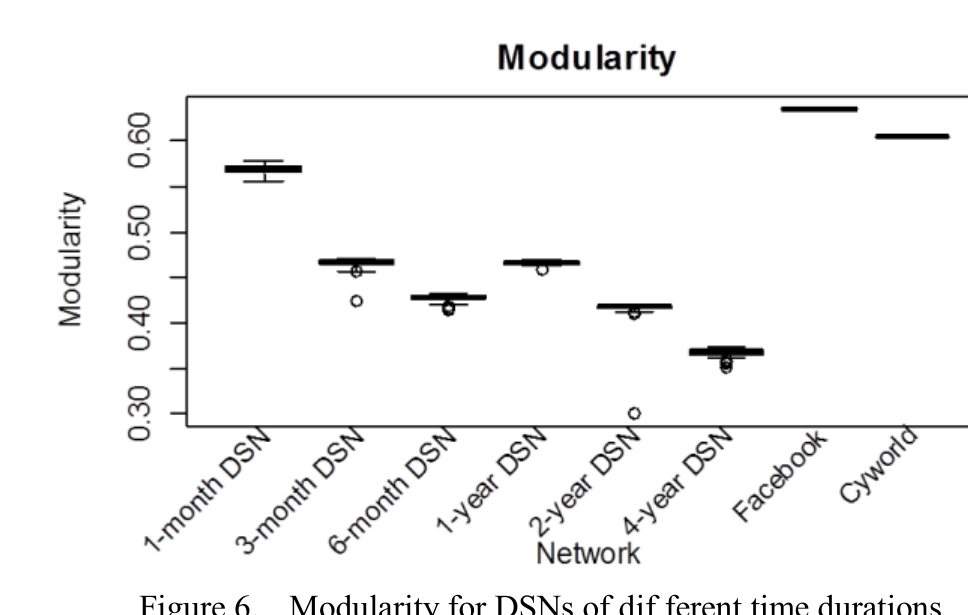
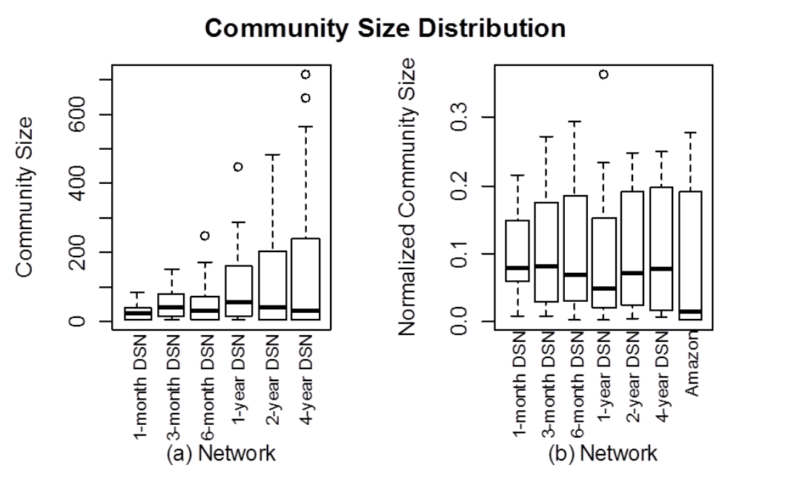

Figure 6. Modularity for DSNs of different time durations

### C. Modularity

Modularity, Q, is the standard measure [1, 3, 10, 11] used to quantify the strength of a community structure. Higher modularity indicates that there are clearly defined communities (teams) within the network. Modularity was introduced by Newman and Girvan in their original community structure paper [9] and for some partition of a graph into communities, its definition is:

Q = Σ_i (e_ii - a_i^2)   (1)

where e_ii is the proportion of the edges between nodes within community i over all edges in the graph, and a_i is the proportion of all edges that are attached to nodes in community i. When the value of modularity is 0, the community structure is no stronger than that of a randomly generated network; there are no communities within the network. The maximum value of modularity is 1. We employ modularity in an effort to understand the community structure of DSNs more easily. In our context, the modularity indicates if there is a clear division of the Mozilla developer population into teams or if the project is fairly integrated with developers coordinating on bugs in an unorganized fashion.

Kwak et al. [1] obtained the modularity of 12 social networks including Facebook and Cyworld, showing that except for the now famous Zachary’s Karate Club (a small network that has become a de facto benchmark in community structure work), social networks have significant community structure since their values of modularity are all above 0.3 [6]. In practice, 0.3 is a threshold above which a naturally occurring network is said to be highly modular [9].

In this section, we examine whether DSNs have as strong a community structure as other GSNs by applying the Louvain algorithm on all DSNs in Fig. 6. As mentioned in Section 2.2, Louvain produces slightly different results on the same network with different input orderings of nodes, so we examined the results for 50 different orderings for each subject DSN. Overall, modularity values are always above 0.3 for the DSNs. With the length of time period increasing, the modularity shows a fluctuant decrease. The highest modularity was obtained in the 1-month DSN, where the median value was 0.57.

We conclude that similar to GSNs, DSNs have significant community structure, as reflected by their modularity.

### D. Community Size

Figure 7. Community size distribution. Normalized community size is measured in terms of proportions of all nodes in the graph since Amazon is much larger.

Within a network with community structure (i.e. high modularity), the community size refers to the total number of nodes within a community. The community size is a key quantitative characteristic of community structure in a network as it indicates if communities are disparate or uniform in their division of a network [17].

Nazir et al. [7] compared the community sizes of three game applications in Facebook: Fighters’ Club (FC), Get Love (GL), and Hugged. All three games have more than 10,000 users. The biggest community for FC accounts for 72.6% of the total users, while the biggest communities in GL and Hugged account for less than 10% of the users. They also found that FC has a biased distribution of community size, but communities from both GL and Hugged have similar wider community size spreads.

Similarly, Clauset et al. [8] studied the community size in the Amazon.com network which has more than 400,000 users. The biggest community accounted for 28% users of the entire network. They found that the community size distribution of Amazon.com network follows a power law. Following a similar methodology, we measured the community sizes of DSNs in different length of periods ranging from 1 month to 4 years. Again, we ran the Louvain algorithm 50 times dividing the DSNs into sub-communities and computed the sizes of communities in the division for each DSN.

Fig. 7(a) shows the inter-quartile box-plots of the community size distributions. The sizes of the communities are small regardless of the length of time period. For instance, the biggest communities in 1-month and 4-year DSNs only have 83 and 718 developers respectively. The biggest community of the DSNs accounts for 21% ~ 36% of the users and the ten biggest communities account for more than 99% of the users for all DSNs. The community size median is small and varies from 23 to 55. The distributions of community size display a similar property to a power law distribution, with a few big communities but many small communities.

A DSN has many similar characteristics to a GSN in terms of community size. First, several big communities account for almost all users in the network. The ten biggest communities account for 87% of users in Amazon.com while that accounts even more in DSNs. Second, the biggest community accounts for similar percentage of users, 28% in Amazon, 21%~36% in DSNs. Fig. 7(b) plots the size distribution of the ten biggest communities after normalizing by the total size of the network. The distributions are surprisingly similar despite the fact that they differ in size by orders of magnitude.