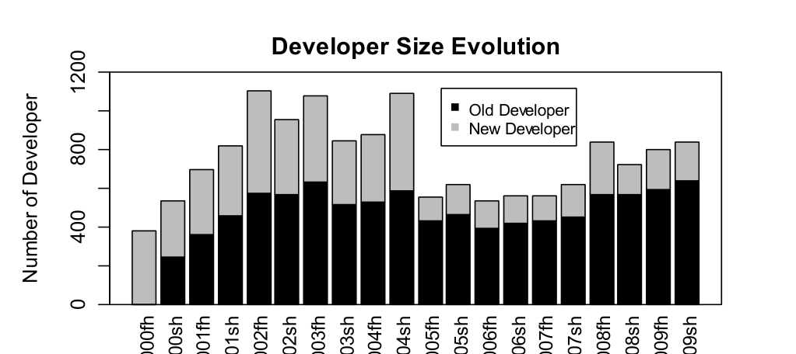
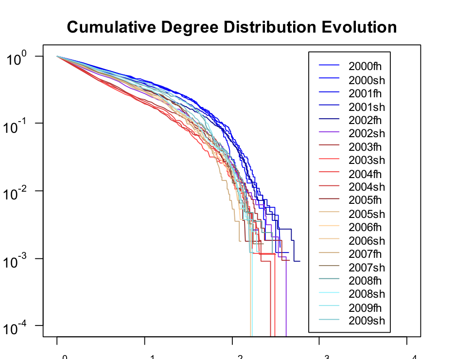

Time  
Figure 8. Number of active developers over time

Degree  
Figure 9. Degree distribution of DSNs over time

## E. Analysis Summary

We summarize the DSN analysis results.

- Unlike GSNs, DSNs do not follow a power law degree distribution. However, DSNs do have other similar properties to GSNs such as having a large portion of nodes with low degree and only a small portion of nodes with high degree.
- Similar to GSNs, DSNs also have the small world property of low degree of separation. However, DSNs have a “smaller” world property.
- DSNs and GSNs both have strong community structure, with modularity values above 0.3.
- The size of communities in DSNs is small compared to that in most GSNs. We also find that DSNs have a widespread community size distribution and their biggest community accounts for 21% to 36% of the total developers.
- Regardless of time period (except 1-month DSN), DSNs have very similar social network properties including degree of separation, modularity, and community size. In addition, we found that the 6-month DSN is a representative of all time durations beyond 6 months.

## IV. DEVELOPER SOCIAL NETWORK EVOLUTION

We have characterized the differences and similarities of DSNs to GSNs. In this section, we turn to an examination of the evolution of social network properties over time. Here we are also only interested in participants with a consistent history of activity working on bugs.

### A. Identifying the Length of Unit Period

The first step in observing DSN evolution is to decide the basic time period unit. We can observe DSN changes for every month, every year, etc. Based on our observations described in Section 3.5, we use 6 months as a representative period and observe how the DSN changes every 6 months. In our figures, we divide each year into first half of the year (using an “fh” suffix) and second half of the year (“sh”).

### B. Developer Changes

We first observe developer changes. Fig. 8 shows the number of new developers and old developers for every 6 month period. For each column, the gray bar indicates the number of developers that are new in that time period and black, the number of developers active in this time period that have been active in an earlier time period. The total number of developers falls into the range of [500, 1200] except for the first period (i.e., the first half year of 2000).

We also observe that the total number of developers increases until 2002. After that, there is a sharp fall-off around 2004 dropping from 1,093 developers to 533. Fig. 8 also shows new developers continually joining the DSN. From 2000 to 2004, new developers account for more than 39% of the developers in the DSN. Fig. 8 shows a similar sharp fall in the percentage of new joining around 2004. We have found evidence that this is related to the Firefox 1.0 release in September 2004. A number of influential developers who developed Netscape/Mozilla left the community soon after. For example, Blake Ross, a core developer, began his new company after the release. Similarly, a few core developers including Ben Goodger and Katsuhiko Momoi joined Google in 2005. We define a “core” developer to be someone that has direct source code commit privileges, contributes non-trivial amounts of code to multiple parts of the system, and has been active in the community for a period of years. We note that these developers who had an influence on the community also had corresponding high degree in the DSN and were important members of their communities, indicating that these social network measures are indicative of real world impact.

From the above observation, we find that the behaviors of influential people often affect other developers in the DSN. The drastic drop in total number of developers in the DSN may be due to the departure of these influential developers.

### C. Degree Distribution Evolution

We also observe the evolution of degree distribution since the degree distribution is a key property of a network (e.g. indicating if a small number of developers play a disproportionately important role). As we did in Section 3.1, we also tested the power law distribution hypotheses for all DSNs in Fig. 9. The p-values for 14 DSNs are less than 0.1 while for the other 6 DSNs the p-values are greater than 0.1, indicating that over two thirds of the DSNs differ from GSNs in that respect. For those which were not statistically different from a power-law, their large p-values might be due to lack of enough sample data [24]. Although DSNs do not display a power law degree distribution over time, they always have a large portion of nodes with low degree and a small proportion of nodes with high degree over time.