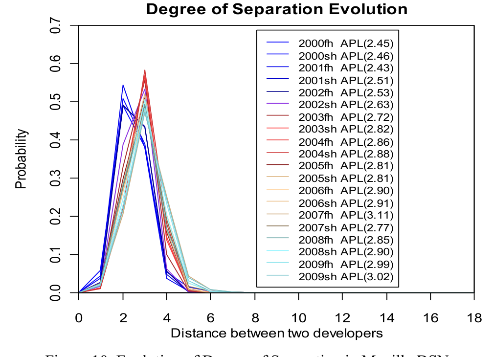
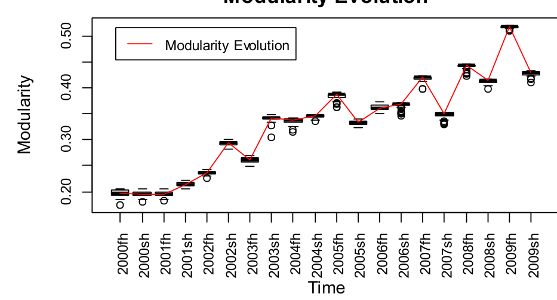
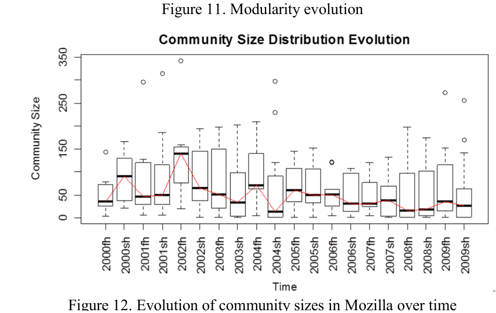

## Degree of Separation Evolution

Distance between two developers  
Figure 10. Evolution of Degree of Separation in Mozilla DSNs  
Degree of Separation Evolution

Figure 10. Evolution of Degree of Separation in Mozilla DSNs

### D. Degree of Separation Evolution

Fig. 10 shows the degree of separation evolving over periods. Overall, the average path length increases slowly from 2.45 to 3.02 over the 10 years. Although the distance between developers increases a small amount over time, developers are always quite close to each other in the DSNs. More than 93% of pairs of developers are within four hops of each other over the whole time period. We conjecture that the small increase is due to the large amount of newly incoming bug reports (e.g., on average, 24,964 per period). Over time, the rate of bug reporting and commenting has increased. However, there is no such increase in the number of developers every period. The probability of two developers commenting on the same bug report at random decreases over time, which might lead to the increase of average path lengths. This is true for all but three periods: the first half year of 2001, 2005 and 2007. In conclusion, the increase in average path length is small and oscillates within a very narrow range above 2.7 after 2004. Thus, we consider it fairly constant over the long term (i.e., the average path length approaches a fairly stable level).

### E. Modularity Evolution

We next examine modularity within the DSNs. Fig. 11 presents boxplots of the modularity for each period which consists of 20 experiments, each containing 50 runs with perturbed input node order. It displays a fluctuant increase in the modularity over periods from the first half year of 2000 to the second half year of 2009. The lowest modularity value is 0.20 (e.g., median of modularity values obtained from 2000sh-DSN) while the highest modularity value is 0.52 (e.g., median of modularity values obtained from 2009fh-DSN). All DSNs extracted before June 2003 have a modularity value below 0.3 indicating a more integrated community [8]. In contrast, the modularity values of all DSNs obtained after July 2003 are above 0.3 and we see a general upward trend over time, implying that the community has split into more well-defined teams over time.

We observe that the modularity increases over time. Since there is no mandated structure, the organization of the project and architecture of the code may be somewhat volatile as the project gradually and organically converges to a stable and accepted structure. Baldwin [21] found that the restructuring of the Netscape codebase (from which Mozilla originated) had both architectural (the code became

#### Modularity Evolution

Figure 11. Modularity evolution

Figure 12. Evolution of community sizes in Mozilla over time

Figure 12. Evolution of community sizes in Mozilla over time

more modular) and organizational (more newcomers began joining the project) impact afterwards. In addition, the Mozilla Foundation, which exists to support and provide leadership for Mozilla project, was officially launched on July 15, 2003. This likely contributes to the increase in modularity after 2003. Overall, we conclude that DSN modularity shows a clear increasing trend, indicating that teams are becoming more well-defined within the Mozilla project.

### F. Community Size Distribution Evolution

Fig. 12 presents the community size distribution evolution over 10 years starting from 2000. The biggest community accounts for 20%–43% of the developers in the DSNs, and the size of the median community falls into the range [14, 141] fluctuating over time instead of increasing or decreasing.

Based on this observation together with the fact that the total number of developers in DSNs for each period is less than 1,200, the community sizes in the DSNs are generally small (most below 75 members), with few changes over time. We see much more variance at the beginning of the project, when developer turnover was higher, than we do in the latter half of the project. We conclude that although community sizes initially were quite unstable, they have remained fairly consistent over the last 5 years. Again, this confirms that a team structure is apparent in the Mozilla project.

### G. Analysis Summary

We summarize the conclusions from our evolution analysis below:

- The sharp change of the developer numbers around 2004 implies a big adjustment in Mozilla following the Firefox 1.0 release. Afterwards, the number of active developers is stable over time.