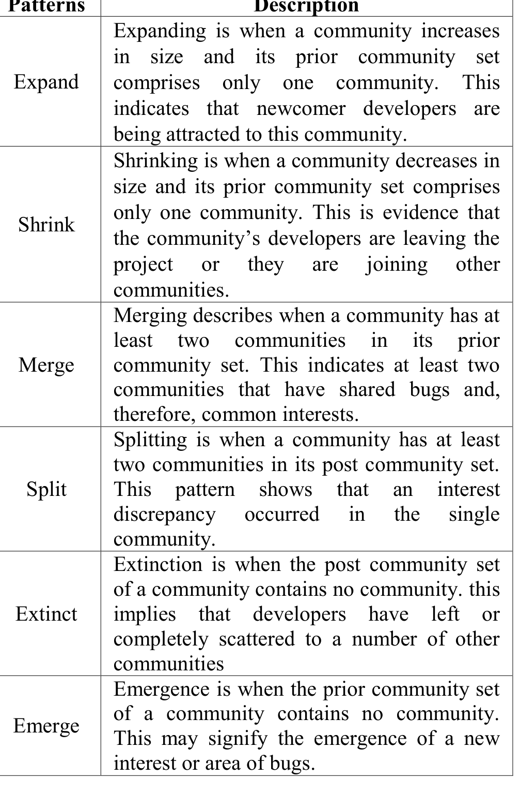

- DSNs have a large proportion of nodes with low degree and a very small proportion of nodes with high degree over time.
- In DSNs, the average path length slowly increases over time, but never grows to the size of GSNs, as over 90% of pairs of developers remain connected within three hops.
- The modularity of DSNs increases steadily over time, indicating communities that become more tight-knit.
- DSN communities are usually small without notable size change over time.

## V. COMMUNITY EVOLUTION

In this section, we change our focus to examine how the communities within the Mozilla DSNs evolve over time.

### A. Community Evolution Patterns

Lin et al. [2] proposed a community evolution taxonomy including five patterns: derivation, merge, split, extinct, and emerges. We refined these patterns and added interpretation of each pattern in the context of DSNs in Table III. We identified all of these patterns in the community evolution for the DSNs as shown in Fig. 13.

### B. Evolution Map

To observe community evolution, we need to trace communities over time. To this end, we use community similarity between two consecutive periods. Given a set of communities C(p) = {C_k(p)} in time period p for k = 1..K, where K is the number of communities in period p, we first compute the percentage of common nodes over the size of the smaller community for all possible pairs of communities. This is to determine which communities in the next time period are similar in makeup to each community in the current time period. Then we determine the closest community set {C_k*(p + 1)} for each C_k(p) by setting a threshold ε = 0.3 to filter out irrelevant communities. We refer to such a community set as a post community set of C_k(p). Similarly, we refer to the closest evolution community set {C_k*(p − 1)} as the prior community set of C_k(p).

Each node in Fig. 13 represents a community, and each edge represents an evolution relationship between two communities. For example, an edge starting from community A and directed towards community B indicates that community B evolved from community A. In Fig. 13, communities detected in the same half year are aligned horizontally.

Overall, there are far more isolated nodes before 2005 than after, which indicates that more communities had weak stability before 2005. This might be due to lack of organization of developers. Firefox is arguably the most successful of the Mozilla projects and its 1.0 release was in September 2004. Mozilla Thunderbird made its 1.0 release soon after, in December 2004. This is consistent with our earlier developer evolution analysis, where we saw that developer turnover decreased dramatically after these releases. We examine several representative paths shown in Fig. 13.

Firefox (the bold_unfilled_circle path). The Firefox path in Fig. 13 shows the communities that contain several known Firefox developers including Gavin Sharp, Mike Beltzner, Ria Klaassen, and Mike Conner. These four

### TABLE III COMMUNITY EVOLUTION PATTERNS AND THEIR IMPLICATIONS ON DSNS.

| Patterns | Description |
|---|---|
| Expand | Expanding is when a community increases in size and its prior community set comprises only one community. This indicates that newcomer developers are being attracted to this community. |
| Shrink | Shrinking is when a community decreases in size and its prior community set comprises only one community. This is evidence that the community’s developers are leaving the project or they are joining other communities. |
| Merge | Merging describes when a community has at least two communities in its prior community set. This indicates at least two communities that have shared bugs and, therefore, common interests. |
| Split | Splitting is when a community has at least two communities in its post community set. This pattern shows that an interest discrepancy occurred in the single community. |
| Extinct | Extinction is when the post community set of a community contains no community; this implies that developers have left or completely scattered to a number of other communities. |
| Emerge | Emergence is when the prior community set of a community contains no community. This may signify the emergence of a new interest or area of bugs. |

Firefox developers eventually reached prominence and their node degrees were all among the top 10. They appear in communities along the path that of bold outlined circles, based on our conjecture that this path characterizes the activity of Firefox.

Bugzilla (the gray_filled_circle path). The Bugzilla path is long lived, evolving from 2001 to 2009. According to our observations, this path displays the evolution of the Bugzilla project. There is one short branch starting from the second half of 2008 which comprises the black filled circles. This short branch is related to the development of the Camino project.

Rhino (the dashed path). The sizes of all communities along this path are small. Based on the activities of developers in this path, we deduce that it is related to the development of the Rhino project. Norris Boyd, Rhino’s creator, appears in most of these communities.

Security (the shadow_circle path). This path represents the evolution of the security community as many active developers in this path are members of the security group. There are a few branches that connect to this path, implying that developers in this group are also interested in other projects. This result is consistent with the fact that security is an issue affecting all projects.

We use several community evolution instances in Fig. 13 to illustrate whether the patterns observed reflect reality. The Expand instance labeled in the Firefox path coincides with the 3.0 release of Firefox on June 17, 2008. Many