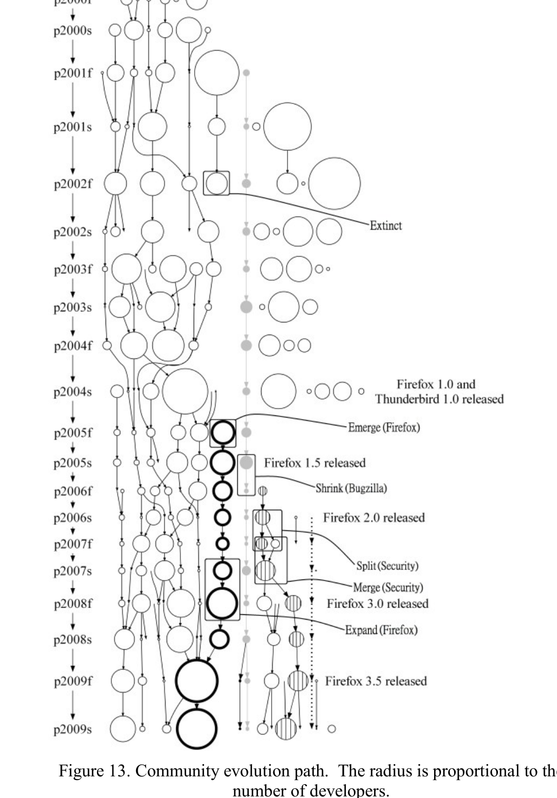

Some of the interesting findings made during our analysis include:
- The community evolution in the DSNs contains all five patterns found by Lin et al. [2].
- The community evolution in DSNs displays various paths which correspond to historical evolution of various subprojects in Mozilla and activity of core developers in Mozilla’s history.
- At the beginning of an open source project the communities are fairly dynamic, but we observe that as time progresses, developers tend to “settle down” into fixed groups.

## VI. THREATS TO VALIDITY

Here we enumerate possible threats to validity in our study along with methods used to mitigate these threats.

In order to remove casual users, we removed nodes with edge weights of only one or two. We use this as indication that they do not have high levels of activity and are not key members of the community. While this means that we remove some members from our analysis, their low connectivity implies that these participants have little impact on the properties of DSNs that we have examined.

We also tried to determine a suitable length of time for observing the DSNs by inspecting four metrics: power law, degree of separation, modularity, and community size. While it is possible that different time periods may yield different results, we cover a comprehensive range of time periods.

Next, we examined some paths in the community evolution of the DSN and made the connection between these paths and both core developers and actual events by analyzing basic information of related bugs, checking information from Mozilla’s website, and consulting developers in Mozilla. While it is possible that this evaluation may miss some key events, this method has been used frequently in the past with positive results [10].

In this work, we have only conducted analysis on the Mozilla project. We chose Mozilla because it is mature, large, considered successful, and has been well studied in prior research, allowing the reader to integrate our results with the findings of others. It is possible that these results on Mozilla may not generalize to other developer social networks. However, our methodology for analysis could easily be used with other projects such as Eclipse.

Figure 13. Community evolution path. The radius is proportional to the number of developers.

## VII. RELATED WORK

There has been prior work on analyzing the static and dynamic properties of various networks. Due to space constraints, we survey the work related to our own.

Crowston and Howison [15] built social links between developers based on their co-occurrence information in bug reports. Their work aims to study the communication centralization problem in OSS teams. Our study also used the co-occurrence information of developers in bug reports to build social networks among developers. However, we aim to study both static and dynamic global properties of DSNs. Additionally, the scale of the subject used in our work is much larger than theirs.

Bird et al. [16] extracted social networks from mailing list archives and empirically studied the differences between developers and non-developers from a social network metrics perspective. They also investigated the correlation between development activity and social network status of developers. In later work [10], they identified the community structure from the same social networks and demonstrated that their division of project was representative of the collaboration behavior of developers in OSS projects. Our work is complementary to this study by examining the community evolution patterns in DSNs and observing the individual community evolution paths. Additionally we conducted a study of the static properties of DSNs over periods of different lengths of time in an effort to determine valid time durations for studying the dynamics of DSNs.

Lo et al. [5] extracted high-level statistics and detailed topological graph patterns from a developer collaboration network extracted from SourceForge.Net. Although we