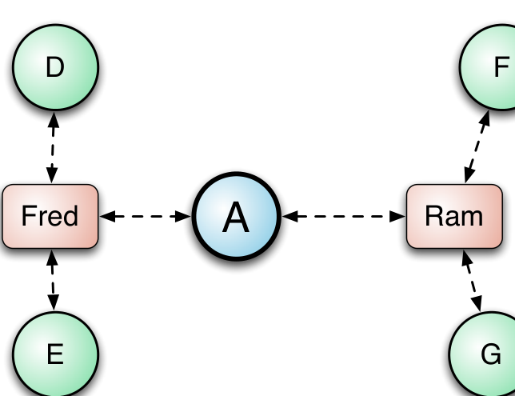
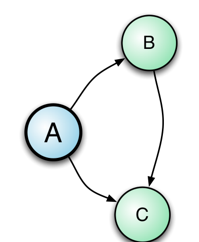
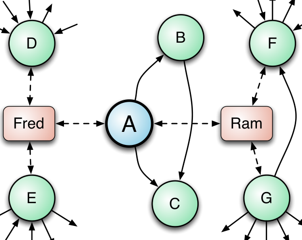

(a) Contribution Network

(b) Dependency Network

(c) Socio-technical Network

(a) Contribution Network (b) Dependency Network (c) Socio-technical Network
Figure 1: Examples of software component networks. Circles denote components and rectangles, developers. Solid lines are directed dependencies and dashed lines are undirected and represent contributions.

Formally, we define this network as follows. Let S be the set of software components, and D be the set of developers that made commits to the source code for these components. The contribution network is then G_c = (V_c, E_c) where the vertices are V_c = D ∪ S and E_c ⊂ D × S is the set of edges such that (d, s) ∈ E_c if developer d contributed to software component s. Edges are weighted based on the number of commits made to a software component s by a developer d. Note that edges in this graph are undirected to allow for paths flowing in either direction, since developers act as “bridges” between components. The contribution network for our example software system is depicted in figure 1a. More specifics are given in [2].

If two components have the contributions from the same developer, then the components have “shared authorship”. The contribution network captures shared authorship between components, and thus, in a sense captures shared expertise between components. If Ram authors two components, A and F, then he represents a person who has knowledge and responsibility of both A and F. Components with many connections are those which share authorial responsibility with many other components; such components might share many cross-cutting concerns [16] with other components. Components that are on many paths in a network but have a low number of connections are likely to lie on organizational boundaries. These are not subject to a high level of shared authorship, but mediate between others that have highly shared ownership. Such components represent critical bottlenecks for expertise flow; they might also be locations where organizational boundaries are crossed, and thus be loci for communication breakdowns or bottlenecks.

### Dependency Networks

A dependency network models the dependency relationships between the software components within the system. Figure 1b shows a simple dependency graph. We use the software component dependency relationships as applicable for the domain, language, and granularity of the system (e.g.

(e.g. call graphs, class inheritance or coupling in ECLIPSE, library type and function dependencies within Windows Vista). We refer to this graph as the dependency graph and denote it formally as G_d = (V_d, E_d) where the vertices V_d is the set of software components and E_d ⊂ V_d × V_d is the set of directed edges, such that (v1, v2) ∈ E_d if component v1 has a dependency on v2. The example shows a system in which both A and B are dependent on C and A is also dependent on B. We refer the reader to prior work ([4]) for more detail regarding the construction of these networks.

A pure software dependency graph (such as a call graph, or a systems dependence graph) captures flow of information and/or control within a large system. In such a graph, the strength and degree of a component’s connections to its immediate neighbors (a local property) indicates how strongly it is coupled with other components. This can be expected to influence the degree to which a component is defect prone. Likewise, high closeness centrality (a measure of the average distance of a component to every other component) might indicate that a component is in the “core” part of the system.

### Socio-Technical Networks

Prior work [2], [11], [3], [4] indicates that the likelihood of a component to fail is strongly related to its topology in networks based on different types of relationships. In fact, the above two networks capture different types of phenomena that might lead to defect introduction and defect importance.

In an effort to understand the differences between the different prior network based approaches, we implemented predictive models based on dependency and contribution networks and performed a manual inspection of the defect-prone software components that were misclassified by both models. Figure 1 illustrates a common scenario that we encountered. Component A represents a defect prone component that was not identified by either approach. Figure 1b shows that the dependency network is small, with A having two dependencies and no dependents. In addition, Figure 1a