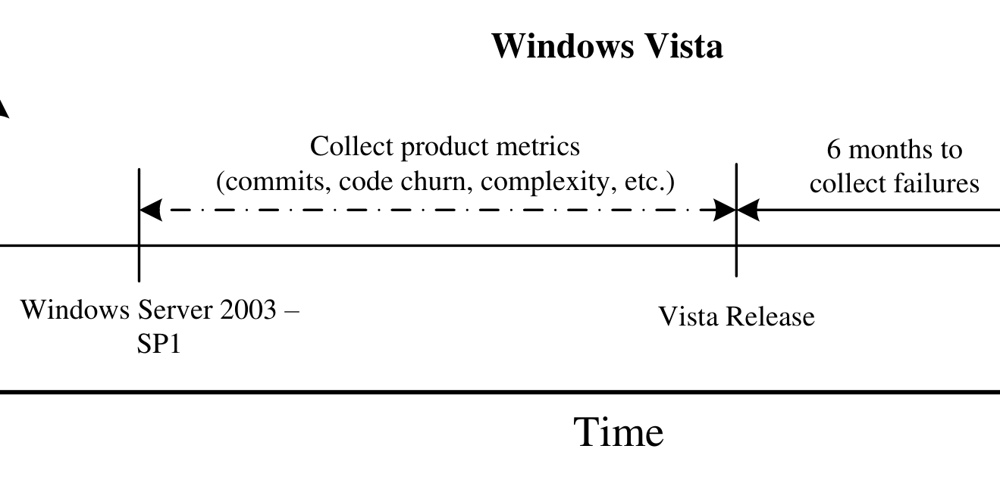

Figure 2: Timeline for Windows Vista data collection

systems. We use post-release failures because they are the most problematic. They clearly were not identified by pre-release inspection, testing or analysis tools, directly affect end-users, and are the most expensive to correct. Both systems have a long development history with large software teams. In addition, each can be decomposed into a system of software components: binaries (exe's, dll's, etc.) in the case of Vista and plugins for ECLIPSE. However, there are important differences between these projects.

### Process Differences:
Although backed by IBM, ECLIPSE is an open source project (and thus represents an OSS-hybrid project [19]) which accepts contributions from volunteers. These unpaid volunteers can be assigned tasks. However, there are no monetary or employment repercussions for not performing tasks (though there are "reputation" repercussions). As an open source project, most developers communicate via written electronic channels such as IRC, mailing lists, and a bug tracking system. Developers can come and go at will. Vista, on the other hand, is developed completely in-house at Microsoft. The software teams that developed Vista were clearly delineated and largely static. In addition, most software teams are geographically collocated and therefore enjoy face-to-face interaction.

### Domain Differences:
Windows Vista is an operating system. Thus it performs tasks ranging from low-level operations such as scheduling read sequences for hard disks to high-level operations such as displaying error messages to users. ECLIPSE is a Java integrated development environment and has a narrower range of functionality, although it ranges from static analysis and dynamic compilation to graphical user interfaces and source code management network protocols.

### Language Differences:
The majority of ECLIPSE is written in one programming language: Java. While mostly portable via use of the JVM, ECLIPSE still needs to deal with multiple platforms (Linux, OS X, Windows). Windows Vista is a combination of C, C++, assembly and .NET managed code (mostly C#). As an operating system, it runs directly on the hardware, but does support a variety of hardware devices and configurations.

### Similarities:
Both software systems are extensible. The ECLIPSE architecture is very flexible and allows developers to add functionality in the form of plugins which are dependent on base functions performed by the core ECLIPSE code. Hardware vendors and third parties extend Vista through the development of drivers, additional libraries, and binaries, all of which are also dependent on core functionality provided by the operating system.

### Data collection: Windows Vista
We use a binary as the level of granularity for software components in Windows Vista. A binary is an executable (.exe), a library (.dll), or a driver (.sys). Vista comprises over 4,000 binaries. Microsoft collects software failure data at the granularity level of binaries.

Our Windows Vista development data is drawn from the Vista source code repositories for all activity prior to release. A few thousand engineers contributed to the source code for Windows Vista during the development phase. We do not include changes to non-source portions of source files that are updated for building.

We measure post-release failures, on a per binary basis, for the six months following release, as shown in figure 2. We also identify dependencies between binaries in Vista. Microsoft has developed an automated tool called MaX [20] that tracks dependency information at the function level, including calls, imports, exports, RPC, COM, and registry access. We used MaX to generate a system-wide dependency graph from both x86 and .NET managed libraries. We lift the dependencies from the function level to the binary level because our measure of failures is mapped to individual binaries.

### Data collection: ECLIPSE
We mined development, dependency and defect data from the ECLIPSE project spanning from 2001 to 2008. We focus on the 6 major releases for which we have complete pre-release development data and post-release bugs for (2.0–3.3). The CVS logs contain the developer contribution data used to construct the contribution network. We also gathered defect data in the form of bug records from the ECLIPSE bugzilla database and "linked" bugs to their source code.