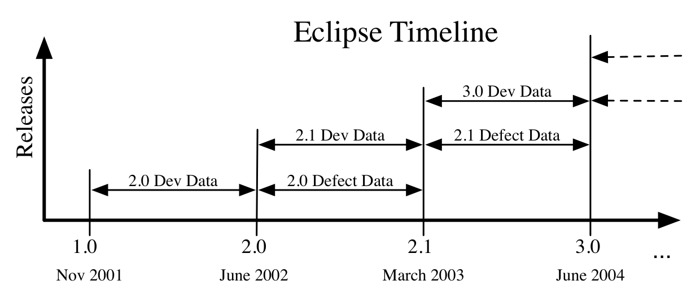

Figure 3: Data collection timeline for ECLIPSE

introduction by using techniques such as examining the log messages to find bug fixing changes [21]. We restrict the set of bugs to those that were opened after the release date for each release. As shown in figure 3, for each release R_i, we examine the development activity from the date of release for R_{i-1} to the date of release for R_i.

We use plugins as the level of granularity for software components (specifically, jars within plugins, as some plugins are composed of multiple jars) in ECLIPSE because the quality of the defect data is not as reliable at the source file level due to the low number of defects that most source code files have. In addition the majority of bug fixes are tied to multiple source files, but the same plugin. The number of plugin jars per release ranged from 90 in 2.0 to 250 in 3.3. We used only the plugins that are part of the ECLIPSE project and exist in the ECLIPSE CVS repository.

We obtained the source files for each of the releases from the public ECLIPSE CVS repository and used the static analysis tool Understand from SciTools1 to identify program dependencies. The dependencies are determined at the class level, and we use a mapping from classes to files and then to plugins to determine plugin dependencies. A class A may depend on a class or interface B if A inherits or implements from B, has a field of type B, calls a method in B, imports B, or creates an instance of B.

We calculate the dependencies between all classes in ECLIPSE and then lift the dependencies to the plugin level. We used UCINET [17] to calculate each of the social network analysis measures described in section 3.2 on the contribution and dependency data collected for Windows Vista and each ECLIPSE release in our study.

## 5. Methods and Analysis

In this section, we describe our data collection methods and analysis techniques.

### 5.1. Logistic Regression

We used logistic regression to examine the relationship between social network analysis metrics and post-release failures. Logistic regression is used to produce an estimated probability that a binary dependent variable will have a particular value. In our case, we categorize binaries into failure prone and not failure prone based on their number of post-release failures. We use social network metrics as predictor variables in the logistic model to predict if a binary is failure prone or not. One of the problems encountered when using network metrics within the model is multicollinearity. Use of logistic regression with multiple predictor variables makes an assumption that the predictors are all independent. In practice, we found that some measures have high levels of correlation. For instance, many binaries with high betweenness also have high degree. Unconstrained use of correlated predictor variables in regression models results in highly overtrained models with low quality parameter estimates and poor predictive power on new data [22].

We use principal component analysis (PCA) [23] to rectify this problem. PCA transforms the predictors’ values for the set of training observations into a new set of observations in orthogonal dimensions (principal components) with no covariance. Each principal component is a linear combination of the predictor variables and the components are ordered by the amount of variance in the initial predictors that they capture. To avoid overfitting, we use only the minimum number of principal components that capture 95% of the variance in observations.

We train logistic models using four data sets for each software system: measures on the dependency network, the contribution network, all of the measures from both networks, and the measures from the socio-technical network.

We evaluate the ability of network measures to identify failure prone software components in two ways. As with prior work, for a particular software system, we randomly select two thirds of the software components to train the logistic prediction model. The model then predicts which of the components in the remaining one third are fault prone and the predictions are evaluated using the standard information retrieval (IR) measures of precision, recall, F-score, and ROC curve [24]. This procedure is repeated 50 times with different random splits and the mean of each IR metric is reported. We can determine if one data set yields better predictive power than another for a particular software system by performing a standard t-test on the IR results for both data sets.

In practice, it is not possible to use a predictive model in this way because it requires that you already have the

1. http://www.scitools.com/products/understand