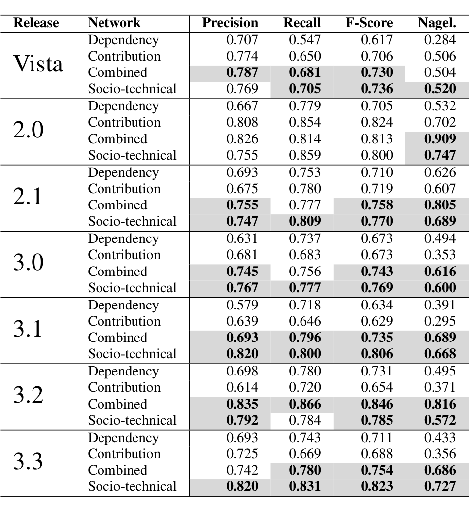
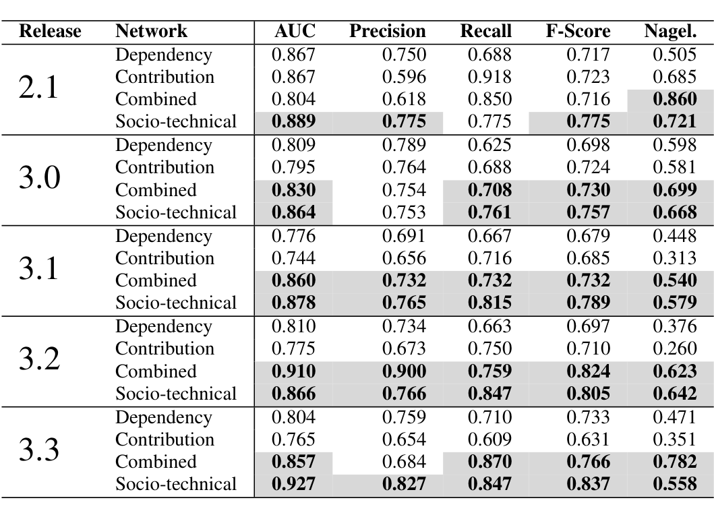

Table 2: Results of 50 random splits on one release. Bold values indicate that they are higher than the contribution and dependency networks to a statistically significant degree.

classification of two thirds of the software components and that the two thirds represent a random sample. Rather, one would expect to train a fault prediction model on one release of a software system to predict the failure prone binaries in the next release. The data from six releases of ECLIPSE can be used to evaluate our approach in exactly the way that a practitioner would use it.

### Evaluating Regression Results

We use five IR measures to assess the quality of the predictive models: precision, recall, the F score, Nagelkerke coefficient of determination, and area under the ROC curve. All measures range from 0 to 1 with higher values indicating better performance.

Precision quantifies the type I errors by measuring the proportion of binaries that were classified as failure prone that actually were observed to be failure prone. Precision is calculated as follows:

truepositives  
Precision = truepositives + falsepositives

Recall measures the proportion of binaries that are actually failure prone that are classified as failure prone (type II errors). This is calculated as:

truepositives  
Recall = truepositives + false negatives

These two measures present a tradeoff as it is possible to sacrifice one to improve the other. A traditional method of assessing both precision and recall is the use of a metric known as the F score. It is calculated as the harmonic mean of the precision and recall for a particular model.

F score = 2 · precision · recall / (precision + recall)

Table 3: Results of training a model on data from release r−1 to predict failure prone components in release r.

Nagelkerke coefficient of determination for a logistic regression is similar to the R2 coefficient of determination in a linear regression model in that it measures explained variation and predictive discrimination.

Area under ROC curve (AUC): Receiver operating characteristic (ROC) curves are a non-parametric way to evaluate 2-class discriminant models. The curve plots the true positive rate against the false positive rate. The ideal discriminant has a 100% true positive rate, a zero false positive rate; random guessing essentially yields a diagonal line. The area under this curve (AUC) provides a measure of the quality of the discriminant function. For more details, see [25].

## 6. Results

We now discuss the results of using the above described analysis on our data.

In order to compare the predictive accuracy of the metrics, we calculated the values of recall, precision, F score, and Nagelkerke coefficient of determination for logistic regression on 50 random splits on each model for Vista and ECLIPSE. Table 2 shows the averages for each of these values per model. Bold values indicate that a Wilcoxon test found the values for that model to be statistically higher than the dependency and contribution models at the p < .05 level. P-values were adjusted using Benjamini Hochberg adjustment for multiple hypothesis testing [26].

### Vista Results

For our analysis on Windows Vista, both the combined and socio-technical models have better recall than the dependency and contribution models. This indicates that they have a lower false negative rate, i.e. are able to detect failure prone binaries better. Only the combined model has statistically significantly higher levels of precision. The socio-technical model has a similar number of false positives, i.e. non-failure prone binaries that are classified as failure prone, as the contribution model. In addition the F score of the