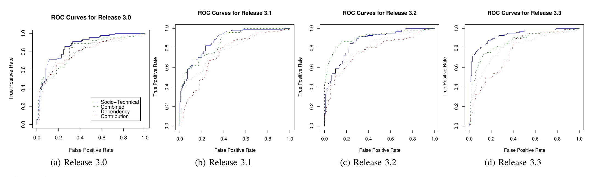

(a) Release 3.0 (b) Release 3.1 (c) Release 3.2 (d) Release 3.3  
Figure 4: ROC curves for prediction models trained on data from release r−1 to predict failure-prone components in release r. The blue solid line is Socio-technical, green dashed line is Combined, red dot-dash line is Contribution, and black dotted line is Dependency.

combined and socio-technical models both exceed that of the dependency and contribution models. Lastly, the Nagelkerke coefficient of determination is higher in the socio-technical model. This indicates that the socio-technical model best captures the variance in the number of post-release failures in the binaries. We note that neither the dependency network model nor the contribution network model were superior to either the combined or socio-technical models for any of the evaluation metrics.

The recall for the combined and socio-technical models in Vista exceeds the previous work by 3% and 5% respectively which is substantial given the thousands of binaries that shipped in Windows Vista.

Based on these findings, we conclude that in the case of Windows Vista, hypotheses 1 and 2 are supported.

### ECLIPSE results

The results for our random splits within ECLIPSE are also shown in table 2. With the exception of release 2.0, the combined and socio-technical models perform markedly better than the dependency and contribution models. The improvement in this case is more dramatic. For instance, the increase in f-score exceeds 8% in all cases after release 2.0. The Nagelkerke coefficient is much better for both the combined and socio-technical models in every release of ECLIPSE. As with Vista, there is no evaluation metric in any release in which the dependency or contribution models perform statistically better than the combined or socio-technical models. We therefore conclude that with the exception of release 2.0, hypotheses 1 and 2 are supported for the ECLIPSE project.

### Prediction Across Releases

We also evaluated our approach more realistic setting, mirroring the way a prediction model might be used in an actual system history, using older releases to predict fault-prone components in a new release. We built logistic prediction models on release r−1 in order to predict fault-prone plugins in release r. This type of predictive modeling is complicated by changing network size. As an example, betweenness of a node is based on the number of geodesics that a node lies on. As a network’s size increases, the number of geodesics increases quadratically. Betweenness may be normalized by dividing all values by the maximum possible betweenness, but in practice, this over-inflates the betweenness for nodes in small networks. We overcome this practice through the use of standard scores (also known as z-scores) [27]. For every metric, m in a particular release, we standardize it by subtracting the mean from each observation, i, to center it around zero and dividing the result by the standard deviation.

z_mi = (x_mi − μ_m) / σ_m

The distribution of the result always has mean 0 and standard deviation 1. We can then compare values of network metrics on software components in different networks more easily. Two binaries from different releases that have betweenness values two standard deviations higher than the mean will both have a standard score of 2.0. These standard scores are used to build the logistic prediction models as described in section 5.1.

Table 3 contains the results. We do not show results for release 2.0 because we didn’t have access to development and defect data for the 1.0 release. In this case, there was no random splitting, so there was no repeated model building and we cannot claim that a particular model performed better than another to a statistically significant degree. Rather the evaluation metrics for which the combined or socio-technical models had superior results than both the dependency and contribution models are shown in bold. In a further effort to illustrate the difference in performance between the models, we show the ROC curves for the models across releases in figure 4. Note that with the exception of the Combined model in release 2.1, both the combined and socio-technical models outperform the other models.

This is an important result in that it demonstrates that when our approach is used in a real-world setting as practitioners would use it, it continues to perform well.