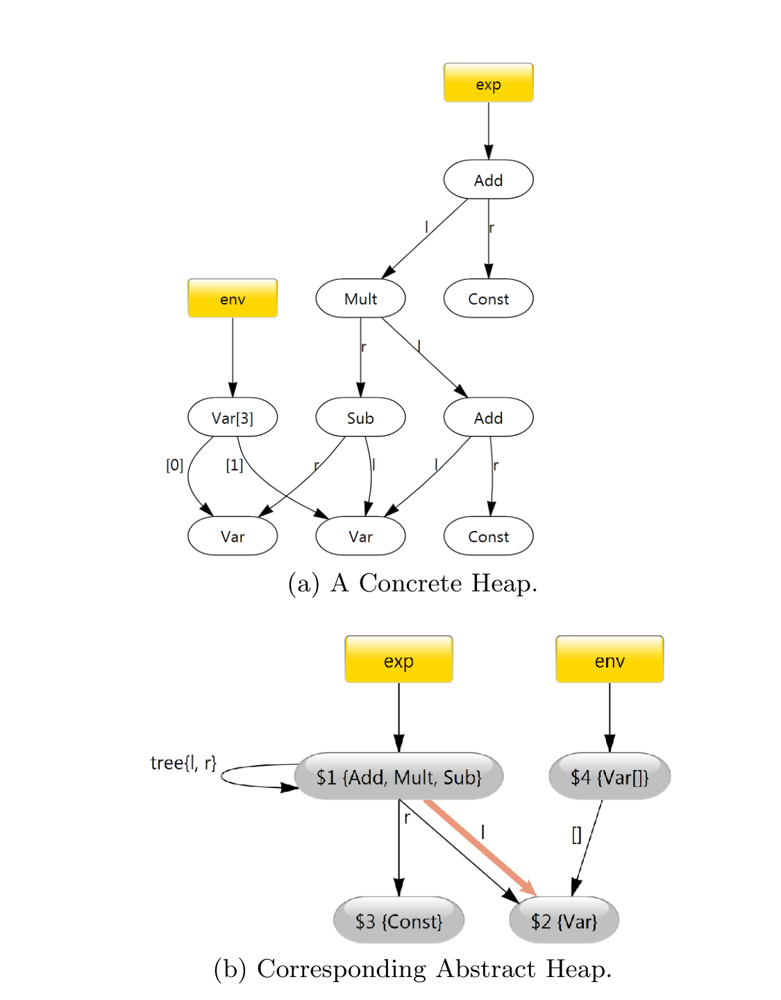

(a) A Concrete Heap.

(b) Corresponding Abstract Heap.

Figure 1: Running example. null pointer sets HeapDbg identifies (Section 4). Thus, the ability to model this precisely is crucial for precisely capturing real world heap structures.

Shape. We characterize the shape of components using standard graph theoretic notions of trees and directed-acyclic graphs (dags), treating the objects as vertices in a graph and non-null pointers as the (labeled) edge set. In this style of definition, the set of graphs that are trees is a subset of the set of graphs that are dags, and dags are a subset of general graphs. For the conceptual component C:

- any(C) holds for any graph.
- dag(C) holds if the subheap restricted to C is acyclic.
- tree(C) holds if dag(C) holds and the subheap restricted to C contains no pointers that create cross edges, i.e. pointers to the same object.
- none(C) holds if the edge set restricted to C is empty.

### 2.1 Illustrative Example

Figure 1 shows the output of HeapDbg; it illustrates how we apply these principles to the concrete heap of a program that manipulates arithmetic expression trees. Figure 1(a) shows a concrete heap snapshot HeapDbg computes on this program. The expression nodes have l and r operand fields. The local variable exp points to an expression tree consisting of four interior binary expression objects and four leaves — two Var and two Const objects. For efficiency, the program

The code for this program can be downloaded from [17].

has interned all variable names into the env array to avoid string comparison during expression evaluation.

Figure 1(b) shows the graph of conceptual components and relations between them as produced by the application of the indistinguishability principles. To ease discussion, we label each node graph with a unique id. The abstraction summarizes the concrete objects into four components, which become nodes in the graph: 1) a node representing all interior recursive objects in the expression tree (viz. Add, Mult, Sub), 2) a node representing the two Var objects, 3) a node representing the two Const objects, and 4) a node representing the environment array. The recursive spine indistinguishability principle groups the four expression objects into node $1 in Figure 1(b). The container indistinguishability principle groups the two Var objects into node $2 and the two Const into node $3. They are not abstracted into a single component because their type distinguishes them. Since no principle applies to the environment array env, it acquires its own node $4. The edges represent sets of pointers and their associated field labels. The edges into node $2 are discussed in Ownership and Research Question 3.

## 2.2 Research Questions

> Given the conceptual components, a natural question is
> Research Question 1: What proportion of conceptual components are simple vs. recursive?

Here, a conceptual component is simple when it is a set, without internal relations, and complex when it abstracts objects that form structures such as trees or cyclic graphs. Answering this question provides insight into the relative importance of inductive vs. set based reasoning in shape analysis tools [2, 9]. It also provides insight into the role that recursive structures and container libraries play in the design of programs; specifically, it answers the question “Are simple recursive structures defined and used frequently or do programmers tend to define a small number of application specific recursive structures and otherwise avoid recursive definitions in favor of builtin collections?”

Ownership Encapsulation is a fundamental concept in OOP and has traditionally been expressed as a binary property in terms of ownership [7], i.e. all paths from the root of a system to an object must pass through that object's owner. This strict definition with transitivity leads to the same issues as encountered in the classic const problem where use of const in one location cascades into its required use throughout a program. Here, we utilize the slightly weaker notion of local ownership (similar to [23]). A set of pointers that do not alias is injective, i.e. the set is a one-to-one map of pointers to objects. A conceptual component is locally owned if it has a single, injective in-edge. Informally, a single pointer points to each of the objects in a locally owned component, even if objects transitively reachable from one of these objects may be shared. Under this definition, transitive sharing does not obscure the fact that some data may be encapsulated in a locally owned object. Figure 1(b) shows that the concrete Const objects are always locally owned, since they are contained in a single conceptual component with a single (narrow), injective in-edge.

Questions about ownership, local ownership, and sharing are fundamental throughout research in programming language design [4, 7, 12], memory management [14, 15, 22],