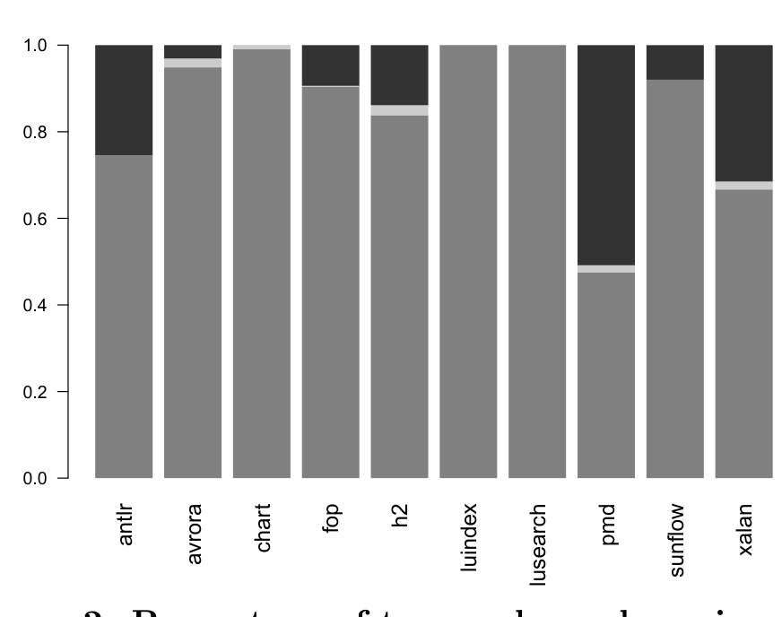

Figure 2: Percentage of types whose shape is cyclic, linear, or atomic.

We compared the proportions of atomic shapes to linear and cyclic shapes with a two-sample t-test. Our sample size of ten projects is fairly small for inferential analysis, but still allows for significant results if the differences are extreme with low variance. Such is the case for our type-shape analysis where we found that atomic shapes dominate to a statistically significant degree (p << 0.01), with a 95% confidence interval for the proportion of shapes that are atomic of 85% ± 12%. Turning to comparing the proportion of cyclic to linear shapes, a t-test shows that cyclic shapes occur more often than linear shapes to a statistically significant degree (p = 0.03).

When we analyze the ratios of shapes per component, atomic shapes again dominate all other shapes to a large degree (p << 0.01, not shown). In fact, the confidence interval for the proportion of atomic shapes over conceptual components is 98.5% ± 1%. In contrast to type shapes, neither cyclic nor linear shapes over components were more prevalent than the other to a statistically significant degree (p > 0.05). In short, the answer to RQ1 is that simple, conceptual components dominate recursive components: for types, the proportion of atomic shapes is 85% ± 12%; for components, 98.5% ± 1%.

Although the use of recursive structures in the program is limited to a few components, these components can involve a large number of types (e.g., antlr, pmd, and xalan). This result is not surprising as object-oriented programming languages 1) often provide extensive container libraries which are used in lieu of custom list and tree structures and 2) support for is-a relations that allow an application to closely model underlying problem domain relations in the data structures, as seen in the abstract syntax tree in pmd.

## Graph Structure and Ownership

Ownership is a structural property of graphs. Let d+ : N → N denote the in-degree, including self edges, of a node. To explore ownership, we first classify the edge e ∈ E that ends at n as:

- Internal iff e is a self edge.
- External iff e is not a self edge.
- Injective iff e is external and Inj(e), i.e., e contains no aliasing concrete pointers, where Inj is defined in Section 2.
- TreeEdge iff e is external and d+(n) = 1.
- CrossEdge iff e is external and d+(n) > 1.
- BackEdge iff e is an external edge a DFS from the program root set would label e a back edge.

Figure 1, our running example, contains only one internal edge, the self-edge on the expression tree exp and, since this edge represents pointers in the l and r fields of Exp, it contains two Internal fields. It contains four external edges: the three outgoing edges from exp and the edge representing the pointers in the Var[]. However, since the l and r fields also appear as Internal fields, there is only one external field. It contains four Injective edges, the local exp variable edge, the static field env, the edge representing the pointers stored in the environment array that refer to Var objects and the pointers in the expression tree that refer to constant objects. Since these edges represent pointers stored in the r and [] fields, the example contains two injective fields. It contains three TreeEdges — the local exp variable edge, the static field env, and the r edge pointing to the Const objects.

Defined using these predicates, the node n is locally owned when its in-edge e is Injective and a TreeEdge. When a conceptual component is locally owned, a unique pointer points to each of the objects in it. In Figure 1, two nodes — of type Var[] and Const — are locally owned. The edge with the r label ending at $3 (the node containing the Const objects) is injective and is $3's only in-edge; therefore, the r edge is the local owner of $3.

Figure 3 shows the distributions, via violin plots4, of in-degree over the components and the types in them. While the number of components and types with in-degree k decreases fairly rapidly as k increases, a nontrivial number of components (types) with high in-degree occur. One reason is large recursive structures, with many types in the recursive structure, that have many in-edges to them. Thus, even though the in-degree of the individual objects is low, the overall in-degree of the structure of which they are members is high. A second contributing factor is large numbers of unique objects. The high portion of in-degree 2 types in Figure 3(a) is a result of this kind of structure. One outlier program, fop, has a large number of unique type objects that are also stored in dictionaries. Figure 3(a) provides initial insight into the value and limitations of using local ownership to describe heap structures in real programs.

To understand how much ownership (Section 2) exists that researchers (and eventually practitioners) can expect to exploit to improve program analysis or to build annotation systems, we examine its prevalence to answer RQ2: What proportion of objects are locally owned?

Consider the components and types with in-degree 1. If their in-edge is injective, then we know a single pointer points to each object in the component or type. The fraction for types is around 51% on average (confidence interval 39%–63%), showing that local ownership is the organizing principle for many parts of the heap. However, the fact that the remaining 37%–61% of the types in the program have references to them stored in multiple locations shows that the principle of local ownership does not dominate real-world heap structures. We see higher ratios of in-degree 1 with a confidence interval of 42%–66% for the components.

Figure 4 shows the percentage of fields (edges) in the heaps that are involved in the internal structure of a conceptual component and represent pointers that are always local owner pointers. Edges are created from each snapshot; their origin is a concrete field in their source conceptual component. Here, we classify a field as a lattice join on the pointer classifications of the edges in which the field participates.

4 A violin plot is similar to a box plot in that it compares distributions, but gives a more detailed view of the shape of the distribution.