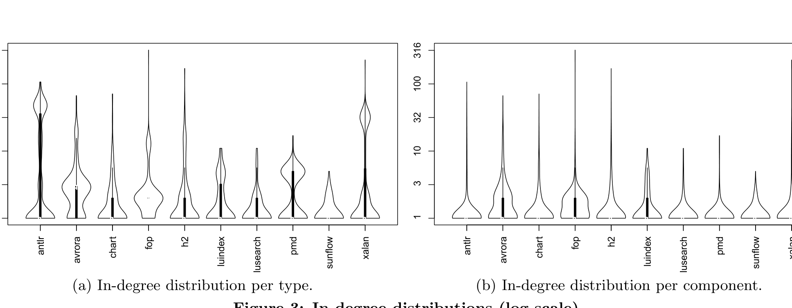
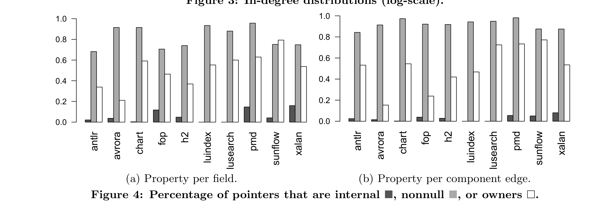

(a) In-degree distribution per type. (b) In-degree distribution per component.

Figure 3: In-degree distributions (log-scale).

(a) Property per field. (b) Property per component edge.

Figure 4: Percentage of pointers that are internal (■), nonnull (■), or owners (□).

For instance, there are two edges labeled ’r’ in our running example, Figure 1. One edge is a tree edge and the other is a cross edge; because cross subsumes tree, we classify ’r’ as a cross field. From these figures, we see that overall most of the connectivity in the program is through pointers (fields) between conceptual components instead of within a single component. Figure 4(a) shows that on average 50% of the fields in the program always contain pointers that locally own their target object.

Thus, our answer to RQ2 is that local ownership, both in terms of fields and edges as well as types and components, is an important but not dominant organizing principle for data structures in object oriented programs. For fields, the calculated confidence interval on the true mean based on our ten project sample is 39%–63%. This ratio translates almost equivalently into the ratio of edges that represent these types of pointers, a mean of 51% with a confidence interval on the true mean of 36%–66%.

Sharing The non-dominance of ownership brings us to the issue of why and how sharing occurs in practice. Our component graphs represent sharing in two ways: either a node has an in-edge that is non-injective or it has multiple in-edges. To capture some of the most common sharing idioms we classify a conceptual component n ∈ N as

Immutable iff ∀τ ∈ Type(n), τ is immutable.
System iff ∀τ ∈ Type(n), τ is a builtin.
Unique iff |Type(n)| = 1 and ∃ a static field with a pointer to n and ∀ n' ∈ N − {n}, Type(n) ∩ Type(n') = ∅.
Global iff |Type(n)| = 1 and ∃ a static field that holds a pointer to a container object that holds pointers to n and ∀ n' ∈ N − {n}, Type(n) ∩ Type(n') = ∅.

In Figure 1, none of the nodes contain immutable types so there are no immutable nodes. It contains one system type and one system node, the node representing the Var[]. The example contains no unique objects (thus no unique nodes or types). In Figure 1, the component containing the Var objects is globally shared, it only represents Var objects stored in an array to which the static field env refers. Thus, the example contains one globally shared node and one globally shared type.

When the edge e = (n_s, n_t) ∈ E is external and ¬Inj(e) (i.e. non-injective), it can be further classified as
- NonInjectiveToImmutable iff n_t is immutable.
- NonInjectiveToUnique iff n_t is unique.
- NonInjectiveToGlobal iff n_t is globally shared.

Figure 1 does not contain any immutable or unique components, so it has no edges (or fields) that interfere only on immutable or unique objects. The Var component is globally shared, so the example contains a non-injective edge, the l edge. Thus, we have one NonInjGlobal edge and one NonInjGlobal field.

Figure 5 classifies the injectivity of field and component edge pointers. This figure shows the ratio of fields and edges that always contain injective pointers to those fields and edges that at some point contain non-injective pointers. In the non-injective case, it further classifies the sharing in terms of what is shared: immutable, unique, global, or otherwise unclassified objects. These figures show that most fields and edges are injective and, when they are not, it is frequently because they are sharing an immutable object. These two cases cover approximately 90% of all fields (with a confidence interval of 87%–96%) and 95% of all edges (con-