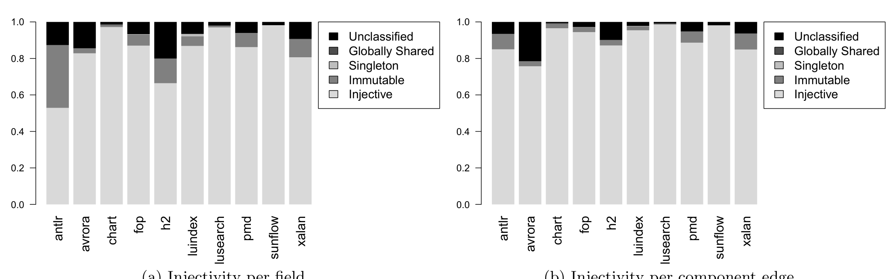

(a) Injectivity per field.  
(b) Injectivity per component edge.

Figure 5: The percentage of field and edge pointers that are injective or non-injective, where the non-injective pointers are further subclassified into those that point at immutable, unique, global, or unclassified objects.

Confidence interval of 90%–99%). The addition of unique and global objects pushes these numbers up a few percent.

We now turn to how multiple nodes and edges (type and field definitions) combine into larger structures on the heap. The first measure we examine looks at the prevalence of tree, cross, and back edges (Defined in Figure 4). We then use programming idioms to further breakdown the cross edges. Table 1 again shows field- and edge-centric classifications in the conceptual component graphs of each program. The far right columns show the confidence interval for the mean proportion of the occurrence of each category in our sample. In most cases (with avrora as a clear exception), tree edges account for a slim majority of the fields (edges) in the heaps; in fact, a t-test indicates that tree offsets are the most common category of edge to a statistically significant degree (p < 0.05). Further these results show that cross edges appear quite frequently and dominate back edges to a statistically significant degree (p < 0.05).

We are now in a position to answer RQ3: What proportion of sharing occurs between objects in the same conceptual component vs. across conceptual components? The non-dominance of local ownership in Figure 4 means that sharing is occurring regularly — the 95% confidence interval of the true mean of sharing is 37%–61% for fields and 34%–63% for edges. Tree edges dominate both the edge and field views of pointers. The only way a tree field or edge can exhibit sharing is through non-injectivity because tree edges are, by our definition, the only in-edge to their target. Thus, the high degree of injectivity in Figure 5 indicates that the sharing that we have observed is mostly due to components whose in-degree is greater than one, viz. either because of incoming cross or back edges. Therefore, most of the sharing we observe spans different conceptual components, as the prevalence of cross edges, the two rows marked † in Table 1, makes clear. Thus, we compute the raw count of cross fields (edges) over the raw count of shared fields (edges) to answer RQ3. Of all sharing, 77%–87% (the confidence interval for field) and 67%–77% (edge) occur between objects in different conceptual components while only 18%–42% (field) and 12%–28% (edge) occur between objects in the same conceptual component. A t-test indicates that sharing occurs more frequently between objects in the different conceptual components to a statistically significant degree (p < 0.05).

Although most of our benchmarks use back pointers sparingly (10% or less in most cases), antlr and avrora in particular make extensive use of them. Some standard idioms we observed in the code include implicit this pointers in inner class definitions, the observer pattern, and parent pointer idioms. Unfortunately, our abstraction currently does not capture the must-alias semantics needed to precisely categorize these back-pointers. Thus, we leave further investigation of back pointers to future work.

## Classified Sharing

Having answered RQ3, we turn to RQ4: What proportion of sharing involves 1) contained 2) global, 3) unique, or 4) immutable objects? To answer this question, we introduce additional edge predicates. The cross edge e ∈ E that ends at node n_t is

- CrossToImmutable iff n_t is immutable.  
- CrossToUnique iff n_t is unique.  
- CrossToGlobal iff n_t is globally shared.  
- CrossToContained iff ∃n_d ∈ N s.t. n_d dominates n_t and the longest acyclic path from n_d to n_t has two or fewer edges, i.e. the sharing is highly localized.

Intuitively, cross edges represent aliasing in the abstract graph, as opposed to aliasing (non-injectivity) in the pointer set abstracted into a single abstract edge. Figure 1 has one TreeField, the static field env; the r field is not a tree field since its label also appears on non-tree edges. It has three CrossEdges all ending at Var. Thus, it contains three CrossFields in the heap — the l, r fields as well as the [] field from the array. It contains a globally shared node, Var, and the cross edges that end at this node, viz. the l, r edges from the expression tree, and the [] edge from the Var[]. Thus, we have three CrossToGlobal edges and, since all the other edges labeled with l, r, or [] are either TreeEdges or are internal tree edges, we have three CrossGlobal fields. Our example does not contain any back edges, immutable or unique nodes, so it does not illustrate the BackEdge, CrossImmutable, or CrossUnique features.

Table 1 shows a classification of cross edges based on their involvement in programmatic idioms, again as a function of both field declarations and edges in the conceptual component graph. We did not collect statistics on back edges and leave their further investigation for future work. Thus, our answer to RQ3 is restricted to cross fields and edges because they are the most general, i.e. when a field participates in both a cross and a tree edge, its classification is cross. Pointers to immutable objects account for the largest fraction of cross edges, as the rows designated with ★ make clear. Indeed, Figure 5 shows that immutable objects are a