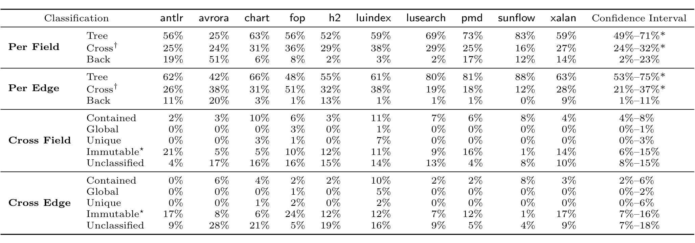

Table 1: Sharing classification per field and per component edge. The per field and per edge columns sum to 100%. The cross field and cross rows groupings further categorize the cross edges using the properties defined in Table 4; their columns do not always sum to their cross row entry marked † because the sharing categories are not disjoint. The ’*’ designates a category that occurs more frequently than the categories below it (within a grouping) to a statistically significant degree.

major source of the cross edge sharing that occurs in practice (confidence interval 6%–15% of fields and 7%–16% of the edges). The “Contained” category shows that our relatively simple definition of localized sharing captures contained objects and shows that they form an important structure in these programs, accounting for 4%–8% on a field basis and 2%–6% of the edges. Finally, unique and globally shared objects are the least frequent, comprising 0%–4% (field) and 0%–8% (edge). Thus, our answer to RQ4 is, of all sharing, immutable objects account for the majority of sharing (via a t-test with p < 0.05), with unique, global, and contained objects representing a smaller amount of the sharing.

### Unclassified Sharing

Combined, our answers to RQ3 and RQ4 conclusively show that, although the sharing relations in the heap can be arbitrarily complex in theory, they are overwhelmingly simple in practice and can be mapped back to common development idioms. The fact that our sampling methodology is biased against frequently instantiated classes, which tend to be simple, further strengthens this result. One simple threat to this result is if our abstraction failed to classify a large percentage of sharing relationships, so we conclude with RQ5: What proportion of sharing relationships remain unclassified? In short, RQ5 is a measure of the effectiveness of our abstraction. For instance, good classification coverage is necessary to use these results as a basis for designing annotations to express the simple structures that our results indicate dominate heaps.

When we consider how much sharing information our current categorization scheme captures in Table 1, we see that our abstraction captures at least 72% of fields and in many cases, over 90% of the sharing relations of fields. The confidence interval for the mean proportion of relations that our approach leaves unclassified is 8%–15%. For edges, the breakdown is more variable but the mean proportion of unclassified edges is only 7%–18%. Further, our analysis is unaware of user-defined immutable types or the sharing of a unique or global object not captured by our current measurements, so some portion of the sharing we report as uncategorized is actually simple and well-behaved. While further study is warranted to investigate other common sharing patterns, this study demonstrates that a surprisingly large percentage of the heap in real world programs exhibits relatively simple structure.

### Conceptual Component Accuracy

Our results rest on accurately identifying a programmer’s intended groupings of heap objects. We used the structural indistinguishability principles from Section 2 to approximate these groupings as equivalence classes of heap objects. Thus, our results rest on the abstraction hypothesis: conceptual components, defined using our indistinguishability principles, accurately partition the heap. Our abstraction could fail in two ways: it could generate conceptual components that lose structural information or it could generate components that do not reflect programmer intent.

If our abstraction lost structural information, we posit that our results would be much noisier, because it would tend to group together unrelated objects. However, this is not the case: our results contain strong signal for each of the reported measures, the measurements correlate with widely used program analysis concepts such as aliasing and shape, and they are ordered in terms of their information content. For example, the tree measurement contains more information than a dag measurement — i.e. it is a more restrictive property as tree(n) ⇒ dag(n). Also, in most of our reported measures, the simpler (from a programmer standpoint) outcome dominates the other outcomes to a statistically significant degree. For example, the injective result dominates the lower information content non-injective result even though in a uniformly generated random partitioning we would expect the non-injective result to be more frequent. Finally, we note that we can precisely describe most of the remaining sharing with a small set of categories motivated by programming idioms. This fact provides strong evidence that our abstraction is accurately capturing features of the heaps that real-world programs build.

It is possible that, although the computed conceptual components effectively capture actual heap structures, these structures do not correspond to how a developer thinks about a program’s heap. Although further study is needed, we present two reasons to believe that our indistinguishability