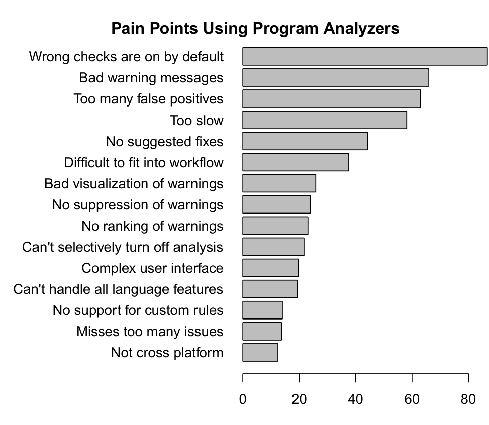

may have different views about the topic than those who are not familiar with it. For the context of this paper, we label these developers experts. 74% of respondents were at least familiar with program analysis. In addition, security issues are especially important to software companies, and security is often given high priority by development teams. In the research community, security is a significant subarea in program analysis that receives a large amount of attention. We refer to developers who indicate that security is a top concern to them as security developers. 40% of respondents indicated that they are security developers. For many questions, we examine the answers provided by developers who are familiar with program analysis and also by those who indicate that security is a top concern for them. We report cases where there is a statistically significant difference between these groups and the answers of the rest of the sample. In cases where there are only two alternatives (e.g., using program analysis versus not using it), we use a Fisher’s exact test [30]. When there are more than two choices, such as the frequency of running program analysis, we use a χ^2 test to assess the difference in distributions between these groups.

Some of the questions on our survey asked developers to select and rank items from a list. For example, we asked developers to rank the pain points they encountered using program analysis as well as the code issues that they would like program analyzers to detect. To analyze the answers, for each option o, we compute the sum of the reciprocals of the rank given to that option for each developer d that responded (d ∈ D):

Weight(o) = sum_{d ∈ D} 1 / Rank_d(o)

Ranks start at one (the option with the greatest importance) and go up from there. If an option is not added to the ranked list by a developer, the option is given a weight of zero for that developer.

In Section 5, we also give an overview of the program analyzers that the survey respondents use the most.

### 2.2.1 What Makes Program Analyzers Difficult to Use?

In our beta survey, we asked developers what pain points, obstacles, and challenges they encountered when using program analyzers. We then examined their responses to create a closed response list of options. In the final survey, we asked developers to select and rank up to five of the options from the list. Figure 1 shows their responses and gives insight into what developers care about most when using program analyzers. Many of our findings, such as the fact that false positives and poor warning messages are large factors, are similar to those of Johnson et al. [39]; their work investigates why software engineers do not use static analysis tools to find bugs through a series of 20 interviews (see Section 6).

The largest pain point is that the default rules or checks that are enabled in a program analyzer do not match what the developer wants. Developers mentioned that some default program analysis rules, such as enforcing a specific convention (for instance, Hungarian Notation) to name variables or detecting spelling mistakes in the code or comments, are not useful, and on the contrary, they are actually quite annoying. Mitigations to this problem may include identifying a small key set of rules that should be enabled (rather than having all rules enabled, which is often the case), or making the

Figure 1: Pain points reported by developers when using program analyzers.

process of selecting the rules and checks that are enabled easy for developers. Just as helpful is knowing the pain points at the bottom of the list. Developers care much more about too many false positives than about too many false negatives (“Misses too many issues”). One developer wrote of their team’s program analyzer “so many people ignore it because it can have a lot of false positives”. Also, the ability to write custom rules does not appear important to many, unlike in the investigation by Johnson et al. [39].

We also asked developers if they had used program analysis but stopped at some point. Only 9% of respondents indicated that they fell into this category. When asked why they stopped, there were three main reasons. 24% indicated that the reason was because the team policy regarding program analysis changed so that it was no longer required. Similarly, 18% indicated that they moved from a company or team that used program analysis to one that did not. Another 21% reported that they could not find a program analyzer that fit their needs; about half said this was due to the programming language they were using. This highlights one aspect of adoption of program analyzers that we also observed in discussions with developers: often, their use of analyzers (or lack thereof) is related to decisions and policies of the team they are on.

> Program analysis should not have all rules on by default.
> 
> High false positive rates lead to disuse.
> 
> Team policy is often the driving factor behind use of program analyzers.

### 2.2.2 What Functionality Should Analyzers Have?

One of the primary reasons why a program analyzer may or may not be used by a developer is whether the analyzer supports the programming language (or languages) that the developer uses. We therefore asked developers what languages they use in their work. Because the list was quite long, we aggregated responses into programming language categories, as shown in Figure 2. The primary languages in the