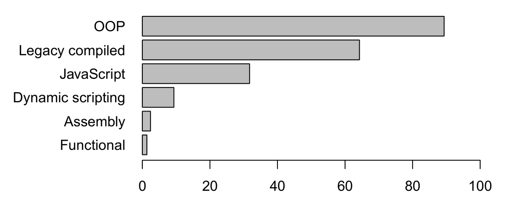
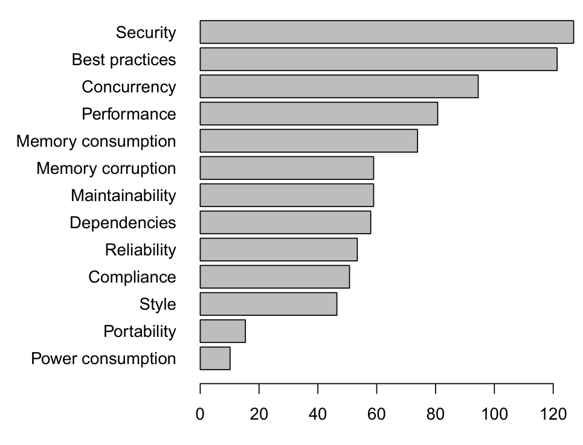
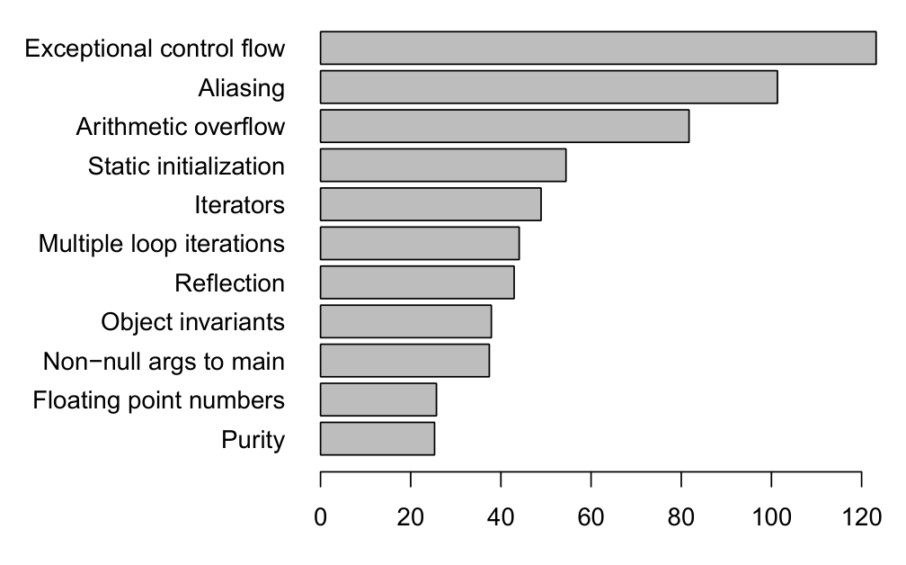

## Percent of Developers Using Each Language

Figure 2: Languages used by developers.

Object-oriented programming (OOP) category include C# and Java. Legacy compiled languages comprise C, C++, and Objective-C. Dynamic scripting languages include Python, Ruby, and Perl. We break out JavaScript (and variants such as TypeScript) because it is unique and one of the fastest growing languages. Our categorization is based on our perceptions and experiences as well as observations of Microsoft development. As such, it is one of many reasonable categorizations and is somewhat subjective (e.g., C++ is technically an OOP language, but it has been around much longer than Java or C# and is used for more low level functionality).

Next, we examine the types of code issues that developers consider to be important and that they would like program analyzers to detect. In our initial beta survey, we allowed developers to write in any type of issue that they deemed important. We then grouped the responses from the beta, leading to the types shown in Figure 3, and asked about the importance of each type of issue in the final survey. (Here and throughout the paper, we only present analysis and data from the final survey.) Note that these types of issues can be overlapping and their definitions flexible. For instance, many security issues could also be reliability issues, but the way to interpret Figure 3 for this particular example is that developers care much more about security issues than general reliability issues. In other words, this question was answered based on the cognitive knowledge developers have about each of these types. The results indicate that security issues are the most important, followed by violations of best practices. Interestingly, in an era where a non-trivial amount of software runs on mobile devices, developers do not consider it important to have program analysis detect power consumption issues.

Related to the types of issues that developers consider to be important are the potential sources of unsoundness in program analysis that can affect the detection of such issues. We listed the most common sources of unsoundness from program analysis research [28] and asked developers to rank up to five of them. During our initial interviews and the beta survey, we found that some developers were unfamiliar with the terminology used (though most were aware of the concepts). We therefore provided a brief explanation of each source of unsoundness in the survey. Figure 4 shows the results. As can be seen, exceptional control flow and aliasing top the list, while purity and dealing with floating point numbers are not considered critical.

Exceptions add a large number of control-flow transitions that complicate program analysis. To avoid losing efficiency and precision due to these transitions, many program analyzers choose to ignore exceptional control flow. Consequently, users who would like analyzers to soundly check exceptional

## Code Issues Developers Would Like Detected

Figure 3: Ranking of types of code issues developers would like program analyzers to detect.

control flow should be willing to sacrifice speed and false positive rates of the analysis. Ignoring certain side-effects due to aliasing avoids the performance overhead of precise heap analysis, so developers who do not want aliasing to be overlooked should be willing to wait longer for the analysis.

In practice, developers may not want program analysis to always examine all of the code in an application. When asked if developers would like the ability to direct the program analyzer toward certain parts of the code, 10% indicated that they have that functionality and are using it. Another 49% indicated that they do not use an analyzer that can do that, but it would be important to them that a program analyzer could be directed in such a way. Interestingly, of developers that are using a program analyzer with the ability to be directed to particular parts of the code, both experts and security developers use this functionality more than other developers to a statistically significant degree. When asked to what level of granularity developers would like to be able to direct a program analyzer, the overwhelming majority said the method level (46%) or the file level (35%).

A related functionality is the ability to analyze a changelist

## Sources of Unsoundness That Should Not Be Overlooked

Figure 4: Ranking of the sources of unsoundness in program analysis that developers indicated should not be overlooked (i.e., considering them during analysis would be most helpful to developers).