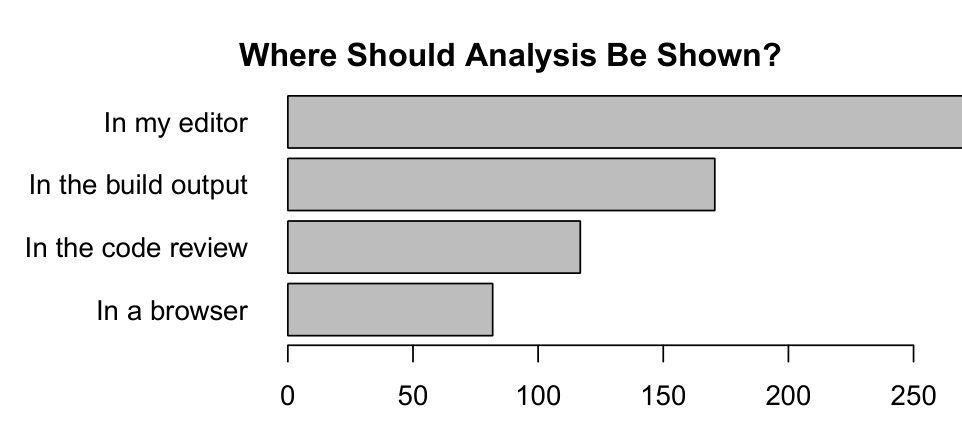

(also known as a commit) rather than the entire codebase. This type of functionality can help developers assess the quality and impact of a change before it is checked into the source code repository. 16% of developers indicated that they have and use this functionality in the program analyzer they use. Another 56% said that they do not have this functionality, but it would be an important factor in adopting a program analyzer. In sum, this 72% of developers use or would like this ability. When looking at experts, this value jumps to 77% (no change for security developers).

Other functionality is less attractive. Many analyzers provide the ability for developers to write their own program analysis rules. However, sometimes the learning curve can be steep or the background required may be deep in order to write custom analysis rules. When asked about the ability to write custom rules, 8% said that they have the functionality and use it and 26% said it is an important factor, while the rest said they either do not use it or do not care about having it. 66% of experts and 61% of security developers also indicated that they do not use or care about this functionality.

We postulated that the reason why developers are not interested in the ability to write custom program analysis rules is because they want to be able to select an analyzer and start using it without much effort. In fact, this is not the case. We asked developers whether they would be willing to add assertions, pre-, postconditions, and/or invariants to their code if this would improve the analysis results. Fully 79% of developers said they would add at least one of these types of specifications to their code, and 35% indicated that they would be willing to write all of them. This provides evidence that developers may be willing to provide additional information to program analyzers in return for better results (e.g., better precision). When asked about the form that such code specifications should take, an overwhelming majority (86%) of developers said that they would be more willing to annotate their code with specifications if these were part of the language, for example taking the form of non-nullable reference types or an assert keyword.

One feature of program analyzers that developers use heavily is the ability to suppress warnings. 46% of developers indicated that they use some mechanism to suppress warnings. The primary methods are through a global configuration file, source code annotations (i.e., not in comments), annotations in source code comments, an external suppression file, and by comparing the code to a previous (baseline) version of it [45]. When asked which of these methods they like and dislike, 76% of those that use source code annotations like them, followed by using a global configuration file (63%) and providing annotations in code comments (56%).

> Program analyzers should prioritize security and best practices and deal with exceptional control flow and aliasing.
>
> Developers want the ability to guide program analyzers to particular parts of the code and analyze changelists.
>
> While most are not interested in writing custom rules, developers are willing to add specifications in their code to help program analyzers.
>
> Suppressing warnings is important, preferably through code annotations.

## 2.2.3 What Should the Non-Functional Characteristics of Program Analyzers be?

In the previous section, we focused on the functionality that developers indicate they want in program analyzers. When examining characteristics, we investigate non-functional aspects of program analyzers, such as how long they should take to perform the analysis, how often their warnings should be correct, and how they should fit into the development process. In many cases, there is a trade-off between characteristics (e.g., an analysis that has fewer false positives may include more complex techniques, such as alias analysis, which would require longer to complete). In these trade-off situations, we asked developers to indicate what characteristic they would sacrifice in order to improve another.

The time taken by a program analyzer is an important characteristic to developers because it can affect how often and where the analyzer can be run, which directly influences the utility of the analyzer to the developer. When asked how long a developer would be willing to wait for results from a program analyzer, 21% of developers said that it should run on the order of seconds, and 53% said they would be willing to wait multiple minutes. Thus, long running analyzers that exceed a few minutes would not be considered by nearly three quarters of developers.

The time required for an analysis dictates where it fits into the development process. When asked where in their development process they would like to use program analyzers, 25% of developers said every time they compile, 24% said once their change was complete but before sending out a code review request, 10% said during the nightly builds, 8% said every time unit tests were run, and 23% said they would like to run it at every stage of development.

Related to how a program analyzer should fit into the development process is how the results of the analyzer should be shown to the developer. The top four answers from developers are shown in Figure 5. The preferred location by a wide margin is in the code editor followed by the build output. This is in line with the findings of the interviews by Johnson et al. [39]: all 20 participants in their interviews wanted to be notified of issues in their code either in the IDE or at build/compile time. Moreover, one of the main lessons learned from the FindBugs experiences at Google [21] was that developers pay attention to warnings only if they appear seamlessly within the workflow.

Warnings that are false positives are cumbersome and time consuming. We asked developers the largest false positive rate that they would tolerate. We show the results as a reverse cumulative distribution curve in Figure 6, with the acceptable false positive rate on the x-axis and the percent of developers that find that rate acceptable on the y-axis. From the graph, 90% of developers are willing to accept up

Figure 5: Where developers would like to have the
output of program analyzers.