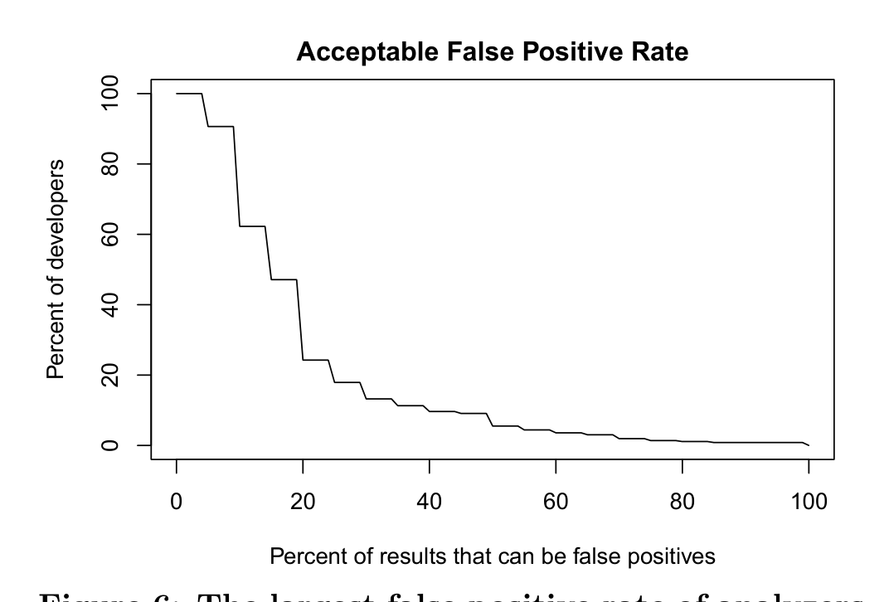

Percent of results that can be false positives  
Figure 6: The largest false positive rate of analyzers that developers would tolerate.

to a 5% false positive rate, 47% of developers are willing to accept a false positive rate up to 15%, and only 24% of developers can handle a false positive rate as high as 20%.

The designers of Coverity [23] confirm this aim for below 20% of false positives for stable checkers. When forced to choose between more bugs or fewer false positives, they typically choose the latter. We also asked developers when they are most willing to deal with false positives and gave them two extremes: (1) when it is easy to determine if a warning is a false positive, and (2) when analyzing critical code. In the latter case, finding issues is so important that developers are willing to deal with false positives in exchange for making sure no issues are missed. 55% of developers preferred to get false positives when they are easy to sift through.

Interestingly, developers are willing to give up more time if the quality of the results is higher. 57% said that they would prefer an analyzer that was slow, but found more intricate code issues to an analyzer that was fast, but was only able to identify superficial issues. Similarly, 57% also said they would prefer a slower analysis that yielded fewer false positives to a faster approach that was not as accurate. 60% reported that they would accept a slower analyzer if it captured more issues (fewer false negatives). While these all show that the majority of developers are willing to give up some speed for improved results, note that the majority is slight. Still 40–43% are willing to deal with more false positives, more false negatives, or superficial issues if meant the analysis was faster. These numbers do not change significantly when looking at just experts or security developers.

Much of the feedback from developers discussed the idea of having two kinds of analyzers, one fast and running in the editor, and another slow and running overnight. One developer put it quite succinctly: “Give me what you can give, fast and accurate (no false positives). Give me the slow stuff later in an hour (it is too good and cheap to not have it). No reasonable change is going to be checked in less than half a day but I do want that style check for that one line fix right away.” Another developer made a comparison of this to unit versus integration testing.

There is even less agreement when we compare the trade-off of reporting false positives versus missing real issues (false negatives). 49.3% developers would prefer fewer false positives even if it meant some real issues were missed, and 50.7% felt that finding more real issues was worth the cost of dealing with false positives.

Some program analyzers can provide lists of possible fixes for the warnings that they identify. We asked developers if they would prefer to sift through lists of potential fixes to identify the correct fix or if they would rather spend that time coming up with a fix on their own. 54% indicated they would be willing to sift through up to 10 potential fixes, while 45% felt that that time would be better spent designing a fix themselves.

> Program analysis should take a two-stage approach, with one analysis stage running in real time providing fast, easy feedback in the editor and another overnight finding more intricate issues.
>
> Program analysis designers should aim for a false positive rate no higher than 15–20%.
>
> Developers are willing to trade analysis time for higher-quality results (fewer false positives, fewer false negatives, more intricate issues).

### 2.2.4 Additional Developer Feedback

In our survey, we asked developers if they would like to share any additional opinions, thoughts, or feedback that they felt were not covered by our questions. 73 developers (19%) answered this question and we inspected and organized their responses. A number of key themes emerged from this analysis and we share those that are useful to program analysis researchers here.

Developers indicated that determinism of the program analysis is important. FxCop [11] (described in Section 5) is not deterministic because it uses heuristics about which parts of the code to analyze, and the Code Contracts analyzer [32] is not because it uses timeouts. If a program analyzer outputs different results each time it is run, it can be difficult to tell if an issue has been fixed. The Coverity designers also stress that randomization is forbidden, timeouts are also bad and sometimes used as a last resort but never encouraged [23].

When a developer makes a change to fix a program analysis warning, he or she would like an easy and quick way to check whether the warning is indeed fixed. A developer does not want to re-build and re-analyze everything for each warning. “Supporting quickly re-checking whether a specific analysis error is fixed would significantly help the test-fix-test cycle.”

Many developers indicated that regardless of the analyzer they run, they would like a way to see and track their warnings, e.g., in SonarQube [18]. SonarQube is a web-based application that leverages its database to show and combine metrics as well as to mix them with historical measures.

Having a standard way of doing program analysis and a standard format of warnings across the organization is important as it can lessen the learning curve and decrease heterogeneity of tools and processes between teams.

It would be beneficial if analysis could help engineers understand how to properly use a programming language. Some engineers learn just enough about a language to do the work, and having an analyzer that teaches them which idioms, libraries, or best practices to use would be helpful.

### 2.2.5 Implications

In this section, we highlight the main implications of our survey findings for the program analysis community.

Expertise. When asked how frequently developers run