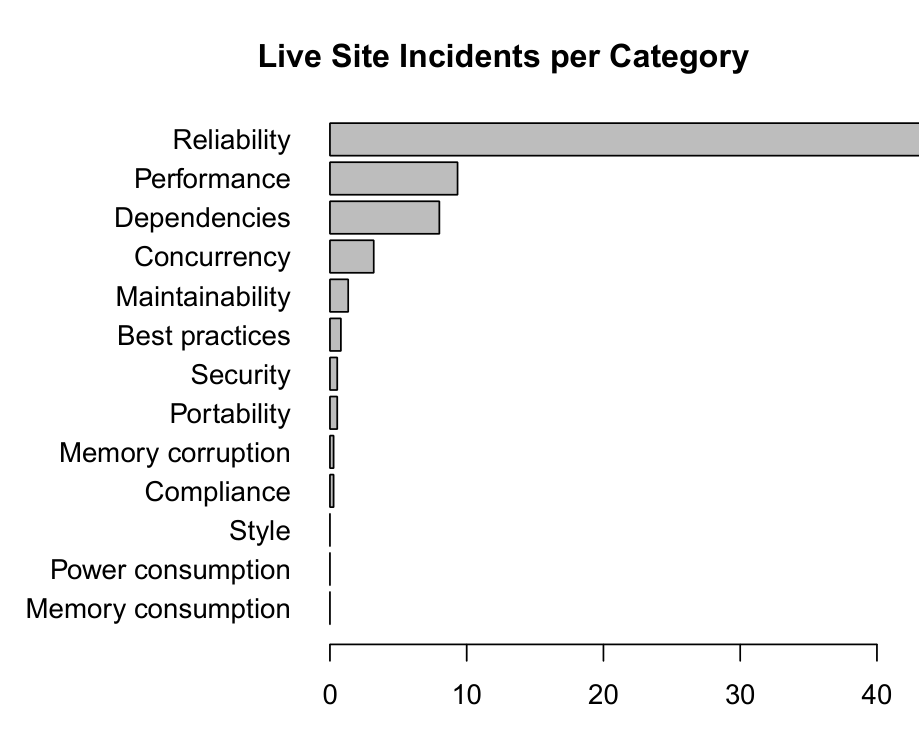

Figure 7: Categorization of live site incidents for 17 different company products.

require immediate intervention of a software engineer (see Figure 7) are ranked low in the preferences of software engineers.

This mismatch between developers' stated desires and the data regarding actual defects is surprising. An explanation for this result is that how much bugs matter depends on your point of view. That is, they matter very much to researchers and designers of program analyzers, but how much they matter to the users of analyzers can be unexpected. During the live site reviews that we attended, we witnessed quotes like “oh, it’ll crash, and we’ll get a call” or “if developers don’t feel pain, they often don’t care”, which were also recorded by Bessey et al. in 2010 [23]. This attitude toward bugs could also explain why the respondents of our survey would not like program analyzers to go after the most painful code issues (presented in Figure 7).

In the survey, we asked participants which types of code issues that they encounter they estimate could have been caught by a program analyzer. The most popular answers were best-practices violations (69%) and style inconsistencies (62%), which are both superficial code issues. On the other hand, intricate code issues, like reliability, concurrency, and security errors, were selected by significantly fewer survey respondents (30%, 37%, and 47%, respectively). Figure 7 about live site incidents indicates a strong need for program analyzers to detect reliability errors. Moreover, security and concurrency errors are the first and third most popular answers, respectively, to the previous survey question (about which types of code issues software engineers would like program analyzers to detect).

This suggests that developers do not trust program analyzers to find intricate code issues. We see two possible explanations for this lack of trust, which are also supported by related work. First, due to the various pain points, obstacles, or annoyances that users encounter when using program analyzers, they might not derive the full potential of these tools. In the end, some users might abandon program analysis altogether, incorrectly thinking that it lacks value [21]. Second, it could be the case that users have little understanding of how program analysis works in a particular tool as well as little interest in learning more. As a consequence, they might end up classifying any detected code issue that is even slightly confusing to them as false [23].

> The vast majority of costly bugs in software services are related to reliability.  
> Developers rank reliability errors low in the types of issues they want program analyzers to detect.  
> Developers do not seem to trust analyzers to find intricate issues although they want them to detect such issues.

## 4. THREATS TO VALIDITY

As with any empirical study, there may be limits to our methods and findings [35]. Because one of our primary instruments was a survey, we were concerned that the right questions were included and presented in the right way [34]. To address construct validity [43], we began by examining the landscape of the use of program analysis in Microsoft and interviewing developers. These interviews led to the creation of a beta survey that we deployed and which provided another round of feedback to fine tune the questions in the final survey. Thus, we have high confidence that the questions are asked in a clear and understandable manner and cover the important aspects of program analyzers. We are also confident that the options provided for answers to the questions capture the majority of developer responses.

With regard to external validity [50], our analysis comes wholly from one software organization. This makes it unlikely that our results are completely representative of the views of software developers in general. However, because Microsoft employs tens of thousands of software engineers, works on diverse products in many domains, and uses many tools and processes, we believe that our approach of randomly sampling improves generalizability significantly. In an effort to increase external validity, we have provided a reference to our survey instrument so that others can deploy it in different organizations and contexts.

Not all categorizations of live site incidents came directly from the software engineer that handled the incident. In cases where we could not contact them, we had to categorize them ourselves based on information in the incident tracker, which may introduce subjectivity. As mentioned previously, we mitigated this by having multiple researchers categorize the incidents independently and checking the inter-rater reliability, which resulted in perfect agreement.

## 5. PROGRAM ANALYZERS IN INDUSTRY

In this section, we give an overview of program analyzers that are currently being used in three large software companies, namely Microsoft, Google, and Facebook. We derived a list of first party program analyzers at Microsoft by interviewing leads and members of the managed and unmanaged static analysis teams in the company. We then asked the participants of our survey (see Section 2) which analyzers they have run the most. We focus on the six most popular first and third party program analyzers for Microsoft. For Google and Facebook, we rely on recent research publications to determine which analyzers are currently being used.

First party program analyzers at Microsoft. The order in which we present the tools is arbitrary and all first party tools were selected by at least 8% of the respondents.