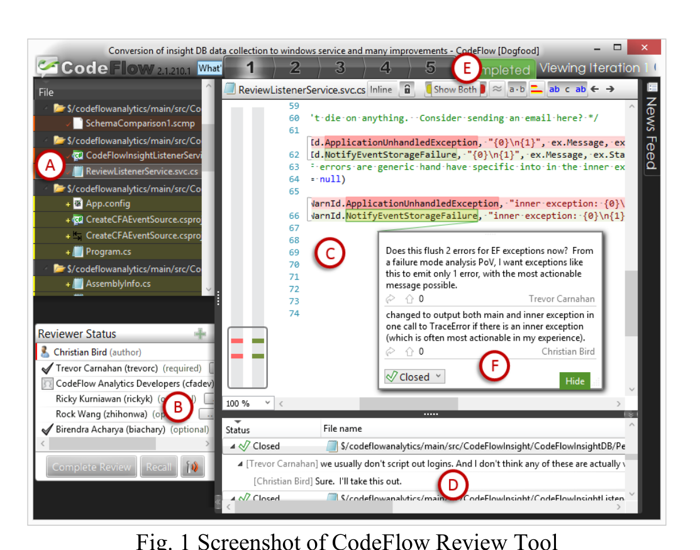

reviewers, provide a description of the change to be reviewed, and submit the review to the CodeFlow service. CodeFlow then notifies the selected reviewers about the incoming task via email. The developer that creates the code change and submits it for review is the review author, and those who receive the review, provide feedback on the change, and can sign off, are termed the reviewers.

To understand the data that CFA collects, it is first important to understand how CodeFlow is used. Once reviewers open a CodeFlow review, they interact with it via a single desktop window (Figure 1). On the top left (A), they see the list of files changed in the code change submitted for review, plus a "description.txt" file, which contains a textual explanation of the change, written by the author. On bottom left, CodeFlow shows the list of reviewers and their status (B). In this example we see that Christian is the review author and Trevor, Ricky, Rock, and Birendra are the reviewers ("CodeFlow Analytics Developers" is a mailing list that the review is sent to, as well). Trevor and Birendra have signed off on the changes while Ricky and Rock have yet to do so. CodeFlow's main view (C) shows the differences in the currently selected file. Both the reviewers and the author can highlight portions of the code and add comments inline (F). These comments can start threads of discussion and are the interaction points for the people involved in the review. Each user viewing the same review in CodeFlow sees events as they happen. Thus, if an author and reviewer are working on the review at the same time, the communication is synchronous and comment threads act similar to instant messaging. The comments are persisted so that if they work at different times, the communication becomes asynchronous. The bottom right pane (D) shows the summary of all the comments in the review along with their status (discussions begin in an "active" state and can be set to "resolved," "won't fix," "pending," or "closed," similar to bug reports). The author can make changes based on reviewers' feedback and submit an updated change, called an iteration in CodeFlow parlance. In the example above, there are five iterations of the change which can be viewed by clicking on the tabs labelled "1" through "5" (E). Once the reviewers are confident in the change and sign off, the author marks the review as

Fig. 1 Screenshot of CodeFlow Review Tool

completed and typically checks his or her change into the project's source code repository.

CodeFlow's simplicity, low barrier for feedback, and flexible support for all of Microsoft's disparate engineering systems (it currently supports Git, Team Foundation Server, Perforce, and an internal source code management system) has driven its adoption since its inception five years ago. In aggregate, CodeFlow is used by engineers in every division to perform 100k to 150k code reviews every month, and 4.9 million code reviews to date spanning every shipping product at Microsoft, as well as a host of internal projects.

While CodeFlow has achieved widespread use, convenient access to the raw data to drive deep understanding and aggregate data to compute and track team, project, and organizational metrics around the code review process was missing. The data was stored in xml files, one per review, on disk behind the middle-tier services. The only access pattern was to retrieve a single code review at a time.

CodeFlow Analytics addresses this problem by continually monitoring activity on reviews, storing data about each review when it becomes available, processing this data into metrics and dimensions (described later), and making it easily available to teams. The architecture for CodeFlow Analytics is a Kimball-styled data warehouse [17] using business intelligence tools from Microsoft SQL Server running on Microsoft Azure (Microsoft's cloud computing platform [18]). For data acquisition, CFA uses a Windows service to poll the central CodeFlow server on a regular basis. We have found that activity on a review occurs in bursts (as reviewers open a review and provide feedback throughout the change under review) and thus the service polls for a list of the ID's of added or modified reviews every ten minutes, but waits to gather the data for a review until it has remained dormant for at least ten minutes. This design decision cuts down the number of requests for CodeFlow data from the server and the number of updates to our database by over 40%, a large performance boost. This raw review data is stored directly into a simple relational database. Every two hours, it is processed into a dimensional model, or star schema [17], via a T-SQL based "Extract, Transform, and Load" (ETL) process [17], and then processed into an Analysis Services tabular cube [19], an in-memory database that supports both traditional relational data storage (where raw review data is stored) as well as a dimensional model. A dimensional model consists of facts (computed metrics) and dimensions, which provide the ability to slice or filter the facts. As a concrete example, one might be interested in the average number of files in a review for reviews conducted in 2014 in Windows. In this case, 2014 is a filter in the time dimension and "Windows" is a filter in the product dimension, while average number of files is a computed fact based on those dimensions. Using such a tabular model allows CFA to be as responsive as we need, as an on-disk relational model would be prohibitively expensive in terms of time (CFA not only houses a large amount of data, but must be able to serve requests from many teams across the company concurrently).

Entities in the raw database along with their attributes include: aspects of the code review (e.g., project, author, description), reviewers (e.g., their current status, when they were as