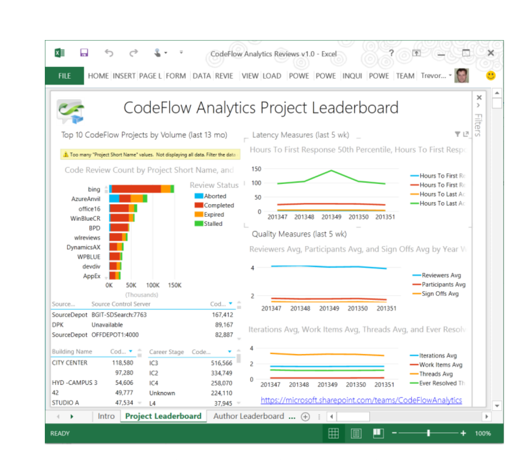
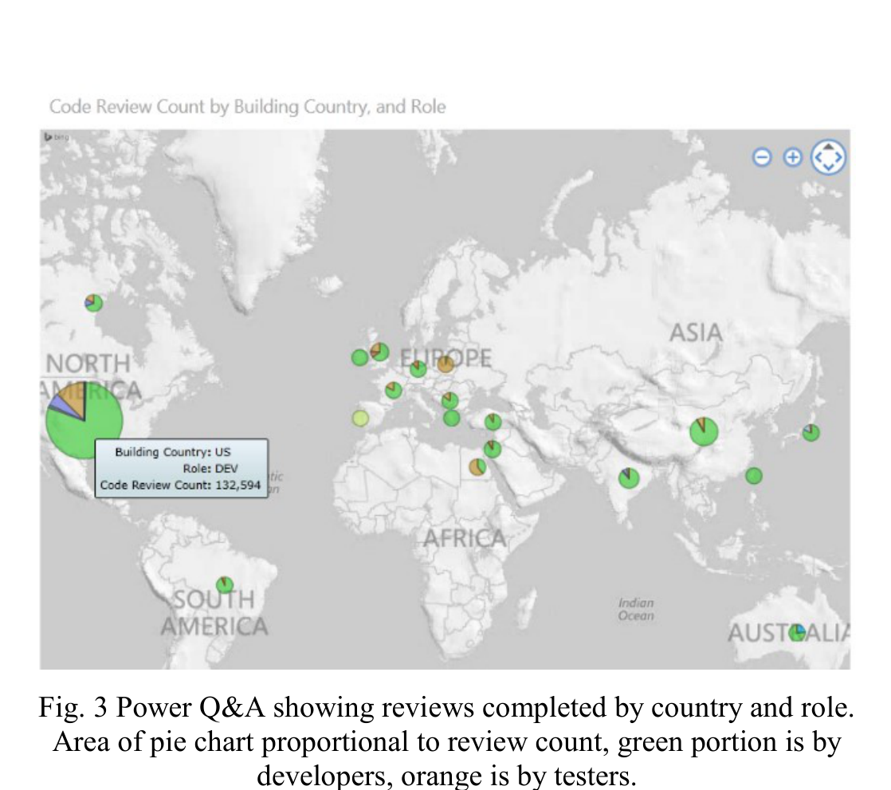

Fig. 2 Excel Power View Charts generated from CFA

signed), the files in the review (e.g. file path, repository location), feedback threads and comments (e.g., content of the comments, who made them and when, where in each file the comment is located), and related work items (references to check-ins, tasks, and defect database entries). We also track when and how each entity changes. For instance, the database may show that a particular review currently has the status “completed,” but it also contains data regarding prior states, so that one can determine that its previous status was “active” and find the specific time that the status changed.

In the relational data warehouse, the data in the raw database is merged with data from the Microsoft employee database, allowing analysis by organizational hierarchy, role, or even geography.

The output of processing is a set of fact tables containing metrics and dimension tables, which in turn contain attributes useful for filtering and slicing the metrics. Examples of the metrics include: time to first response, time to sign-off, time to completion, number of threads by final state, number of comments, number of iterations, number of files, number of reviewers, number of sign-offs, as well as variants of these that have been requested by teams. Examples of dimensions are projects, months, and countries. Users can select the facts that they are interested in, filter and slice by chosen dimensions, and then aggregate in various ways. For example, a user may want to see the average number of sign-offs in his or her project per month. In this case, specifying the project dimension will filter reviews to the project of interest, while slicing along the month dimension yields a time series. The aggregation used is “average” on the fact “sign-offs.” As another example, a developer might look at the 75th percentile number of reviewers in his team. In total, CFA provides over 200 facts and dimensions. We provide the median, average, and percentiles of the metrics to characterize distributions and identify outliers.

Data consumption scenarios are a point of emphasis for CFA. One goal is to optimize the “time to insight,” or the time

Fig. 3 Power Q&A showing reviews completed by country and role. Area of pie chart proportional to review count, green portion is by developers, orange is by testers.

between having a curious question about code reviews and getting an empirical answer from the data. Another goal was to broadly enable many ways to experience the data. We intentionally did not create our own user interface for CFA, instead providing many ways to access the data so that customers could use the data how they see fit and leverage it in their existing tools.

For the casual user with no material data experience who wants quick insights into his or her team’s code review process, CFA provides Excel templates that query the cube and expose standard metrics. Figure 2 shows such a template that displays various metrics, including review outcome by project (top left), average hours to first and last activity and signoff by week (top right), participation (middle right), and feedback activity (bottom right).

CFA also allows casual users who are curious and want to ask ad-hoc questions to use Power Q&A [20]. Power Q&A enables users to ask natural language queries about data and presents the results in intuitive visualizations. As a simple example, entering the query “show the code review count by country by role in 2014 in Bing” results in the map visualization shown in Figure 3. The experience is interactive and allows users to quickly explore the dataset and answer questions. As another example Figure 4 shows how easy it is to inquire about the size of the review (in terms of files and iterations), the feedback received, and whether those metrics are dependent on role.

The natural language capabilities did require additional work to provide natural language synonyms for raw data, metrics, and dimensions to help the query processor, but this was a one-time cost for us that has been beneficial to users.

More advanced consumption experiences are available to the analyst users who want to dive deeper in the data to derive new insights and metrics.

The two primary data sources made available are the Analysis Services Tabular cube (facts and dimensions) and the SQL Server relational data warehouse (raw review data). Making curated data available in these two formats gives the analyst users a full spectrum of query and analysis tools that analysts are likely