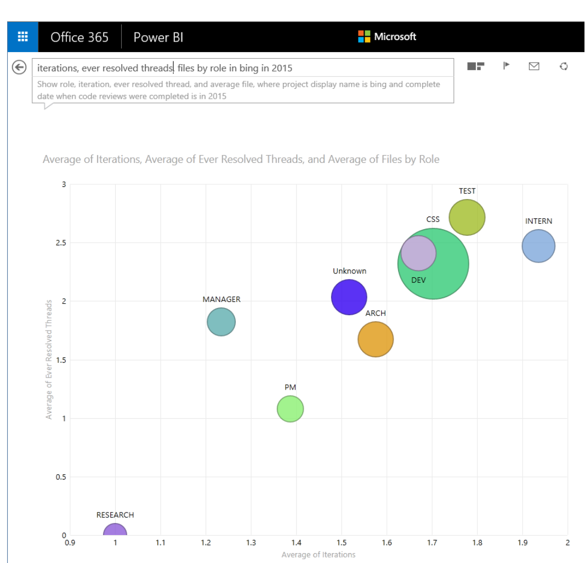

Fig. 4 Power Q&A showing average number of resolved threads of discussion (y-axis), average number of iterations (x-axis), average number of files per review (area of circle) by author role (color and label of circle) in Bing in 2015.

to already be comfortable with, such as Excel, Power BI, Tableau, SQL Server Management Studio, and R, as well as the ability to write custom code in any language that has SQL drivers available (e.g. C#, Java, or Python).

Another query interface developed for developers is a REST web API over the Analysis Services Tabular Model. The REST API makes it simple to include code review data into virtually any application with a simple JavaScript or web call. This has enabled developers to build web sites with dashboards, incorporate data in issue trackers, and incorporate review data into tools such as Visual Studio.

> such as Visual Studio.  
> The lingua franca for data is SQL for data hounds and web APIs for app developers. Those less experienced with data analysis or wanting to easily explore data should have easy entry points. These should all be available from the beginning.

### A. Challenges

There are a number of challenges that CFA has had that we have had to overcome. Here are some, along with our solutions.

#### Branch agnostic data collection and analysis.

Several version control systems are used within Microsoft. Most of them, with the exception of Git, are not branch agnostic. This means that the branch path is reported as a part of the file path, similar to the way branches are part of the directory structure in subversion. For example, consider a file foo.c in directory bar. Then the path of this file would be /bar/foo.c. Now, let us assume this file is part of the code base currently available in two branches, main and release. Since CodeFlow records the full path of each file submitted in a review, a review with

changes to /bar/foo.c on either of these branches would contain either /main/bar/foo.c or /release/bar/foo.c.

Even though these are in fact separate files, logically we might want to recognize them as one "entity" that is edited in two different branches. This example is trivial, but in practice, the portion of the path that is part of the branch can be arbitrarily deep. For example, the creation of a branch rc_1 from the release branch would result in the creation of the file /release/rc_1/bar/foo.c. Branching systems of such large-scale software systems as Microsoft Windows or Microsoft Office tend to be extremely complex (sometimes up to seven levels deep) to allow parallel development by thousands of engineers. In theory, is it possible to obtain the list of all branches for all projects that use CodeFlow, which would make solving this problem fairly straightforward by simply comparing each path to all branches and looking for the longest common prefix.

In practice, the number of projects and permissions issues make such a solution impractical. Therefore, we had to implement heuristics that can take care of extracting the branch path from the file path. As we know that the complete path (i.e., branch path and file path) always starts with the branch path, we designed a heuristic to identify the branch portion of the path. If we do not extract enough of the path into the branch portion (e.g., if we split the aforementioned path into /release for branch path and /rc_1/bar/foo.c for the file path), we run into the problem that the same file in different branches will be seen as several distinct files. On the other hand, if we remove too many segments from the complete path (e.g., if we split the above path into /release/rc_1/bar for the branch portion and /foo.c as the file path) then two files that should be treated separately could be conflated. We did a thorough analysis of the false positive and false negatives rates for several segment length heuristics and settled for an approach that increases the file path with the length of the complete path. This is necessary because the chance of having distinct files with the same file path parts increases the deeper the directory structure is. We try to ensure a minimal length of two segments for the file path and a minimal branch path of one segment, given that the complete path is long enough. This simple approach outperformed many more complex approaches, such as finding common prefixes of branch paths. Our validation against multiple product codebases showed that we correctly split over 97% of the paths.

#### Linking multiple data sources.

Even though CFA provides a rich set of data to explore code review behavior, we quickly found that users wanted to link code review data with other artefacts created during software development. In particular, users wanted to "link" code reviews to the actual checkins of the code change in the software repository. Such linkages allow users to track, for example, how long it took from submitting a code change for review to the final checkin in the code base; a metric frequently asked for by development teams using code review.

As reviews and checkins happen in completely different systems, there is no easy way to find this relationship. We developed a machine learning model using logistic regression that uses features such as the proportion of file paths that a review and checkin have in common, the identities of the review author