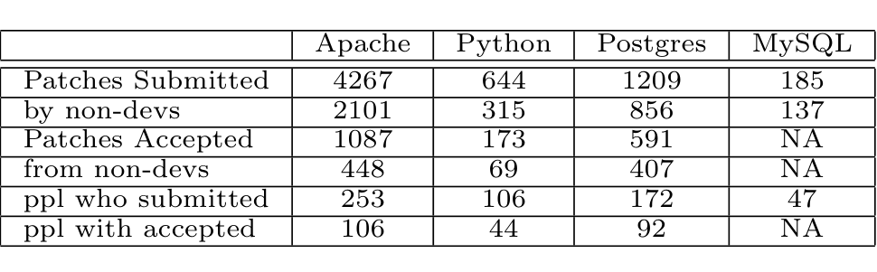

difficult. It’s possible to use the patch -R command, which attempts to apply the patch in reverse. The problem with this approach is that patched files are sometimes modified prior to being committed to the repository. If a developer applies a submitted patch and then moves a curly brace from the end of one line to the beginning of the next, the original patch will not reverse apply and this approach will yield a false negative. In this case the problem is that patches are line based. Other issues that we encountered causing false negatives were comments being added, removed, or modified, and variables being renamed prior to committing patched files.

In an effort to improve the recall of our patch application detection process, we wrote our own tool to deal with these problems and other issues that may be encountered in the future. To address the problem of line based changes (such as the moved curly brace above), our tool reads both the patch and candidate file and produces two sequences of tokens. We use specialized scanners for files depending on the programming language used (determined by file extension) and also a generic scanner for files containing natural text or unrecognized languages. Due to the object oriented nature of our tool, it is quite easy to extend the generic scanner to recognize new languages by simply specifying the keywords, comments, identifiers, symbols, etc. with extended regular expressions.

Once the candidate file and patch have been tokenized, we utilize various matching techniques to determine if the patch token sequence appears in the candidate file token sequence. To deal with comment addition, deletion, and modification, we attempt to match the patch token sequence against the file token sequence both with and without comments. In some cases, we found patches that consisted solely of a modification to a comment in order to clarify code. Our tool is able to recognize cases such as this and act accordingly. We also account for other problems such as tokenizing correctly when patches begin or end within a multi-line comment.

Identifier renaming is a common modification to patched files prior to committing. Many projects have naming conventions that well-meaning newcomers may not be aware of. To mitigate this problem, we check to see if the patch token sequence appears in the candidate file modulo identifier-renaming. Below is an example of such an occurrence from our own data. In this case, the type ap_bucket_brigade in the patch has been renamed to apr_bucket_brigade in the file after patch application but prior to commit. The first section of code is from the body of a submitted patch while the second section represents portions taken from mod_cgi.c itself.

```c
+typedef enum {RUN_AS_SSI, RUN_AS_CGI} prog_types;
+typedef struct {
+    prog_types prog_type;
```

```c
+    ap_bucket_brigade **bb;
+} exec_info;
+
/* KLUDGE --- for back-combatibility, we don’t have to check ExecCGI
...
+    const char **argv;
+    ap_bucket_brigade *bcgi;
+    ap_bucket *b;
+
-----------------------------------------------------------------
typedef enum {RUN_AS_SSI, RUN_AS_CGI} prog_types;
typedef struct {
    prog_types prog_type;
    apr_bucket_brigade **bb;
} exec_info;
/* KLUDGE --- for back-combatibility, we don’t have to check ExecCGI
...
const char **argv;
apr_bucket_brigade *bcgi;
apr_bucket *b;
```

We found that in some cases, the patch itself only applied a renaming of variables (such as when platform specific #define’s in GCC have changed). Our tool also checks for this and requires exact identifier matches in these cases.

We examine each hunk of the patch in turn and check to see if it was applied to the corresponding file. We use a tuneable threshold for the proportion of hunks that must be applied for the patch to be considered successfully accepted. For our purposes, we set this value to around 3/4¹. If a successful application is detected, the corresponding database entry for the patch is updated with the matching file location and version information for use in later analysis.

## 4 Results

We have tested our patch mining process on the Apache webserver, the Python interpreter, and the PostgreSQL and MySQL database systems. In the case of MySQL, we only gathered submission data because we were unable to check out versions of their files due to their use of a proprietary source code management tool (BitKeeper). Table 1 shows the results of our patch mining for these projects. The values indicate the total number of patch submissions, number of submissions by non-developers², total number of acceptances, number accepted from non-developers, and distinct number of people who made submissions and had accepted patches.



Table 1. Results of using our tool on projects studied. 1 This value is more of a “gut feel” than anything else.

Table 1. Results of using our tool on projects studied.
1 This value is more of a “gut feel” than anything else. We wanted a patch to be mostly accepted for us to indicate it as so.
2 Non-developer indicates someone who was not a developer at the time of submission.