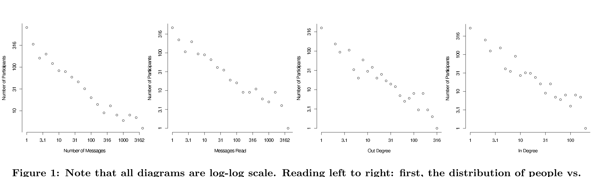
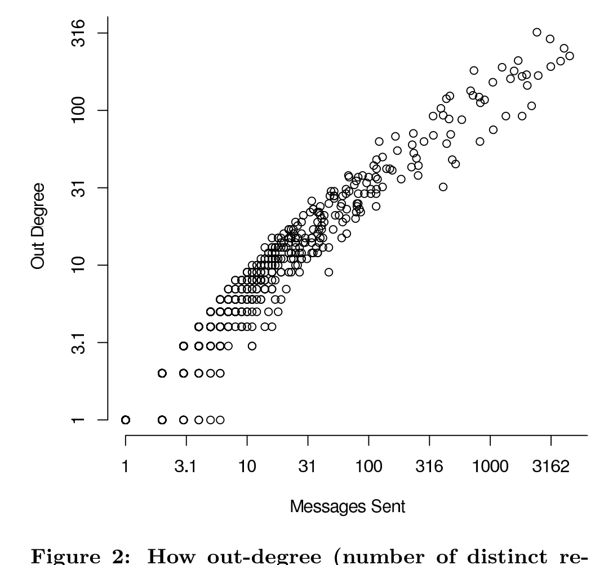

Figure 1: Note that all diagrams are log-log scale. Reading left to right: first, the distribution of people vs. number of messages they sent; next, vs. the number of reply messages they received. Note that a few people account for the bulk of the sending & reply activity. The next two indicate the structure of the social network. First, the out-degree in the social network; finally, vs. the in-degree in the social network. Out degree is an indication of status, as it indicates the number of different people who replied to the ego’s messages. In-degree indicates the number of different people whose messages ego responded to. All distributions show power-law character. The degree distributions show small-world character of the email social network.

The first shows a histogram of message-sending behaviour. The vast majority of people send only one message, and there are some who send a great many. The second is the histogram of message replying behavior. The next two are based on the social network, where an individual s_a has a link to an individual s_b if s_b replied to a message from s_a. Higher out-degree for s_a is an indication of higher status, since more individuals have found messages from s_a of interest. Individuals whose messages attracted no replies were excluded from this graph. Out-degree also shows a scale-free, or power-law distribution, characteristic of small-world social networks [2, 9, 10, 15]. In-degree measures the number of different people to whom an individual has replied, and is an indication of the level of engagement of an individual in the mailing list and the breadth of his/her interests. This distribution also shows a small-world character.

Next, we examine (Figure 2) the relationship between the number of messages sent by an individual, and the number of distinct respondents who replied to that individual. For this graph, we only considered individuals who had actually received at least one response to their message. It can be seen that there is a strong relationship; in fact, we note a very high Spearman’s rank correlation, around 0.97. It should be noted that these are not the same phenomena; the number messages one sends need not necessarily correlate with the number of different people that consider that message worth responding to. This may be due to community norms, i.e., people only post relevant messages, and the community by and large responds to messages. It may also be due to a survival effect, whereby only people who receive replies from several people keep sending messages. We are currently using time-series regression analysis to examine the latter theory, that only people who receive replies to their messages continue to be active on the mailing list.

Finally we present (in Figure 3) a pruned email social network; the full network is too large to render in a useful fashion on non-interactive media. Each directional link in Figure 3 indicates a message count of at least 150. For example, the arrow from Alexei Kosut to Ben Laurie indicates that the latter replied to at least 150 messages from the former;

Figure 2: How out-degree (number of distinct respondents) grows with number of messages sent by ego, n=1063

> This indicates that Laurie found a lot of Kosut’s messages of interest. The reverse arrow indicates that this relationship was mutual. Unidirectional arrows, for example from Slemko to the Rodent, merely indicate that the former replied to less than 150 messages from the latter. Self links indicate that individuals sometimes replied to their own messages, sometimes after comments from others, sometimes to clarify their original message.
>
> The high connectedness of certain individuals (Gaudet, Laurie, Bloom, Jagielski, Rowe) can be seen even in this pruned network; these individuals are in fact the most productive developers. Preliminary statistical data further supporting this is presented in the next section.
>
> We conclude this section with some observations: