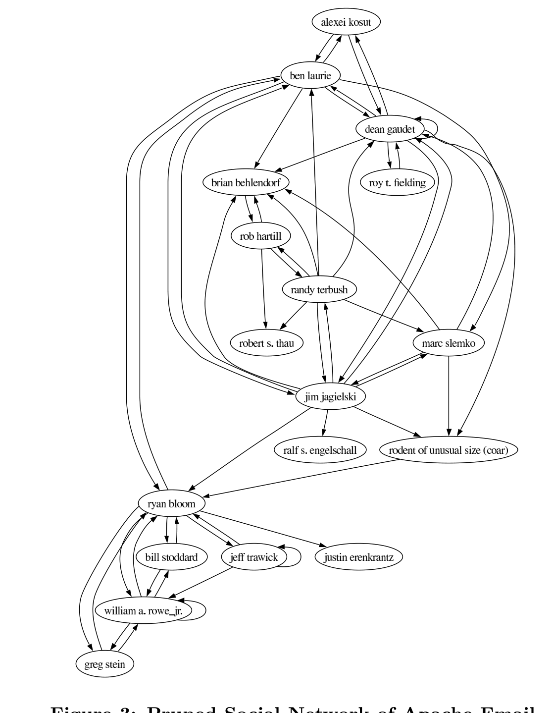

Figure 3: Pruned Social Network of Apache Emailers (Each link indicates at least 150 messages sent, or replied-to).

- The number of messages sent by individuals, and the number of messages sent in reply to individuals, both follow a Pareto distribution;
- The social network of individuals on the email network, where an individual a has a link to an individual b if b replied to a message from a, shows a long-tailed degree distribution on both in- and out-degrees, characteristic of small-world networks.
- There is a strong relationship between the number of messages sent by an individual, and the number of distinct individuals who respond to that individual (also the out-degree in the social network). We are studying this phenomenon using time-series analysis.

This phenomenon using time-series analysis.

## 5. C&C ACTIVITY AND DEVELOPMENT ACTIVITY

Next we turn to examine the relationship between email activity and development activity.

In this section we discuss this question: How does email activity relate to software development activity. In order to study this question, we use data gathered from the CVS archives on how many changes (distinct commits) were made by each individual. In fact only 73 individuals have actually made commits to the versioned repository during the period beginning with 1999 (before which this repository was not used) until the present. There are two types of files, source and documents. We counted each separately, in order to study the relationship of source code and document activity with email activity.

### 5.1 Activity Correlation

There are a large number of correspondents on the mailing list who do not have commit privileges, never make any changes to the project files. These individuals tend to be less active on the email list. In order to study the relationship between the effort spent on C&C activities, and development activities, we excluded individuals who have not made any changes to source code or documents from this study. By focusing on just those individuals who have made changes, we hope to get a clearer picture of the relationship of email activity with development activity.

Based on the data for just the 73 committers, we observe a Spearman’s rank correlation of about 0.80 between the number of messages sent by an individual, and the number of source changes they make. This clearly indicates that the more software development work an individual does, the more C&C activity the individual must undertake. There is a somewhat lower correlation, around 0.57, with number of document changes. We hypothesize that this is because source code activities require much more co-ordination effort than documentation effort, but further study, using time-series data is needed to determine this.

The total number of messages is only one aspect of a community’s structure; the volume of messages sent by an individual (even if they receive replies) doesn’t necessarily indicate the individual’s position in the social network. Sociologists have invented several measures of an individual’s position in a network, when viewed globally. We also study the relationship of some of these measures to the activity level of an individual.

### 5.2 Social Network Measures

We focus on 3 measures, in-degree, out-degree and betweenness, which are indicators of the importance of an individual in a network. Out-degree and in-degree were discussed earlier; for this part, we normalize out-degree and in-degree by the total size of the network. For a node v in a graph g, betweenness BW is defined as follows:

BW(v) = sum_{i,j, i≠j, i≠v, j≠v} g_ij(v) / g_ij

where g_ij(v) is the number of shortest paths (geodesics) in g, between i and j, that go through v; and g_ij is the total number of shortest paths from i to j.

High betweenness indicates that the person is a kind of broker, or gatekeeper in the social network; s/he plays a role in a great many interactions. Such people can have high status, and can also be bottlenecks. Actors who are high in betweenness centrality have the potential to control or disrupt communication or trust relationships between various end points. So we ask the question, Are developers more likely to play the role of gatekeepers or brokers in the

Note that there may be more than one shortest path between two nodes if multiple paths are of the same length.