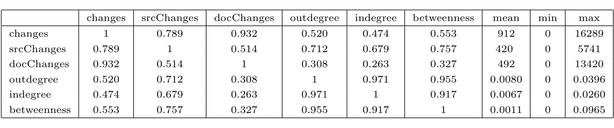
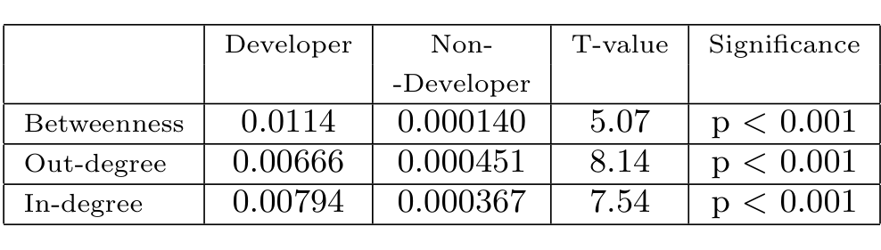

Figure 4: Cross-correlation table (using Spearman’s rank correlation) showing relationship between the total number of changes, the changes to source, changes to documents, relative in-degree, relative out-degree, betweenness. Average, min and max are also shown. n=73

complete email social network? To answer this question, we computed the betweenness scores of developers (n = 73) and non-developers (n = 1123) in the full email social network. The mean betweenness of developers is 0.0114, and the mean betweenness of non-developers is 0.000140. A simple T-test indicates a t-value of 5.07, which is highly significant. The other measures, out-degree and in-degree, were also calculated. They also indicate that developers have a significantly higher status, as indicated in the table below.

0.00794 0.000367 7.54 p < 0.001

So we can conclude that developers are higher in status than non-developers. Next, we consider just the population of developers, and study the indicators of status within this population.

### 5.3 Relative Status of Developers

Considering just the population of developers who have made changes to the source and documents (n = 73) we turn the reader’s attention to Figure 4, which shows a table with the relevant descriptive statistics and correlation values. The top 3 rows (left 3 columns) are measures of activity: total changes, source code changes, and document changes. The bottom 3 rows (columns 4, 5, and 6) are indicators of social status.

Considering just the 3 change variables, it can be seen that source changes are not as highly correlated with document changes, indicating that not all developers are engaged in both to the same degree. Thus, developer nd made 13420 document changes, and 2869 source changes, while developer dougm made 1322 source changes and 74 document changes. There are several others who were skewed in this way.

Turning now to the relative indicators of status, we can see that source changes shows the strongest rank correlation with the social network status indicators of normalized out- and in-degrees, and betweenness. In fact the correlation for betweenness is quite high, at 0.757. It should be noted that these are non-parametric correlation measures, and are thus more robustly indicative of a relationship. This indicates that even within the higher-status group of developers, the most active developers play the strongest role of communicators, brokers, and gatekeepers. It’s also noteworthy that the correlation with document changes is much weaker, indicating that higher activity in source code is a stronger determinant of social status than activity in documents.

A later study of the developer mailing list and source code repository data for the Postgres4 project showed that the social status measures had similar levels of correlation with source code changes [3]. The Postgres data, however, showed much higher correlations between document changes and social network measures than the Apache data. We plan to examine this statistic in future work.

We end this section with several preliminary conclusions:

- The level of activity on the mailing list is strongly correlated with source code change activity, and to a lesser extent with document change activity.

- Social network measures such as in-degree, out-degree (normalized by the number of developers) and betweenness indicate that developers who actually commit changes play much more significant roles in the email community than non-developers.

- Even within the select group of developers, there is a strong correlation between the abovementioned measures of social network importance and level of source code change activity.

## 6. RELATED WORK

There has been considerable study of social behavior in on-line communities; we only survey work here in the OSS development context.

Social networks among developers have been studied from other perspectives. Xu et al [19] consider two developers socially related if they participate in the same project. Our view is to consider developers related if there is evidence of email communication; this is arguably a more direct evidence of a social link. Wagstrom, Herbsleb and Carley [18] gathered empirical social network data from several sources, including blogs, email lists and networking web sites, and built models of their social behavior on the network; these were then used to construct a simulation model of how users joined and left projects. Our goal is empirical rather than to run a simulation; we explicitly wish to study the relationship of email behavior and commit behavior in a single project.

Crowston & Howison [7] use co-occurrence of developers on bug reports as indicators of a social link. They empirically demonstrate that the social networks of smaller projects are more central than those of larger projects, presumably larger

4http://www.postgresql.org